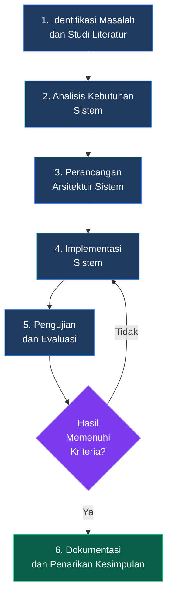
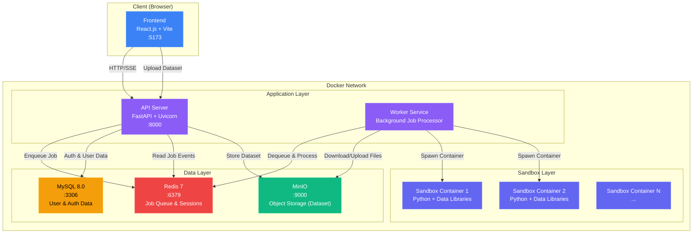
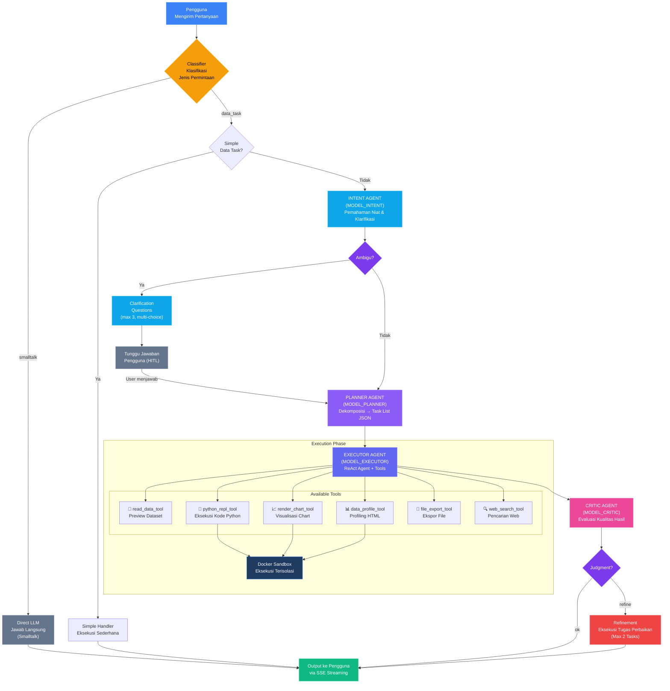
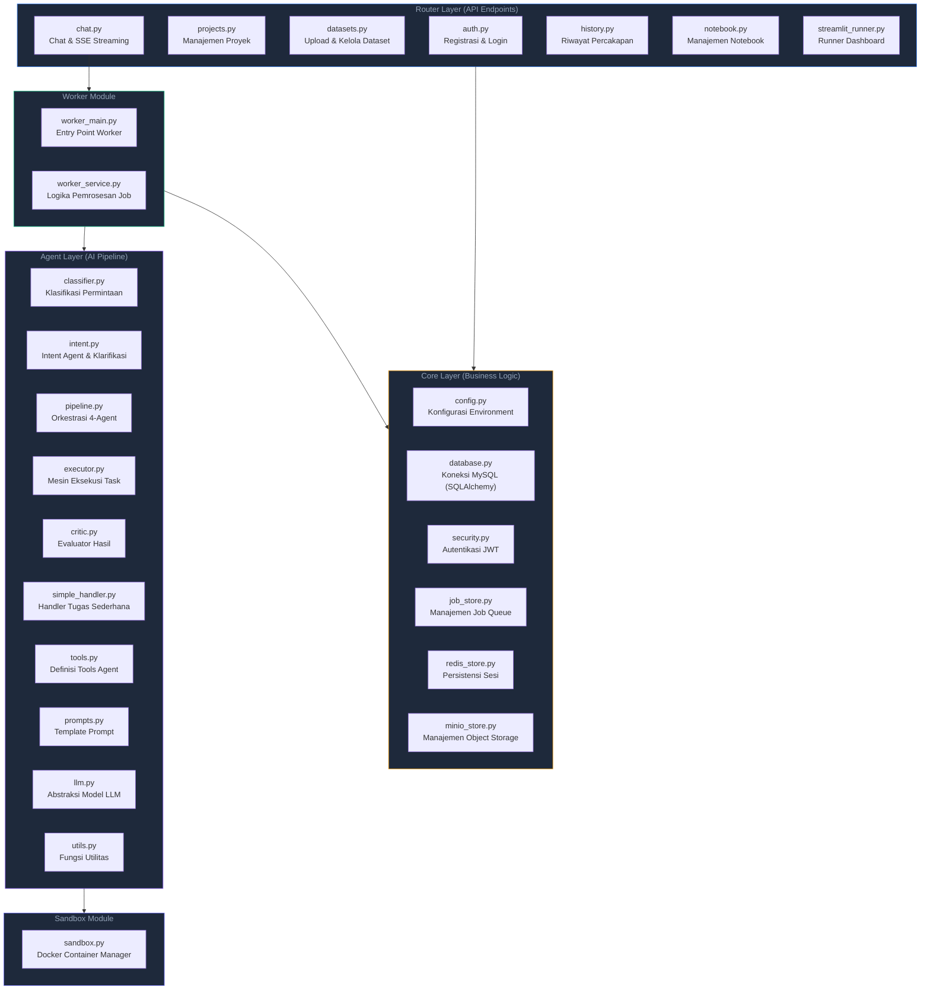
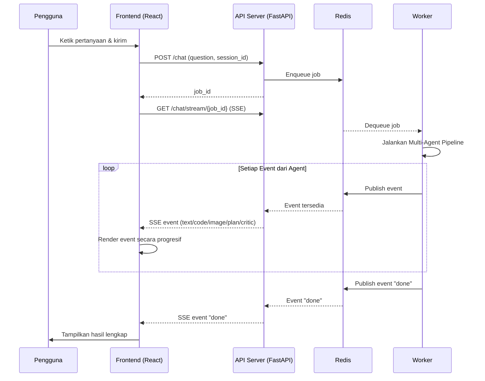
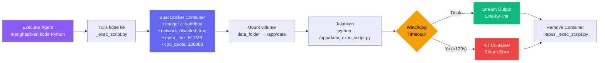

# BAB III
# METODE PENELITIAN

## 3.1 Jenis Penelitian

Penelitian ini menggunakan pendekatan **Research and Development (R&D)** atau penelitian dan pengembangan, yaitu metode penelitian yang bertujuan untuk menghasilkan produk tertentu dan menguji efektivitas produk tersebut. Produk yang dihasilkan dalam penelitian ini adalah sebuah platform web *automated data analysis* berbasis arsitektur *Multi-Agent* menggunakan LangGraph.

Pengembangan perangkat lunak dalam penelitian ini mengikuti model proses **Prototyping**, di mana prototipe sistem dibangun secara bertahap berdasarkan kebutuhan fungsional yang telah diidentifikasi, kemudian dievaluasi dan disempurnakan melalui iterasi. Model prototyping dipilih karena sesuai dengan sifat penelitian yang membutuhkan eksplorasi arsitektur *multi-agent* yang kompleks dan memerlukan validasi fungsional secara bertahap.

## 3.2 Alur Penelitian

Alur penelitian ini terdiri dari enam tahapan utama yang dilaksanakan secara sekuensial. Setiap tahapan memiliki tujuan dan keluaran (*output*) yang spesifik. Gambar 3.1 menunjukkan diagram alur penelitian secara keseluruhan.

**Gambar 3.1 — Diagram Alur Penelitian**



Berikut adalah penjelasan masing-masing tahapan:

### 3.2.1 Identifikasi Masalah dan Studi Literatur

Tahap pertama adalah mengidentifikasi permasalahan yang menjadi latar belakang penelitian, yaitu keterbatasan metode analisis data konvensional dan pendekatan *single-agent* dalam memberikan analisis yang adaptif dan andal. Studi literatur dilakukan dengan mengkaji jurnal ilmiah, artikel konferensi, dan dokumentasi teknis yang relevan terkait:
- *Multi-Agent System* (MAS) dan penerapannya pada domain LLM
- LangGraph sebagai *framework* orkestrasi agen
- *Exploratory Data Analysis* (EDA) dan alat otomatisasinya
- Teknik *sandboxing* untuk eksekusi kode yang aman
- *Human-in-the-Loop* (HITL) dan mekanisme pertanyaan klarifikasi pada sistem dialog

### 3.2.2 Analisis Kebutuhan Sistem

Tahap kedua adalah menganalisis kebutuhan fungsional dan non-fungsional sistem berdasarkan hasil identifikasi masalah. Kebutuhan ini menjadi acuan dalam perancangan arsitektur dan implementasi.

**Kebutuhan Fungsional:**

| No | Kode | Deskripsi |
|----|------|-----------|
| 1 | F-01 | Pengguna dapat melakukan registrasi dan autentikasi akun |
| 2 | F-02 | Pengguna dapat membuat dan mengelola proyek analisis |
| 3 | F-03 | Pengguna dapat mengunggah dataset dalam format CSV |
| 4 | F-04 | Pengguna dapat memberikan perintah analisis dalam bahasa alami melalui antarmuka *chat* |
| 5 | F-05 | Sistem dapat mengklasifikasikan jenis permintaan pengguna (*smalltalk*, *simple data task*, atau *complex data task*) |
| 6 | F-06 | *Intent Agent* dapat mengidentifikasi niat pengguna dan menilai tingkat ambiguitas permintaan |
| 7 | F-07 | *Intent Agent* dapat mengajukan pertanyaan klarifikasi (*multi-choice*, maksimal 3 pertanyaan) ketika permintaan bersifat ambigu (*Human-in-the-Loop*) |
| 8 | F-08 | *Planner Agent* dapat mendekomposisi permintaan menjadi rencana tugas terstruktur |
| 9 | F-09 | *Executor Agent* dapat mengeksekusi kode Python di lingkungan *sandbox* terisolasi |
| 10 | F-10 | *Critic Agent* dapat mengevaluasi hasil eksekusi dan memicu perbaikan jika diperlukan |
| 11 | F-11 | Sistem dapat menghasilkan visualisasi data (grafik, chart) secara otomatis |
| 12 | F-12 | Sistem dapat menghasilkan laporan *profiling* dataset dalam format HTML |
| 13 | F-13 | Pengguna dapat mengekspor hasil analisis ke berbagai format file (CSV, XLSX, HTML, Notebook) |
| 14 | F-14 | Sistem menampilkan respons agen secara *streaming* (*real-time*) |
| 15 | F-15 | Pengguna dapat membuat *dashboard* Streamlit interaktif melalui perintah bahasa alami |

**Kebutuhan Non-Fungsional:**

| No | Kode | Deskripsi |
|----|------|-----------|
| 1 | NF-01 | Eksekusi kode terisolasi menggunakan *container* Docker untuk keamanan |
| 2 | NF-02 | Batas waktu eksekusi *sandbox* maksimal 120 detik per pemanggilan |
| 3 | NF-03 | Pembatasan memori *sandbox* sebesar 512 MB dan kuota CPU terkontrol |
| 4 | NF-04 | Antarmuka pengguna responsif dan mendukung *dark/light mode* |
| 5 | NF-05 | Sistem mendukung *concurrent* pengguna melalui mekanisme antrian pekerjaan (*job queue*) |
| 6 | NF-06 | Riwayat percakapan tersimpan secara persisten |

### 3.2.3 Perancangan Arsitektur Sistem

Tahap ketiga adalah merancang arsitektur keseluruhan sistem yang terdiri dari arsitektur infrastruktur (*deployment*), arsitektur *backend*, arsitektur *multi-agent pipeline*, dan arsitektur *frontend*.

### 3.2.4 Implementasi Sistem

Tahap keempat adalah mengimplementasikan rancangan ke dalam kode program yang fungsional menggunakan bahasa pemrograman Python (backend) dan JavaScript (frontend).

### 3.2.5 Pengujian dan Evaluasi

Tahap kelima adalah menguji sistem yang telah diimplementasikan melalui beberapa metode pengujian untuk memastikan kualitas dan fungsionalitas.

### 3.2.6 Dokumentasi dan Penarikan Kesimpulan

Tahap terakhir adalah mendokumentasikan seluruh proses penelitian dan menarik kesimpulan berdasarkan hasil pengujian dan evaluasi.

---

## 3.3 Peralatan Penelitian

Peralatan yang digunakan dalam penelitian ini terdiri dari perangkat keras dan perangkat lunak.

### 3.3.1 Perangkat Keras

| No | Komponen | Spesifikasi |
|----|----------|-------------|
| 1 | Prosesor | Intel Core / AMD Ryzen (minimal 4 core) |
| 2 | Memori (RAM) | Minimal 8 GB |
| 3 | Penyimpanan | SSD minimal 50 GB |
| 4 | Koneksi Internet | Diperlukan untuk akses API LLM dan pencarian web |

### 3.3.2 Perangkat Lunak

| No | Perangkat Lunak | Versi | Fungsi |
|----|----------------|-------|--------|
| 1 | Python | 3.11 | Bahasa pemrograman utama *backend* |
| 2 | Node.js | 20+ | *Runtime* JavaScript untuk *frontend* |
| 3 | Docker & Docker Compose | 24+ | Kontainerisasi dan orkestrasi layanan |
| 4 | FastAPI | 0.115 | *Framework* web *backend* |
| 5 | React.js | 18 | Pustaka antarmuka pengguna *frontend* |
| 6 | Vite | 5 | *Build tool* dan *dev server* *frontend* |
| 7 | LangChain | 0.3 | Pustaka *chaining* komponen LLM |
| 8 | LangGraph | 0.2 | *Framework* orkestrasi agen berbasis graf |
| 9 | MySQL | 8.0 | Basis data relasional untuk data pengguna |
| 10 | Redis | 7 | *In-memory data store* untuk antrian pekerjaan dan sesi |
| 11 | MinIO | Latest | *Object storage* kompatibel S3 untuk penyimpanan dataset |
| 12 | SumoPod API | - | Penyedia *Large Language Model* |
| 13 | Pytest | 8.3 | *Framework* pengujian unit (*unit testing*) |
| 14 | Visual Studio Code | Latest | *Integrated Development Environment* (IDE) |
| 15 | Git | 2.40+ | Sistem kontrol versi |

Seluruh dependensi *backend* Python di-*pin* (dikunci) ke versi eksak di dalam berkas `requirements.txt` untuk menjamin **reprodusibilitas** (*reproducibility*) pembangunan *image* Docker pada lingkungan yang berbeda. Dependensi pengujian dipisahkan pada berkas `requirements-dev.txt` agar tidak ikut terpasang di *image* produksi.

### 3.3.3 Pustaka Python Pendukung

| No | Pustaka | Fungsi |
|----|---------|--------|
| 1 | Pandas | Manipulasi dan analisis data tabular |
| 2 | NumPy | Komputasi numerik |
| 3 | Matplotlib | Pembuatan visualisasi/grafik statis |
| 4 | Seaborn | Visualisasi statistik tingkat tinggi |
| 5 | Plotly | Visualisasi interaktif |
| 6 | ydata-profiling | Pembuatan laporan *profiling* dataset otomatis |
| 7 | Pydantic | Validasi data dan serialisasi |
| 8 | SQLAlchemy | ORM (*Object-Relational Mapping*) untuk basis data |
| 9 | Uvicorn | ASGI server untuk FastAPI |
| 10 | Streamlit | Pembuatan *dashboard* interaktif |
| 11 | Pytest, pytest-mock, pytest-cov | Pengujian unit, *mocking*, dan pengukuran *code coverage* |

---

## 3.4 Perancangan Arsitektur Sistem

### 3.4.1 Arsitektur Infrastruktur (*Deployment*)

Platform ini menggunakan arsitektur berbasis **mikroservis** (*microservices*) yang diorkestrasi menggunakan Docker Compose. Setiap komponen berjalan sebagai *container* independen yang saling terhubung melalui jaringan internal Docker. Gambar 3.2 menunjukkan arsitektur infrastruktur keseluruhan.

**Gambar 3.2 — Arsitektur Infrastruktur Sistem**



Penjelasan komponen infrastruktur:

1. **API Server (FastAPI):** Menerima permintaan HTTP dari *frontend*, mengelola autentikasi pengguna, manajemen proyek, pengunggahan dataset, dan meneruskan permintaan analisis ke antrian pekerjaan (*job queue*) di Redis.

2. **Worker Service:** Proses latar belakang (*background process*) yang mengambil pekerjaan dari antrian Redis, mengunduh file dataset dari MinIO ke direktori sementara, menjalankan *pipeline* agen, dan mengunggah hasil kembali ke MinIO. Setiap *event* yang dihasilkan agen dipublikasikan ke Redis secara *real-time*.

3. **MySQL 8.0:** Basis data relasional yang menyimpan data pengguna, informasi autentikasi, dan metadata proyek.

4. **Redis 7:** Digunakan sebagai:
   - **Antrian pekerjaan (*job queue*):** Menerima dan mendistribusikan tugas analisis ke *worker*.
   - **Penyimpanan sesi:** Menyimpan riwayat percakapan (*chat history*) pengguna.
   - **Publikasi *event*:** Mengirimkan *event* dari agen ke API Server secara *real-time* untuk diteruskan ke *frontend* via SSE.

5. **MinIO:** Penyimpanan objek (*object storage*) yang kompatibel dengan protokol S3, digunakan untuk menyimpan file dataset pengguna dan file hasil analisis (grafik, laporan, file ekspor).

6. **Sandbox Container:** *Container* Docker yang dibuat secara dinamis (*on-demand*) untuk setiap eksekusi kode Python. Setiap *container* bersifat terisolasi (tanpa akses jaringan), memiliki pembatasan memori (512 MB) dan CPU, serta batas waktu eksekusi (120 detik).

### 3.4.2 Arsitektur Multi-Agent Pipeline

Inti kecerdasan sistem terletak pada *pipeline* kolaborasi empat agen yang diorkestrasi menggunakan LangGraph, yaitu *Intent Agent*, *Planner Agent*, *Executor Agent*, dan *Critic Agent*. Gambar 3.3 menunjukkan alur kerja *multi-agent pipeline* secara lengkap.

**Gambar 3.3 — Diagram Alur Multi-Agent Pipeline**



Berikut penjelasan detail setiap komponen dalam *pipeline*:

#### A. Classifier (Pengklasifikasi Permintaan)

Sebelum permintaan pengguna memasuki *pipeline* utama, **Classifier** terlebih dahulu menentukan jenis permintaan. Klasifikasi dilakukan melalui dua mekanisme:

1. **Heuristik (*Rule-Based*):** Pemeriksaan cepat berdasarkan kata kunci. Jika permintaan berupa sapaan sederhana (misal: "halo", "terima kasih"), langsung diklasifikasikan sebagai `smalltalk` tanpa memanggil LLM.
2. **LLM Classifier:** Untuk kasus yang ambigu, LLM ringan digunakan untuk menentukan apakah permintaan termasuk `smalltalk` atau `data_task`.

Jika terklasifikasi sebagai `smalltalk`, sistem menjawab langsung menggunakan LLM tanpa melibatkan *pipeline* agen. Jika terklasifikasi sebagai `data_task`, dilakukan pemeriksaan tambahan apakah tugas bersifat sederhana (*simple data task*) yang dapat dijawab tanpa *pipeline* lengkap. Apabila tugas tergolong kompleks, permintaan diteruskan ke *Intent Agent*.

#### B. Intent Agent (Agen Pemahaman Niat)

*Intent Agent* merupakan agen pertama dalam *pipeline* utama yang bertugas memahami niat pengguna sebelum proses perencanaan dimulai. Agen ini menggunakan LLM yang dikonfigurasi melalui variabel lingkungan `MODEL_INTENT` (dapat berbeda dari model untuk *Planner*/*Executor*/*Critic*) dan menghasilkan keluaran dalam format JSON dengan atribut sebagai berikut:

```json
{
  "intent": "eda | visualization | preprocessing | machine_learning | qa | unknown",
  "confidence": 0.0,
  "is_ambiguous": false,
  "rewritten_query": "Pertanyaan yang diperjelas",
  "questions": [
    {"id": "q1", "question": "...", "options": ["A", "B", "C"]}
  ],
  "reasoning": "Alasan singkat dalam bahasa Indonesia"
}
```

Mekanisme keputusan *Intent Agent* meliputi:

1. **Klasifikasi niat (*intent classification*):** Menentukan kategori tugas analisis yang paling sesuai dari enam kategori baku.
2. **Penilaian keyakinan (*confidence*):** Menghasilkan skor kepercayaan dalam rentang 0,0–1,0 yang menentukan apakah permintaan cukup spesifik untuk diteruskan.
3. **Deteksi ambiguitas:** Apabila atribut `is_ambiguous` bernilai `true`, agen menghasilkan maksimal tiga pertanyaan klarifikasi berbentuk pilihan ganda (*multiple choice*) yang dikirim ke *frontend* melalui *event* SSE bertipe `clarification`.
4. **Penulisan ulang kueri (*query rewriting*):** Jika niat dinilai jelas, agen menghasilkan `rewritten_query` yang lebih eksplisit dan diteruskan sebagai *input* bagi *Planner Agent*, sehingga *Planner* dapat menyusun rencana yang lebih tepat sasaran.

Dialog klarifikasi dilakukan dalam **satu putaran** (*single-round*): setelah pengguna memilih opsi jawaban, *pipeline* langsung melanjutkan ke *Planner Agent* tanpa pemanggilan ulang *Intent Agent*, untuk menghindari siklus tanya-jawab yang panjang. *Intent Agent* juga dilengkapi mekanisme *fallback* berupa *parser* JSON yang toleran terhadap keluaran LLM yang tidak ideal (misalnya JSON dibungkus *markdown code fence*) dan validasi otomatis terhadap jumlah pertanyaan serta struktur opsi.

#### C. Planner Agent (Agen Perencana)

*Planner Agent* menerima pertanyaan pengguna beserta konteks dataset (daftar file, skema kolom) dan menghasilkan rencana eksekusi berupa **daftar tugas terurut dalam format JSON**. Setiap tugas memiliki atribut:

```json
[
  {"task": "Deskripsi tugas spesifik", "agent": "execution", "phase": 0},
  {"task": "Tugas berikutnya", "agent": "execution", "phase": 1}
]
```

Atribut `phase` menentukan urutan eksekusi: tugas dengan `phase` yang sama dapat dieksekusi secara **paralel**, sedangkan tugas dengan `phase` berbeda dieksekusi secara **sekuensial**. Mekanisme ini memungkinkan efisiensi waktu untuk tugas-tugas yang tidak memiliki ketergantungan satu sama lain.

#### D. Executor Agent (Agen Eksekutor)

*Executor Agent* merupakan agen berbasis pola **ReAct** (*Reasoning and Acting*) yang dibangun menggunakan fungsi `create_react_agent` dari LangGraph. Agen ini dilengkapi dengan enam *tools*:

| No | Tool | Fungsi |
|----|------|--------|
| 1 | `read_data_tool` | Membaca preview dataset: shape, tipe kolom, dan n baris pertama |
| 2 | `python_repl_tool` | Mengeksekusi kode Python di *sandbox* Docker untuk analisis, EDA, preprocessing |
| 3 | `render_chart_tool` | Mengeksekusi kode Matplotlib/Seaborn dan menyimpan hasil sebagai PNG |
| 4 | `data_profile_tool` | Menghasilkan laporan *profiling* HTML komprehensif dari dataset |
| 5 | `file_export_tool` | Mengekspor hasil analisis ke file (CSV, XLSX, JSON, Notebook, HTML, Markdown) |
| 6 | `web_search_tool` | Melakukan pencarian informasi di internet melalui Tavily API atau DuckDuckGo |

Setiap pemanggilan `python_repl_tool`, `render_chart_tool`, dan `data_profile_tool` dieksekusi di dalam **Docker Sandbox** yang terisolasi. Jika terjadi *error*, *Executor Agent* secara otomatis menganalisis pesan kesalahan dan mencoba memperbaiki kode (*auto-debug*).

#### E. Critic Agent (Agen Pengulas)

Setelah seluruh tugas dieksekusi, *Critic Agent* mengevaluasi keseluruhan hasil dengan memeriksa apakah:
- Pertanyaan pengguna telah dijawab secara substansial
- Tidak ada *error* kritis yang belum ditangani
- Visualisasi tersedia jika diminta oleh pengguna
- Tidak terindikasi *data leakage* atau metrik evaluasi yang tidak sesuai

Hasil evaluasi berupa objek JSON dengan tiga atribut:

```json
{
  "judgment": "ok | refine",
  "feedback": "Evaluasi dalam bahasa Indonesia",
  "additional_tasks": ["Tugas perbaikan spesifik 1", "Tugas perbaikan 2"]
}
```

Jika `judgment` bernilai `refine`, *Critic Agent* menyertakan **maksimal 2 tugas perbaikan** yang spesifik. Tugas perbaikan ini kemudian dieksekusi oleh *Executor Agent* dalam satu putaran perbaikan (*one-shot refinement*) tanpa evaluasi ulang, untuk menghindari siklus tak terbatas.

### 3.4.3 Arsitektur Backend

Arsitektur *backend* mengikuti pola ***layered architecture*** dengan pemisahan tanggung jawab yang jelas. Gambar 3.4 menunjukkan struktur modul *backend*.

**Gambar 3.4 — Struktur Modul Backend**



### 3.4.4 Arsitektur Frontend

Antarmuka pengguna (*frontend*) dibangun menggunakan React.js dengan arsitektur berbasis komponen. Aplikasi terdiri dari tiga halaman utama dan sejumlah komponen pendukung.

**Halaman Utama:**

| No | Halaman | Fungsi |
|----|---------|--------|
| 1 | `HomePage` | Halaman beranda (*landing page*) yang menampilkan informasi produk |
| 2 | `AuthPage` | Halaman autentikasi (registrasi dan *login*) |
| 3 | `DashboardPage` | Halaman manajemen proyek dan dataset |
| 4 | `ChatPage` | Halaman utama interaksi analisis data (*chat interface*) |

**Komponen Pendukung Utama:**

| No | Komponen | Fungsi |
|----|----------|--------|
| 1 | `Sidebar` | Panel samping navigasi dengan daftar sesi dan file |
| 2 | `MessageBubble` | Komponen gelembung pesan (*chat bubble*) dengan dukungan Markdown, kode, dan gambar |
| 3 | `PipelineDemo` | Demonstrasi visual alur kerja *multi-agent* |
| 4 | `HeroSection` | Bagian hero halaman beranda |

**Alur Komunikasi Frontend — Backend:**



Komunikasi antara *frontend* dan *backend* menggunakan **Server-Sent Events (SSE)** untuk *streaming* respons secara *real-time*. Ketika pengguna mengirim pertanyaan, *frontend* membuka koneksi SSE ke *endpoint* `/chat/stream/{job_id}` dan menerima rangkaian *event* yang di-*render* secara progresif. Jenis *event* yang diterima meliputi:

| Tipe Event | Deskripsi |
|------------|-----------|
| `agent_label` | Label agen yang sedang aktif (Intent/Planner/Execution/Critic) |
| `clarification` | Pertanyaan klarifikasi dari *Intent Agent* (*multi-choice questions*) disertai *intent* dan *reasoning* |
| `plan` | Daftar rencana tugas dari *Planner Agent* |
| `task_start` | Penanda awal eksekusi suatu tugas |
| `text` | Teks penjelasan dari agen |
| `code` | Potongan kode yang sedang dieksekusi |
| `output` | *Output* hasil eksekusi kode |
| `progress` | Pesan progres dari *sandbox* |
| `image` | Gambar visualisasi (*base64 encoded*) |
| `critic` | Hasil evaluasi dari *Critic Agent* |
| `streamlit` | Penanda pembuatan *dashboard* Streamlit |
| `file_export_done` | Penanda ekspor file berhasil |
| `done` | Penanda akhir seluruh *pipeline* |

### 3.4.5 Mekanisme Sandbox (Eksekusi Kode Terisolasi)

Mekanisme *sandbox* merupakan komponen kritis yang memastikan keamanan sistem saat mengeksekusi kode yang dihasilkan oleh LLM. Gambar 3.5 menunjukkan alur eksekusi kode di dalam *sandbox* Docker.

**Gambar 3.5 — Alur Eksekusi Kode di Docker Sandbox**



Parameter keamanan *sandbox*:
- **Jaringan dinonaktifkan** (`network_disabled: true`): *Container* tidak dapat mengakses internet atau layanan eksternal.
- **Batas memori** (`mem_limit: 512MB`): Mencegah konsumsi memori berlebihan.
- **Kuota CPU** (`cpu_quota: 100000`): Membatasi penggunaan CPU agar tidak mengganggu proses lain.
- **Batas waktu** (`timeout: 120 detik`): Mekanisme *watchdog* yang secara otomatis menghentikan (*kill*) *container* jika eksekusi melebihi batas waktu.
- **Pembersihan otomatis**: *Container* dan *script* sementara dihapus setelah eksekusi selesai.

---

## 3.5 Perancangan Basis Data

Sistem menggunakan MySQL sebagai basis data relasional untuk menyimpan data pengguna dan metadata proyek. Tabel 3.1 menunjukkan struktur tabel utama.

**Tabel 3.1 — Struktur Tabel Basis Data**

| No | Tabel | Deskripsi | Kolom Utama |
|----|-------|-----------|-------------|
| 1 | `users` | Data akun pengguna | `id`, `email`, `hashed_password`, `name`, `created_at` |
| 2 | `projects` | Metadata proyek analisis | `id`, `user_id`, `name`, `description`, `created_at` |

Riwayat percakapan dan sesi disimpan di **Redis** dengan format key-value yang diindeks berdasarkan `user_id` dan `session_id`. Keputusan ini diambil karena data percakapan bersifat semi-terstruktur (berisi campuran teks, kode, gambar *base64*, dan metadata agen) yang lebih efisien disimpan sebagai dokumen JSON dibandingkan dalam tabel relasional.

File dataset dan hasil analisis (grafik, laporan HTML, file ekspor) disimpan di **MinIO** *object storage* dengan skema *bucket* per pengguna yang diorganisasi berdasarkan `project_id`.

---

## 3.6 Perancangan Antarmuka Pengguna

Antarmuka pengguna dirancang dengan prinsip kemudahan penggunaan (*usability*) agar pengguna non-teknis dapat berinteraksi dengan sistem analisis data secara intuitif. Berikut adalah rancangan antarmuka untuk halaman-halaman utama.

### 3.6.1 Halaman Beranda (*Home Page*)

Halaman beranda menampilkan informasi produk, demonstrasi visual alur kerja *multi-agent*, dan tombol navigasi untuk memulai penggunaan sistem.

### 3.6.2 Halaman Autentikasi (*Auth Page*)

Halaman autentikasi menyediakan formulir registrasi akun baru dan *login*. Autentikasi menggunakan mekanisme JWT (*JSON Web Token*).

### 3.6.3 Halaman Dashboard (*Dashboard Page*)

Halaman *dashboard* menampilkan daftar proyek milik pengguna. Pengguna dapat membuat proyek baru, mengunggah dataset, dan mengakses sesi analisis.

### 3.6.4 Halaman Chat (*Chat Page*)

Halaman *chat* merupakan antarmuka utama sistem yang terdiri dari:
- **Panel kiri (Sidebar):** Menampilkan daftar sesi percakapan sebelumnya dan daftar file proyek.
- **Area utama (Chat Area):** Menampilkan percakapan antara pengguna dan agen AI secara *streaming*. Mendukung tampilan teks *Markdown*, blok kode dengan *syntax highlighting*, gambar visualisasi *inline*, indikator agen aktif (Planner/Executor/Critic), dan komponen evaluasi Critic.
- **Input area:** Area input teks untuk menulis perintah analisis dalam bahasa alami.

---

## 3.7 Metode Pengujian dan Evaluasi

Pengujian dan evaluasi sistem dilakukan melalui beberapa metode sebagai berikut:

### 3.7.1 Pengujian Fungsional (*Black-Box Testing*)

Pengujian fungsional dilakukan untuk memverifikasi bahwa setiap fitur sistem berfungsi sesuai dengan kebutuhan fungsional yang telah ditetapkan (F-01 hingga F-15). Pengujian menggunakan metode ***black-box testing*** dengan teknik **pengujian berbasis skenario** (*scenario-based testing*), di mana serangkaian skenario penggunaan diuji dan hasilnya dibandingkan dengan keluaran yang diharapkan.

**Tabel 3.2 — Rencana Pengujian Fungsional (Contoh)**

| No | Skenario | Input | Output yang Diharapkan | Kode |
|----|----------|-------|----------------------|------|
| 1 | Registrasi akun baru | Email, password, nama | Akun terdaftar, redirect ke dashboard | F-01 |
| 2 | Upload dataset CSV | File CSV | File tersimpan, muncul di daftar file | F-03 |
| 3 | Klarifikasi niat pengguna | "Analisis data ini" (ambigu) | Intent Agent menampilkan pertanyaan pilihan ganda, pipeline menunggu jawaban | F-06, F-07 |
| 4 | Perintah EDA bahasa alami | "Lakukan EDA pada dataset" | Statistik deskriptif, visualisasi, insight | F-04, F-08, F-09, F-11 |
| 5 | Pembuatan visualisasi | "Buat grafik distribusi harga" | Gambar chart ditampilkan inline | F-11 |
| 6 | Pengujian Critic Agent | Permintaan analisis kompleks | Critic memberikan judgment dan feedback | F-10 |
| 7 | Ekspor hasil analisis | "Ekspor ke notebook" | File .ipynb tersedia untuk diunduh | F-13 |

### 3.7.2 Pengujian Unit (*Unit Testing*)

Selain pengujian fungsional, penelitian ini juga menerapkan **pengujian unit** (*unit testing*) untuk memverifikasi kebenaran komponen-komponen kritis *backend* secara terisolasi dari dependensi eksternal. Pengujian unit menggunakan *framework* **Pytest** dan pustaka pendukung `pytest-mock` untuk *stubbing* pemanggilan LLM serta `pytest-cov` untuk mengukur *code coverage*.

Strategi pengujian dirancang dengan prinsip **isolasi**: pemanggilan LLM (SumoPod) dan eksekusi *sandbox* Docker di-*mock* melalui berkas `tests/conftest.py`, sehingga pengujian dapat dijalankan secara deterministik dan cepat tanpa memerlukan koneksi ke layanan eksternal. Tabel 3.3 merangkum modul *backend* yang menjadi sasaran pengujian unit beserta cakupan skenario pengujiannya.

**Tabel 3.3 — Cakupan Pengujian Unit Backend**

| No | Modul | Fokus Pengujian | Contoh Skenario |
|----|-------|-----------------|------------------|
| 1 | `backend/agent/intent.py` | *Parser* JSON toleran, normalisasi pertanyaan klarifikasi, *fallback* ketika LLM gagal | JSON terbungkus *markdown fence*, jumlah pertanyaan melebihi batas, LLM melempar *exception*, pertanyaan tanpa opsi |
| 2 | `backend/agent/classifier.py` | Rute heuristik *smalltalk*, deteksi *simple data task*, *fallback* rute LLM | Sapaan "halo" → *smalltalk*, permintaan "shape data" → *simple*, kegagalan LLM → rute default |
| 3 | `backend/worker_service.py` | Validasi *payload* pekerjaan, propagasi *error*, kompatibilitas format *auto-save* sesi | *Payload* tanpa `question` → `JobPayloadError`, *exception* umum dilempar ulang, *event* klarifikasi format baru & lama disimpan benar |

Pengujian unit dijalankan secara otomatis setiap kali terjadi perubahan kode melalui perintah `pytest` dari *root* proyek. Ambang keberhasilan yang digunakan adalah **seluruh skenario uji harus lulus** (*all green*) sebelum perubahan dianggap siap untuk pengujian fungsional tingkat selanjutnya.

### 3.7.3 Pengujian Performa Agen

Pengujian performa agen bertujuan untuk mengukur efektivitas arsitektur *multi-agent* dalam menyelesaikan tugas analisis data. Metrik yang diukur meliputi:

1. **Keberhasilan Eksekusi (*Success Rate*):** Persentase tugas analisis yang berhasil diselesaikan tanpa *error* kritis dari total tugas yang diberikan.
2. **Waktu Respons (*Response Time*):** Durasi waktu yang dibutuhkan sistem untuk menyelesaikan seluruh *pipeline* agen dari permintaan pengguna hingga respons akhir.
3. **Kualitas Evaluasi Critic:** Persentase kesesuaian antara *judgment* Critic Agent dengan penilaian manual peneliti terhadap kualitas hasil analisis.

### 3.7.4 Pengujian Keamanan Sandbox

Pengujian keamanan *sandbox* dilakukan untuk memvalidasi bahwa lingkungan eksekusi kode terisolasi dengan benar. Skenario pengujian meliputi:

| No | Skenario | Kode Uji | Hasil yang Diharapkan |
|----|----------|----------|----------------------|
| 1 | Akses jaringan dari sandbox | `import requests; requests.get('http://google.com')` | Gagal (network disabled) |
| 2 | Timeout enforcement | `import time; time.sleep(200)` | Container dihentikan setelah 120 detik |
| 3 | Akses file di luar volume mount | `open('/etc/passwd').read()` | File bisa dibaca (container env), tapi tidak ada dampak ke host |
| 4 | Konsumsi memori berlebihan | `x = [0] * (10**9)` | Container dihentikan (OOM killed) |

### 3.7.5 Pengujian Kepuasan Pengguna

Untuk mengukur aspek *usability* antarmuka pengguna, penelitian ini menggunakan metode **System Usability Scale (SUS)**. Kuesioner SUS terdiri dari 10 pernyataan yang dijawab menggunakan skala Likert 1–5. Skor SUS dihitung dan diinterpretasikan berdasarkan kategori:

| Rentang Skor | Grade | Interpretasi |
|-------------|-------|--------------|
| 80.3 – 100 | A | Sangat Baik |
| 68 – 80.3 | B | Baik |
| 51 – 68 | C | Cukup |
| < 51 | D/F | Kurang |

Responden yang dilibatkan adalah mahasiswa dan profesional yang memiliki kebutuhan analisis data dengan latar belakang teknis yang beragam.

---

## 3.8 Teknik Pengumpulan Data

Data penelitian dikumpulkan melalui beberapa teknik:

1. **Studi Pustaka:** Pengumpulan informasi dari jurnal, artikel ilmiah, dokumentasi resmi, dan buku teks yang relevan dengan topik penelitian.
2. **Observasi Sistem:** Pengamatan langsung terhadap perilaku dan performa sistem selama pengujian, termasuk pencatatan log eksekusi agen, waktu respons, dan *error* yang terjadi.
3. **Kuesioner:** Penyebaran kuesioner SUS kepada responden untuk mengukur kepuasan dan pengalaman pengguna.
4. **Eksperimen:** Pelaksanaan serangkaian skenario analisis data untuk mengukur keberhasilan dan performa sistem secara kuantitatif.

---

## 3.9 Teknik Analisis Data

Data hasil pengujian dianalisis menggunakan teknik berikut:

1. **Analisis Deskriptif:** Perhitungan rata-rata, persentase, dan distribusi hasil pengujian fungsional dan performa agen.
2. **Perhitungan Skor SUS:** Skor SUS dihitung menggunakan rumus standar SUS dan dikategorikan berdasarkan skala interpretasi.
3. **Analisis Kualitatif:** Umpan balik terbuka dari responden dianalisis untuk mengidentifikasi kelebihan, kekurangan, dan saran perbaikan sistem.
