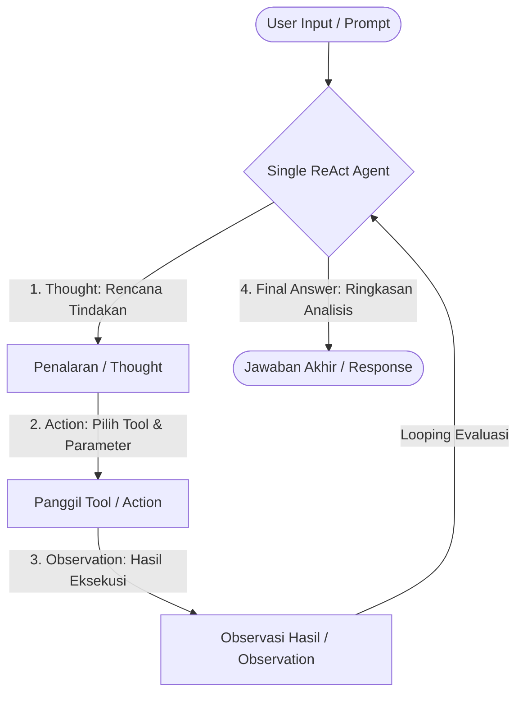
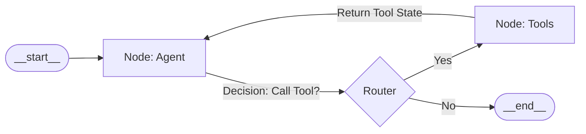
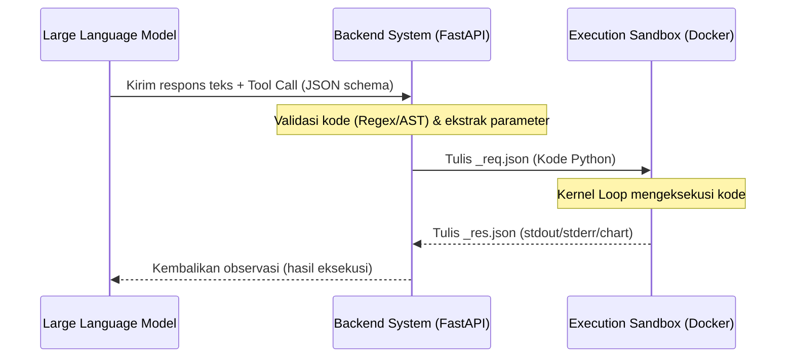
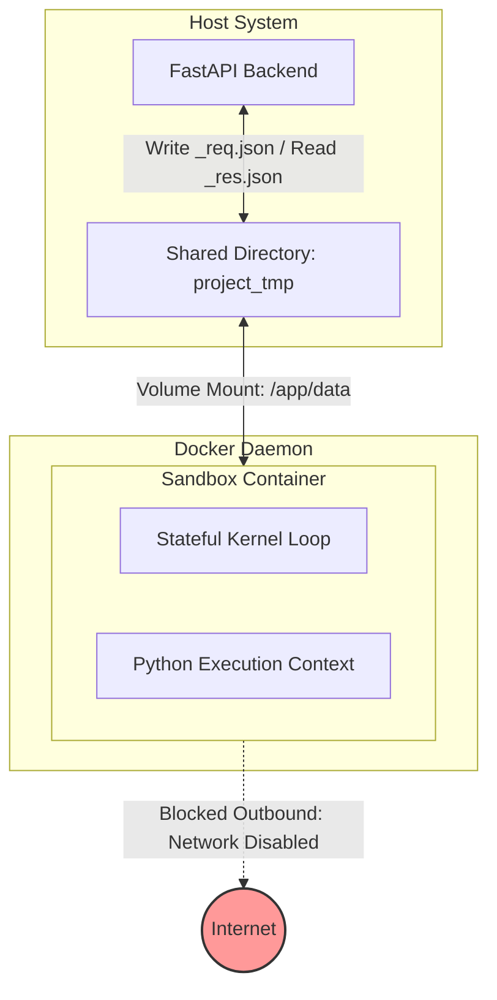

# BAB 2: TINJAUAN PUSTAKA

Bab ini membahas landasan teori dan tinjauan literatur yang mendasari pengembangan platform AI Data Analyst berbasis *single-agent* dengan *tool calling* dan *Python sandbox*. Pembahasan mencakup penelitian terdahulu yang relevan, teori analisis data, teori dasbor analitik, konsep arsitektur agen tunggal berbasis *Reasoning and Acting* (ReAct), kerangka orkestrasi kognitif menggunakan LangGraph, mekanisme pemanggilan alat (*tool calling*), pemrosesan analitik menggunakan DuckDB, serta aspek keamanan kontainer menggunakan teknologi Docker.

---

## 2.1 Penelitian Terdahulu

Penelitian mengenai otomatisasi analisis data dan agen kecerdasan buatan berbasis *Large Language Models* (LLM) telah berkembang pesat dalam beberapa tahun terakhir. Berbagai studi memfokuskan pada pemanggilan alat eksternal (*tool calling*), integrasi basis data analitik, serta mekanisme isolasi eksekusi kode demi keamanan. Matriks penelitian terdahulu pada Tabel 2.1 berikut menggambarkan perbandingan fokus penelitian, metodologi yang digunakan, serta kontribusi unik dari masing-masing literatur yang menjadi pijakan dalam penelitian ini.

### Tabel 2.1 Matriks Perbandingan Penelitian Terdahulu

| Peneliti & Tahun | Fokus Penelitian | Metodologi / Teknologi | Kelebihan & Hasil Utama | Relevansi dengan Sistem Analisai |
| :--- | :--- | :--- | :--- | :--- |
| **Febrian & Figueredo (2024)** | Otomatisasi analisis data keuangan dan regulasi | RAG + LangChain, *Prompt Engineering*, *Fine-tuning* | Meningkatkan akurasi pemahaman dokumen dari 35% menjadi 61% | Dasar integrasi LLM dengan LangChain dan evaluasi peningkatan akurasi |
| **Yao et al. (2023)** | Orkestrasi penalaran (*reasoning*) dan tindakan (*acting*) | Metode ReAct (*Reasoning and Acting*) pada LLM | Mengatasi masalah *hallucination* dan penumpukan kesalahan dalam penalaran | Konsep inti arsitektur agen tunggal yang mengevaluasi hasil *action* secara iteratif |
| **Schick et al. (2023)** | Kemampuan LLM dalam menggunakan alat eksternal | Model Toolformer, *self-supervised learning* | LLM dapat memutuskan secara otonom alat mana yang akan dipanggil dan parameternya | Landasan teori mekanisme pemanggilan *tool* (seperti eksekusi kode Python) oleh LLM |
| **Zhang, Shen, Lu & Zhuang (2023)** | Manajemen dataset tabular menggunakan agen LLM | Data-Copilot, pembangkitan kode dinamis | Mampu menjembatani dataset dengan pengguna melalui eksekusi kode otomatis | Dasar pengembangan *tool calling* analisis data tabular pada proyek ini |
| **Haq et al. (2024)** | Analisis keamanan infrastruktur Docker kontainer | Metode SoK (*Systematic of Knowledge*) Docker Security | Mengidentifikasi celah keamanan kontainer dan konfigurasi isolasi | Dasar implementasi *Docker Sandbox* terisolasi tanpa akses jaringan luar |
| **Bolanowski et al. (2022)** | Performa komunikasi microservices | Perbandingan efisiensi REST API dan gRPC | Memberikan metrik performa latensi dan *payload* pada komunikasi REST | Dasar perancangan REST API dan streaming SSE pada arsitektur server-side |

---

## 2.2 Analisis Data

Analisis data secara akademis merupakan proses inspeksi, pembersihan, transformasi, dan pemodelan data dengan tujuan menemukan informasi yang berguna, menginformasikan kesimpulan, serta mendukung pengambilan keputusan bisnis maupun operasional. Dalam konteks sistem analisis data otomatis berbasis kecerdasan buatan, proses ini diterjemahkan ke dalam beberapa tahapan komputasi yang terstruktur.

### 2.2.1 Data Cleaning
*Data cleaning* atau pembersihan data adalah langkah awal yang sangat krusial dalam siklus analisis data. Proses ini melibatkan deteksi, koreksi, atau penghapusan catatan yang tidak akurat, tidak lengkap, atau tidak konsisten dari dataset. Menurut Wickham, Çetinkaya-Rundel & Grolemund (2023) dalam konsep penyusunan dataset terstruktur, data yang kotor dapat menghambat proses analisis dan menghasilkan kesimpulan yang bias. Pembersihan data dalam sistem otomatis ini mencakup penanganan nilai yang hilang (*missing values*), deteksi data pencilan (*outliers*), penghapusan duplikasi, serta penyelarasan tipe data agar siap diproses lebih lanjut, sejalan dengan taksonomi pembersihan data modern (Chu, Ilyas, Krishnan & Wang, 2016).

### 2.2.2 Data Transformation
*Data transformation* atau transformasi data adalah proses mengubah format, struktur, atau nilai data agar lebih sesuai untuk kebutuhan analisis. Berdasarkan prinsip pengolahan data terstruktur (Wickham et al., 2023), transformasi ini mencakup operasi seperti penyaringan baris (*filtering*), pemilihan kolom (*selecting*), pengurutan data (*sorting*), penggabungan dataset (*joining*), pembuatan variabel baru (*feature engineering*), serta agregasi data. Transformasi data yang sistematis memastikan dataset berada dalam bentuk optimal sebelum divisualisasikan atau dimodelkan secara statistik.

### 2.2.3 Exploratory Data Analysis (EDA)
*Exploratory Data Analysis* (EDA) atau analisis data eksploratif adalah suatu pendekatan analisis dataset untuk merangkum karakteristik utamanya, yang sebagian besar menggunakan metode visual (McKinney, 2022). Tujuan utama EDA adalah untuk memahami struktur data secara mendalam, mendeteksi anomali, menguji hipotesis, dan memeriksa asumsi dasar sebelum melakukan pemodelan formal. Pendekatan analisis eksploratif menekankan pentingnya fleksibilitas dalam mengeksplorasi data tanpa dibatasi oleh model matematika yang kaku di awal, sehingga memungkinkan penemuan pola-pola tersembunyi secara otonom oleh analis (McKinney, 2022).

### 2.2.4 Data Visualization
*Data visualization* atau visualisasi data adalah representasi grafis dari informasi dan data dengan menggunakan elemen visual seperti grafik, bagan, dan peta. Visualisasi data bukan sekadar menampilkan angka dalam bentuk gambar, melainkan sebuah metode komunikasi untuk menyampaikan pesan penting di balik data (*storytelling with data*). Visualisasi yang efektif menerapkan prinsip-prinsip desain visual yang baik guna meminimalkan beban kognitif pengguna serta membantu mereka mengidentifikasi tren, pola, dan korelasi yang tidak terlihat secara langsung pada data mentah, dengan memanfaatkan representasi visual yang terstruktur (Wilke, 2019).

### 2.2.5 Statistical Summary
*Statistical summary* atau ringkasan statistik memberikan gambaran kuantitatif mengenai karakteristik utama dari dataset. Ini mencakup statistik deskriptif dasar seperti ukuran pemusatan data (rata-rata, median, modus), ukuran penyebaran data (standar deviasi, varians, jangkauan), nilai minimum dan maksimum, serta distribusi kuartil. Ringkasan statistik ini memberikan fondasi numerik awal bagi agen cerdas untuk memahami bentuk distribusi data sebelum melakukan analisis visual yang lebih spesifik.

---

## 2.3 Dashboard Analytics

Pengembangan sistem analisis data modern sering kali melibatkan penyajian informasi hasil analisis dalam bentuk dasbor interaktif. Teori mengenai *dashboard analytics* mencakup aspek penyusunan visual, interaktivitas, dan integrasinya dengan kebutuhan bisnis.

### 2.3.1 Definisi Dashboard
*Dashboard* adalah representasi visual dari informasi paling penting yang diperlukan untuk mencapai satu atau lebih sasaran, yang dikonsolidasikan dan diatur dalam satu layar tunggal sehingga informasi tersebut dapat dipantau sekilas oleh pengguna (Wexler, Shaffer & Cotgreave, 2017). Dasbor yang dirancang dengan baik harus mampu menyampaikan pesan utama secara cepat, akurat, dan intuitif tanpa membebani kognisi pengguna dengan elemen dekoratif yang tidak relevan, yang sering kali dijabarkan sebagai prinsip kesederhanaan visual dasbor (Sarikaya, Correll, Bartram, Tory & Fisher, 2019; Wexler et al., 2017).

### 2.3.2 KPI Visualization
Visualisasi *Key Performance Indicators* (KPI) merupakan inti dari fungsionalitas dasbor. KPI adalah metrik operasional maupun strategis yang digunakan untuk mengukur efektivitas organisasi dalam mencapai sasaran kerjanya. Menurut Wexler et al. (2017), visualisasi KPI yang efektif tidak hanya menampilkan nilai terkini, tetapi juga harus menyediakan konteks pembanding seperti target kerja, batas ambang batas (*threshold*), serta tren historis untuk mempermudah evaluasi kinerja secara objektif.

### 2.3.3 Interactive Dashboard
*Interactive dashboard* memberikan kebebasan bagi pengguna untuk mengeksplorasi data secara mandiri melalui manipulasi visual secara langsung. Fitur interaktivitas yang umum meliputi penyaringan data (*filtering*), penelusuran lebih dalam (*drill-down*), pengurutan variabel (*sorting*), serta kemampuan untuk mengubah jenis grafik secara dinamis. Interaktivitas ini sangat penting dalam analisis data eksploratif karena memungkinkan pengguna beralih dari pandangan makro (ringkasan eksekutif) ke pandangan mikro (detail transaksi) secara instan.

Dalam arsitektur platform analitik modern, interaktivitas tingkat tinggi ini dicapai dengan merepresentasikan komponen visual ke dalam berkas konfigurasi terstruktur seperti skema JSON. Skema ini dibaca oleh aplikasi frontend untuk merender grafik secara dinamis, sementara kueri analitik di sisi server maupun klien dieksekusi menggunakan mesin basis data analitik berkinerja tinggi (seperti DuckDB) untuk menghasilkan agregasi data instan tanpa membebani memori utama host.

### 2.3.4 Business Intelligence Dashboard
Dalam konteks organisasi, dasbor terintegrasi erat dengan sistem *Business Intelligence* (BI). Sharda, Delen & Turban (2020) membagi dasbor BI ke dalam tiga kategori utama berdasarkan target penggunanya:
1. **Dasbor Operasional**: Digunakan oleh staf teknis untuk memantau aktivitas harian dan metrik waktu nyata (*real-time*).
2. **Dasbor Taktis**: Digunakan oleh manajer untuk menganalisis proses bisnis, tren mingguan atau bulanan, dan membandingkan performa antar sub-unit.
3. **Dasbor Strategis**: Digunakan oleh jajaran eksekutif untuk memantau pencapaian visi jangka panjang organisasi dan metrik kesehatan bisnis secara menyeluruh.

---

## 2.4 Arsitektur Single-Agent ReAct

Pendekatan *Reasoning and Acting* (ReAct) mengintegrasikan kemampuan bernalar (*reasoning*) dan bertindak (*acting*) secara terpadu di dalam sebuah *Large Language Model* (LLM) (Yao, Zhao, Yu, Du, Shafran, Narasimhan & Cao, 2023). Melalui metode ReAct, LLM dapat menghasilkan langkah-langkah penalaran (*thought processes*) sebelum mengambil tindakan (*action*) berupa pemanggilan alat eksternal. Hasil eksekusi dari alat tersebut kemudian diumpankan kembali ke LLM sebagai observasi (*observation*), yang memicu siklus penalaran berikutnya.

Tidak seperti arsitektur *multi-agent* yang membagi tugas spesifik ke beberapa agen mandiri yang saling berkomunikasi, sistem ini menerapkan arsitektur *Single-Agent ReAct*. Seluruh logika—mulai dari deteksi niat pengguna (*intent detection*), perencanaan analisis, penulisan kode Python, hingga penulisan kesimpulan akhir—dipusatkan pada satu agen tunggal (Xi et al., 2025; Li et al., 2024). Arsitektur ini dipilih dengan pertimbangan utama sebagai berikut:
1. **Konsistensi Konteks**: Seluruh riwayat analisis dan hasil eksekusi *tool* tersimpan dalam satu *state* memori tunggal, meminimalkan risiko hilangnya informasi krusial saat perpindahan agen.
2. **Efisiensi Rute**: Menghilangkan *overhead* latensi komunikasi dan kompleksitas routing antar-agen yang sering ditemui pada sistem *multi-agent*.
3. **Iterasi Proses Penalaran**: Agen dapat mengevaluasi dan merencanakan kembali langkah berikutnya dalam satu alur percakapan yang berkelanjutan.

Siklus penalaran dan tindakan yang terjadi pada agen ReAct diilustrasikan secara detail pada Gambar 2.1.

**[Gambar 2.1: Diagram Alur Penalaran dan Tindakan Agen ReAct (Siklus Thought-Action-Observation)]**

---

## 2.5 Orkestrasi Alur Kerja Agen dengan LangGraph

LangChain menyediakan abstraksi untuk merangkai interaksi LLM dengan alat-alat eksternal secara linier. Namun, untuk sistem analisis data interaktif yang memerlukan logika siklik—seperti siklus ReAct yang berjalan berulang kali hingga hasil analisis ditemukan—diperlukan kerangka kerja orkestrasi yang lebih ekspresif. LangGraph digunakan sebagai mesin pengelola alur kerja kognitif (*cognitive architecture*) pada sistem ini untuk menstrukturkan memori, perencanaan, dan pemanggilan alat secara dinamis (Chase, 2023; Sumers, Yao, Narasimhan & Griffiths, 2024).

### 2.5.1 Directed Cyclic Graph (DCG) pada LangGraph
Berbeda dengan alat bantu *workflow* data tradisional (seperti Apache Airflow) yang dibatasi oleh aturan *Directed Acyclic Graph* (DAG), LangGraph secara eksplisit memodelkan hubungan antar-node sebagai graf terarah bersiklus atau *Directed Cyclic Graph* (DCG). Desain ini sangat krusial karena siklus interaksi antara node Agen dan node Alat (*Tools*) bersifat rekursif. Agen dapat memanggil alat eksekusi kode berkali-kali sampai LLM mendeteksi bahwa data telah siap diinterpretasikan. Alur graf terarah bersiklus pada sistem ini digambarkan pada Gambar 2.2.

**[Gambar 2.2: Contoh Visualisasi Alur Siklik (DCG) pada Node LangGraph]**

### 2.5.2 State Management
Orkestrasi pada LangGraph berbasis pada *State* terpusat yang didefinisikan sebagai skema data bersama (*shared schema*) antar seluruh node dalam graf. Setiap node direpresentasikan sebagai fungsi Python yang menerima *State* saat ini sebagai argumen dan mengembalikan pembaruan (*updates*) ke dalam *State* tersebut. Pengelolaan *State* ini menggunakan mekanisme *reducer*, yang mendefinisikan bagaimana nilai baru digabungkan dengan nilai yang sudah ada (misalnya, menambahkan pesan baru ke dalam riwayat percakapan tanpa menghapus pesan sebelumnya). Hal ini memastikan konsistensi data selama siklus eksekusi agen.

### 2.5.3 MemorySaver dan Durable Execution
Untuk mendukung interaksi multi-sesi dan ketahanan sistem, LangGraph menyediakan mekanisme checkpointer seperti `MemorySaver` (Chase, 2023). Checkpointer bertindak sebagai media penyimpanan status (*state store*) yang secara otomatis menyimpan cuplikan (*snapshot*) dari *State* graf pada setiap langkah eksekusi. 

Terdapat dua kategori utama checkpointer dalam ekosistem LangGraph:
1.  ***In-Memory Checkpointer* (`MemorySaver`)**: Menyimpan status grafik langsung di dalam memori RAM server. Pendekatan ini sangat efisien untuk melacak siklus langkah eksekusi agen cerdas (*thought-action-observation loop*) dalam satu giliran panggilan aktif (*active run*), namun datanya bersifat sementara (*volatile*) dan akan hilang apabila server dimatikan atau di-restart.
2.  ***Persistent Checkpointer* (seperti `PostgresSaver` atau database eksternal)**: Menyimpan status grafik secara fisik pada penyimpanan persisten untuk menjamin data tetap utuh dari kegagalan server total.

Mekanisme *checkpointing* ini mendukung *Durable Execution*, di mana jika terjadi gangguan koneksi atau kegagalan server di tengah proses analisis yang panjang, sistem dapat memulihkan status agen ke langkah terakhir yang sukses tanpa harus mengulang proses analisis dari awal. Hal ini juga memungkinkan sesi analisis data bersifat dapat diputar kembali (*replayable*). Pada sistem AnalisAI, persistensi jangka panjang untuk riwayat obrolan di luar siklus eksekusi agen didelegasikan kepada basis data Redis sebagai penyimpanan sesi utama.

### 2.5.4 Human-in-the-loop (HITL)
Salah satu fitur paling krusial dari LangGraph dalam konteks analisis data adalah dukungan bawaan untuk interaksi *Human-in-the-loop* (HITL). LangGraph memungkinkan graf untuk diinterupsi secara otonom sebelum node tertentu dijalankan (misalnya, sebelum mengeksekusi kode Python yang berpotensi memiliki biaya komputasi tinggi atau mengubah database). Selama interupsi, status agen ditangguhkan, dan kendali diberikan kepada pengguna untuk meninjau kode yang dihasilkan oleh LLM, memberikan persetujuan (*approval*), memberikan umpan balik (*feedback*), atau melakukan modifikasi langsung pada *State* sebelum proses dilanjutkan.

### 2.5.5 Perbandingan LangGraph dengan LangChain Konvensional
Untuk memperjelas keunggulan LangGraph dalam skenario agen analisis data, Tabel 2.2 menyajikan perbandingan fungsional antara LangChain konvensional dan LangGraph.

### Tabel 2.2 Perbandingan Fungsionalitas LangChain Konvensional dan LangGraph

| Dimensi Perbandingan | LangChain Konvensional | LangGraph |
| :--- | :--- | :--- |
| **Pola Alur Kerja** | Terbatas pada alur linier atau pohon keputusan searah (*Directed Acyclic Graph* / DAG) | Mendukung alur siklik rekursif secara asli (*Directed Cyclic Graph* / DCG) |
| **Manajemen State** | Stateless secara bawaan; membutuhkan logika eksternal yang kompleks untuk memelihara riwayat memori | Stateful dengan skema terpusat dan pembaruan otomatis menggunakan *reducer* |
| **Mekanisme Checkpointing** | Tidak ada dukungan bawaan untuk penyimpanan status pada setiap langkah eksekusi | Memiliki checkpointer bawaan (`MemorySaver`, PostgreSQL) untuk pemulihan kegagalan (*Durable Execution*) |
| **Human-in-the-loop (HITL)** | Sulit diimplementasikan; memerlukan pembuatan modul kustom untuk menangguhkan dan melanjutkan *chain* | Didukung penuh secara asli melalui fungsi *interrupt* dan modifikasi *State* secara dinamis |

Berdasarkan perbandingan pada Tabel 2.2, LangGraph dipilih karena menyediakan struktur data graf bersiklus yang mutlak diperlukan untuk siklus ReAct yang dinamis, serta memiliki fitur manajemen *state* persisten dan interupsi manusia yang terintegrasi secara modular, yang tidak dimiliki secara bawaan oleh LangChain konvensional.

---

## 2.6 Mekanisme Pemanggilan Alat (Tool Calling Mechanism)

*Large Language Model* memiliki keterbatasan mendasar dalam melakukan kalkulasi matematis yang presisi dan tidak memiliki akses langsung ke sistem file komputer. Mekanisme pemanggilan alat (*tool calling*) memecahkan masalah ini dengan melatih LLM untuk mengenali kapan harus mendelegasikan tugas ke program eksternal melalui keluaran terstruktur seperti skema JSON (Schick, Dwivedi-Yu, Dessì, Raileanu, Lomeli, Zettlemoyer, Cancedda & Scialom, 2023).

Dalam sistem asisten analis data ini, agen dilengkapi dengan 8 alat bantu utama yang didefinisikan secara deklaratif di dalam sistem backend. LLM mendeteksi parameter masukan yang dibutuhkan oleh masing-masing fungsi berdasarkan instruksi sistem:
- **python_repl_tool**: Mengirimkan skrip Python yang dihasilkan oleh LLM ke lingkungan eksekusi untuk pengolahan data menggunakan pustaka komputasi Pandas/Numpy.
- **read_data_tool**: Mengambil ringkasan struktur kolom, tipe data, serta nilai kosong dari berkas tabular secara teknik terstruktur sebelum analisis dimulai.
- **render_chart_tool**: Digunakan khusus untuk eksekusi visualisasi data analitik dan pembuatan grafik menggunakan pustaka Matplotlib atau Seaborn.
- **data_profile_tool**: Menghasilkan profil deskriptif lengkap (*profiling report*) berkas data secara otomatis dalam format berkas HTML.
- **file_export_tool**: Mengekspor konten teks hasil analisis ke berbagai berkas keluaran seperti Jupyter Notebook (ipynb), CSV, Excel (xlsx), JSON, Markdown (md), HTML, atau berkas teks.
- **download_dataset_tool**: Mengunduh berkas dataset dari sumber luar atau internet seperti Kaggle API hub atau tautan publik Google Sheets.
- **update_task_list_tool**: Memperbarui status kemajuan tugas (*to-do list*) di widget UI khusus pengguna agar proses analisis terpantau dinamis.
- **bash_tool**: Menjalankan perintah terminal atau shell dasar (seperti `ls`, `pwd`, atau `cat`) di dalam lingkungan sandbox untuk tujuan inspeksi struktur berkas.

Penerapan skema pemanggilan alat terstruktur ini sejalan dengan kerangka kerja penanganan data berbasis LLM yang diperkenalkan oleh Zhang et al. (2023) dalam Data-Copilot, yang menunjukkan bahwa efisiensi pemecahan masalah data meningkat secara signifikan ketika LLM difokuskan sebagai perencana, sementara eksekusi teknis didelegasikan ke modul eksternal yang stabil. Alur komunikasi terstruktur ini diilustrasikan secara detail pada Gambar 2.3.

**[Gambar 2.3: Alur Interaksi Komunikasi Tool Calling Terstruktur via JSON Payload]**

---

## 2.7 Pemrosesan Data Analitik dengan DuckDB

Eksplorasi data interaktif membutuhkan kecepatan komputasi query yang tinggi tanpa membebani memori utama sistem. Sistem ini mengintegrasikan **DuckDB**, sebuah sistem manajemen basis data relasional berbasis kolom (*column-oriented*) yang dirancang khusus untuk beban kerja pemrosesan analitik (*Analytical Processing* / OLAP).

DuckDB memberikan kemampuan eksekusi kueri SQL secara langsung terhadap berkas tabular (seperti CSV, Excel, Parquet, dan JSON) dengan latensi minimal. Berbeda dengan penelitian Kohn, Boncz & Raasveldt (2022) yang memperkenalkan DuckDB-Wasm untuk eksekusi langsung di dalam peramban (*client-side browser*), platform Analisai mengimplementasikan DuckDB pada sisi server (*server-side*). Hal ini dikonfigurasi guna menghindari keterbatasan memori pada perangkat pengguna dan mencegah transfer berkas dataset berukuran besar ke peramban, sehingga membantu meningkatkan efisiensi penggunaan lebar pita (*bandwidth*) jaringan serta menjaga kestabilan *render* frontend.

---

## 2.8 Keamanan dan Isolasi Eksekusi (Docker Sandbox)

Mengizinkan LLM menulis dan menjalankan kode Python secara otonom pada sistem utama menghadirkan risiko keamanan bagi sistem host. Kode yang dihasilkan secara tidak sengaja atau melalui teknik injeksi prompt berbahaya (*prompt injection*) dapat menghapus berkas sistem, mencuri data rahasia, atau mengeksploitasi jaringan host (Kang, Li, Stoica, Guestrin, Zaharia & Hashimoto, 2024). Oleh karena itu, penerapan isolasi eksekusi menggunakan lingkungan terisolasi (*sandbox*) sangat krusial untuk meminimalkan risiko keamanan sistem host.

Sistem *sandbox* pada proyek ini dibangun menggunakan kontainer Docker yang dikonfigurasi dengan kebijakan keamanan ketat berdasarkan kerangka kerja Docker Security (Dakic, 2025; Haq, Nguyen, Vollmer, Tosun, Korkmaz & Sadeghi, 2024):
1. **Isolasi Jaringan (Network Isolation)**: Kontainer dijalankan dengan opsi `network_disabled=True`. Kebijakan ini memutus koneksi internet dari dalam *sandbox*, meminimalkan risiko kebocoran data (*data exfiltration*) atau pengunduhan pustaka berbahaya dari luar selama kode dijalankan.
2. **Pembatasan Sumber Daya**: Memanfaatkan alokasi batas memori (RAM) maksimum sebesar 512 MB dan kuota penggunaan unit pemroses sentral (CPU) melalui pengaturan `mem_limit` dan `cpu_quota` pada Docker SDK. Hal ini dilakukan untuk meminimalkan potensi eksploitasi serangan *Denial of Service* (DoS) akibat *infinite loop* atau konsumsi memori tak terbatas (Dakic, 2025).
3. **Validasi Kode & AST**: Sebelum kode dikirim ke kontainer, backend melakukan penyaringan regex dan analisis sintaksis untuk memblokir impor pustaka sensitif (seperti `subprocess` atau fungsi tertentu dari modul `os`).

Desain arsitektur keamanan *sandbox* Docker terisolasi ini diilustrasikan pada Gambar 2.4.

**[Gambar 2.4: Desain Keamanan Arsitektur Sandbox Docker Terisolasi]**

---

## Referensi

1. Bolanowski, M., Zak, K., Paszkiewicz, A., Ganzha, M., Paprzycki, M., Sowinski, P., Lacalle, I., & Palau, C. E. (2022). Efficiency of REST and gRPC realizing communication tasks in microservice-based ecosystems. In *Proceedings of the 21st International Conference on Intelligent Software Methodologies, Tools, and Techniques (SoMeT 2022)*, 512-525. https://doi.org/10.3233/faia220242
2. Chase, H. (2023). LangChain. *GitHub Repository*. https://github.com/langchain-ai/langchain.
3. Chu, X., Ilyas, I. F., Krishnan, S., & Wang, J. (2016). Data Cleaning: Overview and Emerging Challenges. In *Proceedings of the 2016 International Conference on Management of Data (SIGMOD)*, 2201–2206. https://doi.org/10.1145/2882903.2912574
4. Dakic, V. (2025). The role of container security in application development. *Edelweiss Applied Science and Technology*, 9(1), 1243–1261. https://doi.org/10.55214/25768484.v9i1.4382
5. Febrian, G. F., & Figueredo, G. (2024). KemenkeuGPT: Leveraging a Large Language Model on Indonesia's Government Financial Data and Regulations to Enhance Decision Making. *arXiv preprint arXiv:2407.21459*. https://doi.org/10.48550/arXiv.2407.21459
6. Haq, M. S., Nguyen, T. D., Vollmer, F., Tosun, A. S., Korkmaz, T., & Sadeghi, A. R. (2024). SoK: A Comprehensive Analysis and Evaluation of Docker Container Attack and Defense Mechanisms. In *Proceedings of the IEEE Symposium on Security and Privacy (SP)*, 4573–4590. https://doi.org/10.1109/sp54263.2024.00268
7. Kang, D., Li, X., Stoica, I., Guestrin, C., Zaharia, M., & Hashimoto, T. (2024). Exploiting Programmatic Behavior of LLMs: Dual-Use Through Standard Security Attacks. In *Proceedings of the IEEE Security and Privacy Workshops (SPW)*, 123-134. https://doi.org/10.1109/spw63631.2024.00018
8. Kohn, M., Boncz, P., & Raasveldt, M. (2022). DuckDB-Wasm: Efficient Analytical Query Processing in the Browser. *Proceedings of the VLDB Endowment*, 15(12), 3562-3565. https://doi.org/10.14778/3554821.3554847
9. Li, Y., Wen, H., Wang, W., Li, X., Yuan, Y., Liu, G., Liu, J., Xu, W., Wang, X., Sun, Y., Kong, R., Wang, Y., Geng, H., Luan, J., Jin, X., Ye, Z., Xiong, G., Zhang, F., Li, X., Xu, M., Li, Z., Li, P., Liu, Y., Zhang, Y.-Q., & Liu, Y. (2024). Personal LLM agents: Insights and survey about the capability, efficiency and security. *arXiv preprint arXiv:2401.05459*. https://doi.org/10.48550/arXiv.2401.05459
10. McKinney, W. (2022). *Python for Data Analysis* (3rd ed.). O'Reilly Media.
11. Sarikaya, A., Correll, M., Bartram, L., Tory, M., & Fisher, D. (2019). What do we talk about when we talk about dashboards? *IEEE Transactions on Visualization and Computer Graphics*, 25(1), 682-692. https://doi.org/10.1109/tvcg.2018.2864903
12. Schick, T., Dwivedi-Yu, J., Dessì, R., Raileanu, R., Lomeli, M., Zettlemoyer, L., Cancedda, N., & Scialom, T. (2023). Toolformer: Language Models Can Teach Themselves to Use Tools. *arXiv preprint arXiv:2302.04761*. https://doi.org/10.48550/arXiv.2302.04761
13. Sharda, R., Delen, D., & Turban, E. (2020). *Analytics, Data Science, & Decision Support* (11th ed.). Pearson.
14. Sumers, T., Yao, S., Narasimhan, K., & Griffiths, T. L. (2024). Cognitive Architectures for Language Agents. *Transactions on Machine Learning Research*. https://doi.org/10.48550/arXiv.2309.02427
15. Wexler, S., Shaffer, J., & Cotgreave, A. (2017). *The Big Book of Dashboards: Visualizing Your Data Using Real-World Scenarios*. John Wiley & Sons.
16. Wickham, H., Çetinkaya-Rundel, M., & Grolemund, G. (2023). *R for Data Science* (2nd ed.). O'Reilly Media.
17. Wilke, C. O. (2019). *Fundamentals of data visualization: A primer on making informative and compelling figures*. O'Reilly Media. https://clauswilke.com/dataviz/index.html
18. Xi, Z. H., Chen, W. X., Guo, X., He, W., Ding, Y. W., Hong, B. Y., Zhang, M., Wang, J. Z., Jin, S. J., Zhou, E. Y., Zheng, R., Fan, X. R., Wang, X., Xiong, L. M., Zhou, Y. H., Wang, W. R., Jiang, C. H., Zou, Y. C., Liu, X. Y., Yin, Z. Y., Dou, S. H., Weng, R. X., Cheng, W. S., Zhang, Q., Qin, W. J., Zheng, Y. Y., Qiu, X. P., Huang, X. J., & Gui, T. (2025). The rise and potential of large language model based agents: a survey. *Science China Information Sciences*, 68(2), 121101. https://doi.org/10.1007/s11432-024-4222-0
19. Yao, S., Zhao, J., Yu, D., Du, N., Shafran, I., Narasimhan, K., & Cao, Y. (2023). ReAct: Synergizing Reasoning and Acting in Language Models. *ICLR 2023*. https://doi.org/10.48550/arXiv.2210.03629
20. Zhang, W., Shen, Y., Lu, W., & Zhuang, Y. (2023). Data-Copilot: Bridging Billions of Data and Humans with Language Models. *arXiv preprint arXiv:2306.07209*. https://doi.org/10.48550/arXiv.2306.07209
