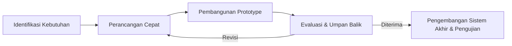
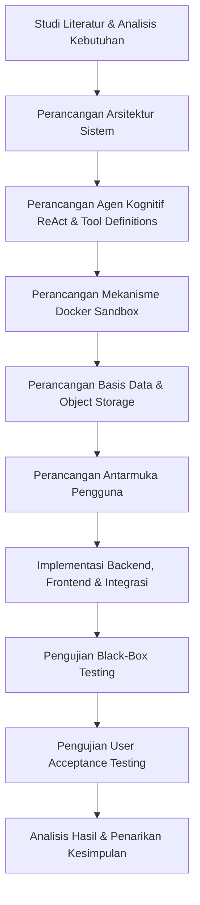
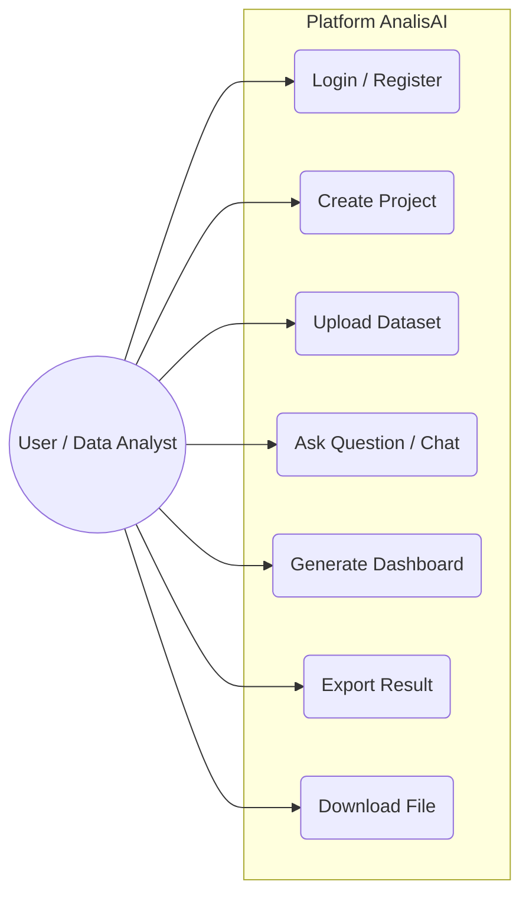
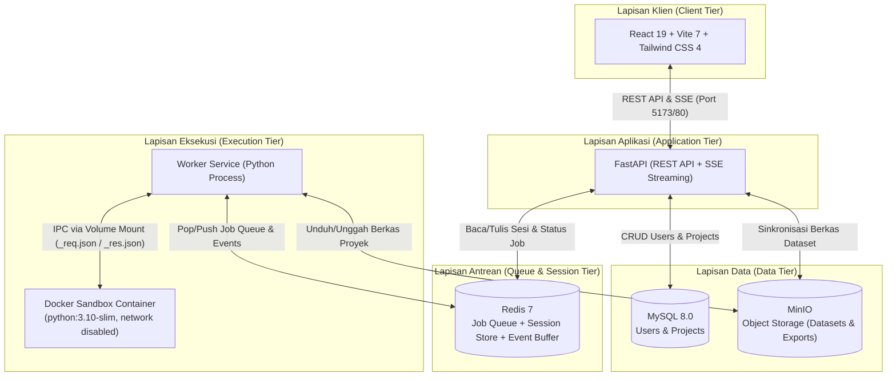
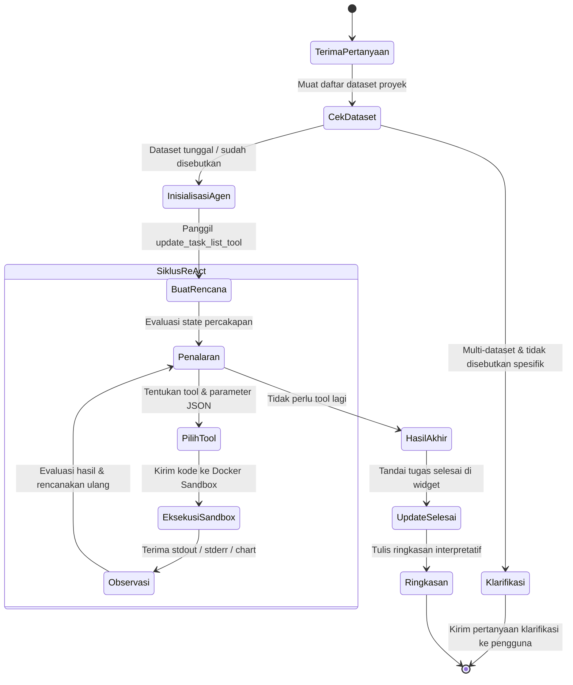
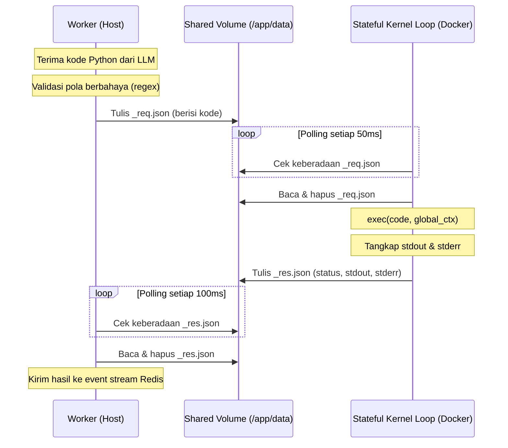
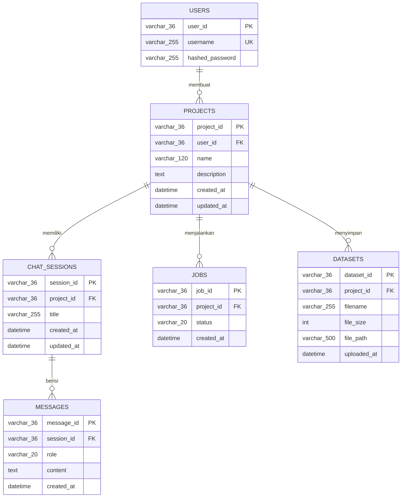
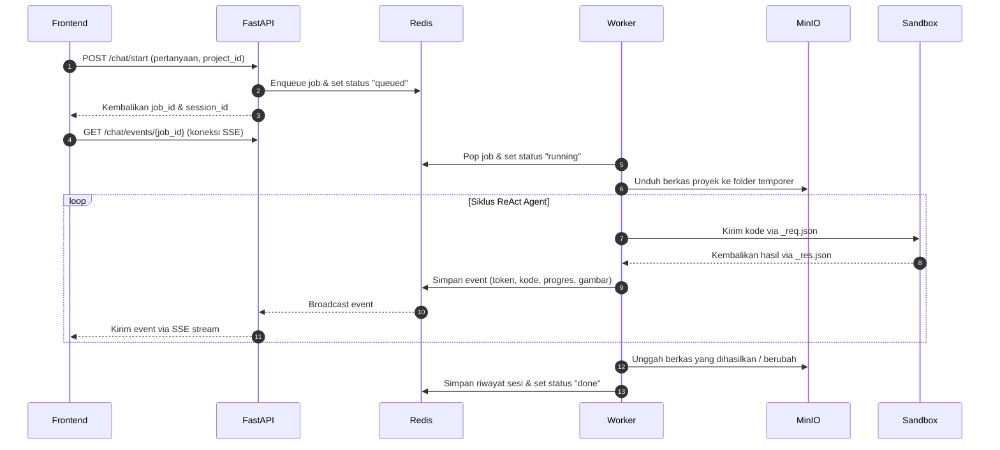
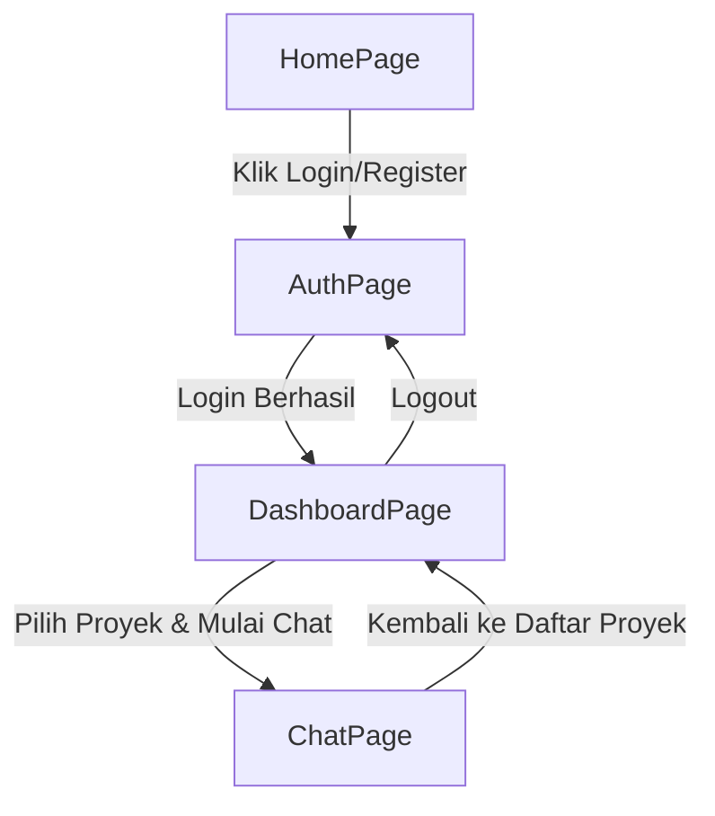

# BAB III

# METODE PENELITIAN

Bab ini menguraikan metode penelitian yang digunakan dalam pengembangan platform AnalisAI, mencakup prosedur implementasi, peralatan dan bahan yang dibutuhkan, tahapan penelitian secara rinci, perancangan arsitektur sistem, serta rencana pengujian dan evaluasi.

## 3.1 Metode Pengembangan Sistem

Penelitian ini mengadopsi model pengembangan **Prototype** sebagai prosedur implementasi utama. Model *Prototype* dipilih karena sifat sistem yang interaktif dan eksploratif, di mana kebutuhan pengguna terhadap fitur analisis data berbasis percakapan belum sepenuhnya dapat didefinisikan di awal. Melalui pendekatan ini, pengembangan dilakukan secara iteratif: purwarupa fungsional dibangun terlebih dahulu, kemudian dievaluasi dan disempurnakan berdasarkan umpan balik hingga menghasilkan sistem akhir yang memenuhi kebutuhan.

Tahapan model *Prototype* yang diterapkan dalam penelitian ini terdiri dari lima fase utama yang digambarkan pada Gambar 3.1:

**[Gambar 3.1: Diagram Alur Metode Pengembangan Prototype]**



Penjelasan setiap fase adalah sebagai berikut:
1. **Identifikasi Kebutuhan**: Menganalisis kebutuhan fungsional dan non-fungsional sistem berdasarkan rumusan masalah yang telah ditetapkan pada Bab I, yaitu bagaimana membangun platform analisis data otomatis berbasis *single-agent* dengan *tool calling* dan *Docker sandbox*.
2. **Perancangan Cepat**: Merancang arsitektur sistem secara garis besar, meliputi struktur komponen *backend*, *frontend*, mekanisme isolasi eksekusi kode, serta alur interaksi agen dengan pengguna.
3. **Pembangunan Prototype**: Mengimplementasikan purwarupa fungsional yang mencakup fitur-fitur inti seperti unggah dataset, percakapan analisis, eksekusi kode di *sandbox*, dan visualisasi data.
4. **Evaluasi dan Umpan Balik**: Menguji purwarupa untuk mendeteksi kekurangan, ketidaksesuaian, atau potensi perbaikan pada alur kerja agen, antarmuka pengguna, dan keamanan *sandbox*.
5. **Pengembangan Sistem Akhir dan Pengujian**: Menyempurnakan sistem berdasarkan hasil evaluasi, kemudian melaksanakan pengujian formal menggunakan metode *Black-Box Testing* dan *User Acceptance Testing* (UAT).

---

## 3.2 Peralatan dan Bahan Penelitian

### 3.2.1 Perangkat Keras
Pengembangan dan pengujian sistem dilakukan menggunakan spesifikasi perangkat keras berikut:

| Komponen | Spesifikasi |
|---|---|
| Prosesor | Intel / AMD (minimal 4 core) |
| Memori (RAM) | Minimal 8 GB |
| Penyimpanan | SSD minimal 50 GB (untuk Docker images dan dataset) |
| Koneksi Internet | Diperlukan untuk akses API LLM dan unduh dependensi |

### 3.2.2 Perangkat Lunak
Perangkat lunak yang digunakan dalam penelitian ini terbagi menjadi tiga kategori, yaitu infrastruktur (Tabel 3.1), *backend* (Tabel 3.2), dan *frontend* (Tabel 3.3).

**Tabel 3.1 Perangkat Lunak Infrastruktur**

| Perangkat Lunak | Versi | Fungsi |
|---|---|---|
| Docker & Docker Compose | 24.x / 2.x | Orkestrasi kontainer untuk seluruh layanan (MySQL, Redis, MinIO, Sandbox, Nginx) |
| MySQL | 8.0 | Basis data relasional untuk penyimpanan metadata pengguna dan proyek |
| Redis | 7 (Alpine) | Penyimpanan sesi, antrean pekerjaan (*job queue*), dan *buffer* event SSE |
| MinIO | Latest | Penyimpanan objek (*object storage*) untuk berkas dataset dan hasil ekspor per proyek |
| Nginx | Stable | *Reverse proxy* untuk mengarahkan lalu lintas HTTP ke API dan frontend |

**Tabel 3.2 Perangkat Lunak Backend**

| Pustaka / Framework | Versi | Fungsi |
|---|---|---|
| Python | 3.10+ | Bahasa pemrograman utama sisi server |
| FastAPI | 0.115.6 | *Framework* REST API dan *Server-Sent Events* (SSE) |
| LangChain Core | 0.3.28 | Abstraksi interaksi LLM dan definisi *tool* |
| LangChain OpenAI | 0.2.14 | Klien LLM untuk penyedia API kompatibel OpenAI (SumoPod) |
| LangGraph | 0.2.60 | Orkestrasi agen ReAct berbasis graf siklik (*Directed Cyclic Graph*) |
| SQLAlchemy | 2.0.36 | *Object-Relational Mapping* (ORM) untuk MySQL |
| Docker SDK (Python) | 7.1.0 | Pengelolaan siklus hidup kontainer *sandbox* secara programatik |
| DuckDB | 1.1.3 | Mesin kueri SQL analitik untuk pemrosesan data tabular *server-side* |
| Pandas | 2.2.3 | Pustaka manipulasi dan analisis data tabular |
| Matplotlib / Seaborn | 3.9.2 / 0.13.2 | Pustaka visualisasi data untuk pembuatan grafik |
| bcrypt | 4.2.1 | Algoritma *hashing* kata sandi pengguna |
| python-jose | 3.3.0 | Pembuatan dan verifikasi *JSON Web Token* (JWT) |

**Tabel 3.3 Perangkat Lunak Frontend**

| Pustaka / Framework | Versi | Fungsi |
|---|---|---|
| React | 19.x | Pustaka antarmuka pengguna berbasis komponen |
| Vite | 7.x | *Build tool* dan *development server* |
| Tailwind CSS | 4.x | *Framework* utilitas CSS untuk *styling* responsif |
| Chart.js | 4.5.x | Pustaka *rendering* grafik interaktif pada *dashboard* |
| AG Grid | 35.x | Komponen tabel data interaktif dengan fitur *sorting* dan *filtering* |
| React Router | 7.x | Navigasi halaman berbasis rute (*client-side routing*) |
| Framer Motion | 12.x | Pustaka animasi dan transisi antarmuka |
| Axios | 1.13.x | Klien HTTP dengan *interceptor* JWT otomatis |

### 3.2.3 Bahan Penelitian (Data)

Bahan utama penelitian ini adalah berkas dataset tabular dalam format CSV, Excel (.xlsx, .xls), JSON, dan Parquet. Karakteristik dari masing-masing dataset pengujian dirinci pada Tabel 3.4. Untuk memvalidasi fungsionalitas dan kinerja sistem AnalisAI, proses pengujian dilakukan secara khusus menggunakan dua dataset publik dari repositori Kaggle yang merepresentasikan skenario analisis dunia nyata:

**Tabel 3.4 Karakteristik Dataset Pengujian**

| Nama Dataset | Jumlah Baris | Jumlah Kolom | Ukuran Berkas | Sumber |
|---|---|---|---|---|
| **Retail Sales Dataset** | 1.000 | 9 | ~60 KB | Kaggle (mohammadtalib786) |
| **Used Car Dataset (Ford)** | 17.965 | 9 | ~1,2 MB | Kaggle (adityadesai13) |

1. **Retail Sales Dataset** (https://www.kaggle.com/datasets/mohammadtalib786/retail-sales-dataset)  
   Dataset ini berisi data transaksi ritel sebanyak 1.000 baris dengan atribut meliputi `Transaction ID`, `Date`, `Customer ID`, `Gender`, `Age`, `Product Category`, `Quantity`, `Price per Unit`, dan `Total Amount`. Dataset ini digunakan untuk menguji fungsionalitas AnalisAI dalam mengeksekusi analisis statistik deskriptif transaksi ritel, visualisasi distribusi demografi pelanggan (seperti histogram usia dan perbandingan gender), serta analisis deret waktu (*time-series*) transaksi ritel bulanan.
    
2. **Used Car Dataset (Ford and Mercedes)** (https://www.kaggle.com/datasets/adityadesai13/used-car-dataset-ford-and-mercedes)  
   Dataset ini berisi 17.965 data transaksi penjualan mobil bekas (khususnya pabrikan Ford) dengan kolom-kolom seperti `model` (model mobil), `year` (tahun pembuatan), `price` (harga jual), `transmission` (tipe transmisi), `mileage` (jarak tempuh), `fuelType` (jenis bahan bakar), `tax` (pajak kendaraan), `mpg` (konsumsi bahan bakar), dan `engineSize` (kapasitas mesin). Dataset ini digunakan untuk menguji performa AnalisAI dalam menangani data dengan pengelompokan kategorikal yang kompleks, pembersihan data pencilan (*outliers*), dan analisis korelasi multivariat (seperti pengaruh jarak tempuh dan kapasitas mesin terhadap harga jual mobil bekas).

Selain berkas lokal, sistem juga mendukung pengunduhan dataset langsung dari internet melalui URL publik dan integrasi ekspor otomatis Google Sheets ke CSV menggunakan modul `download_dataset_tool`.

---

## 3.3 Tahapan Penelitian

Keseluruhan tahapan penelitian dirangkum dalam diagram alur yang menggambarkan urutan proses dari analisis kebutuhan hingga penarikan kesimpulan pada Gambar 3.2:

**[Gambar 3.2: Bagan Alur Tahapan Penelitian]**



Penjelasan masing-masing tahapan diuraikan pada sub-bab berikut.

### 3.3.1 Studi Literatur dan Analisis Kebutuhan
Tahap awal penelitian dilakukan dengan mempelajari literatur terkait arsitektur agen berbasis LLM, mekanisme *tool calling*, kerangka kerja LangGraph, serta prinsip isolasi eksekusi kode menggunakan Docker. Hasil studi literatur ini telah diuraikan pada Bab II. Berdasarkan kajian tersebut, kebutuhan sistem diidentifikasi dan dirumuskan sebagai berikut:

**a. Kebutuhan Fungsional**
1. Sistem menyediakan fitur registrasi dan autentikasi pengguna menggunakan JWT (*access token* dan *refresh token*).
2. Pengguna dapat membuat, mengelola, dan menghapus ruang proyek yang masing-masing memiliki dataset dan riwayat sesi percakapan terpisah.
3. Pengguna dapat mengunggah berkas dataset tabular (CSV, XLSX, XLS, JSON, Parquet) atau memberikan tautan URL untuk diunduh otomatis oleh sistem.
4. Pengguna dapat mengajukan pertanyaan analisis data menggunakan bahasa alami, dan sistem mengeksekusi analisis secara otomatis melalui agen tunggal berbasis ReAct.
5. Sistem mampu menghasilkan visualisasi data (grafik *bar*, *line*, *scatter*, *pie*, *heatmap*, *histogram*, dan lainnya) secara otomatis berdasarkan permintaan pengguna.
6. Sistem mampu menghasilkan laporan profiling deskriptif berformat HTML secara otomatis.
7. Sistem mampu menghasilkan *dashboard* interaktif dengan grafik, tabel, dan filter berbasis kueri SQL DuckDB.
8. Pengguna dapat mengekspor hasil analisis ke berbagai format berkas (Jupyter Notebook, CSV, XLSX, JSON, Markdown, HTML).
9. Sistem menyediakan *widget* daftar tugas (*task list*) yang menampilkan rencana kerja dan progres agen secara *real-time*.
10. Sistem mendukung klarifikasi otomatis ketika terdapat beberapa dataset dalam satu proyek dan pengguna tidak menyebutkan dataset tertentu.

**b. Kebutuhan Non-Fungsional**
1. **Keamanan**: Seluruh kode Python yang dihasilkan LLM dieksekusi di dalam kontainer Docker terisolasi tanpa akses jaringan (*network disabled*), dengan pembatasan memori maksimal 512 MB dan *timeout* eksekusi 120 detik.
2. **Responsivitas**: Respons agen dikirimkan secara *streaming* menggunakan protokol *Server-Sent Events* (SSE) agar pengguna dapat melihat token teks, log progres, dan grafik secara *real-time*.
3. **Skalabilitas**: Pemrosesan pekerjaan analisis dilakukan secara asinkron melalui antrean Redis, memungkinkan penambahan jumlah *worker* secara horizontal.
4. **Ketahanan**: Kegagalan jaringan atau penyegaran halaman (*refresh*) tidak membatalkan analisis yang sedang berjalan; pengguna dapat terhubung kembali dan membaca ulang *buffer* event dari Redis.

**c. Use Case Diagram Sistem**

Rancangan interaksi antara aktor (pengguna) dengan fungsionalitas sistem dimodelkan melalui Use Case Diagram yang digambarkan pada Gambar 3.3:

**[Gambar 3.3: Use Case Diagram Platform AnalisAI]**



Aktor utama dalam sistem AnalisAI adalah *User* (yang bertindak sebagai peneliti atau analis data). Fungsionalitas atau *use case* yang dapat diakses oleh aktor tersebut didefinisikan sebagai berikut:
1. **Login / Register**: Pengguna mendaftarkan akun baru atau masuk ke sistem untuk mendapatkan token akses JWT.
2. **Create Project**: Pengguna membuat ruang proyek baru untuk mengelompokkan analisis dan dataset.
3. **Upload Dataset**: Pengguna mengunggah satu atau lebih berkas dataset tabular (CSV, Excel, dll.) ke proyek.
4. **Ask Question (Chat)**: Pengguna melakukan percakapan interaktif menggunakan bahasa alami untuk menanyakan analisis data, di mana sistem akan menerjemahkan menjadi kode Python dan menjalankannya.
5. **Generate Dashboard**: Pengguna meminta visualisasi berupa dashboard analitik interaktif berbasis kueri SQL DuckDB.
6. **Export Result**: Pengguna mengekspor log analisis, ringkasan interpretasi, kode, dan notebook hasil komputasi.
7. **Download File**: Pengguna mengunduh hasil ekspor berkas analisis (seperti file .ipynb atau visualisasi grafik PNG).

### 3.3.2 Perancangan Arsitektur Sistem
Arsitektur sistem dirancang secara terdistribusi dengan pemisahan tanggung jawab ke dalam beberapa lapisan layanan, sebagaimana diilustrasikan pada Gambar 3.4. Seluruh layanan tersebut diorkestrasi menggunakan Docker Compose.

**[Gambar 3.4: Diagram Arsitektur Sistem AnalisAI]**



Deskripsi fungsi masing-masing komponen:
- **Frontend (React 19)**: Antarmuka pengguna berbasis web yang menyediakan halaman autentikasi, manajemen proyek, obrolan analisis, dan tampilan *dashboard* interaktif.
- **FastAPI Backend**: Gerbang API (*API Gateway*) yang menangani autentikasi JWT, manajemen proyek, unggah dataset, dan penerimaan permintaan analisis. Backend mendorong pekerjaan ke antrean Redis dan menyalurkan *event stream* SSE ke klien.
- **Redis**: Bertindak sebagai *message broker* dan penyimpanan sementara. Redis menyimpan antrean pekerjaan (`queue:jobs`), status pekerjaan, *buffer* event SSE, dan riwayat sesi percakapan.
- **Worker Service**: Proses *background* yang secara kontinu mengambil pekerjaan dari antrean Redis, mengunduh berkas proyek dari MinIO, menjalankan agen ReAct, dan mengunggah kembali berkas hasil ke MinIO.
- **Docker Sandbox**: Kontainer terisolasi berbasis `python:3.10-slim` yang menjalankan *stateful kernel loop* untuk mengeksekusi kode Python yang dihasilkan LLM. Jaringan dinonaktifkan dan sumber daya dibatasi.
- **MySQL 8.0**: Basis data relasional yang menyimpan informasi akun pengguna dan metadata proyek.
- **MinIO**: Penyimpanan objek yang berfungsi sebagai *persistent storage* untuk dataset pengguna dan berkas hasil ekspor, diorganisasi per `user_id/project_id`.

### 3.3.3 Perancangan Agen Kognitif (ReAct Agent Design)
Agen kognitif dirancang menggunakan metode ReAct (*Reasoning and Acting*) yang diorkestrasi oleh LangGraph. Agen merupakan agen tunggal (*single-agent*) yang dilengkapi dengan 8 definisi alat (*tools*) dan dibuat menggunakan fungsi `create_react_agent` dari pustaka LangGraph. Alur keputusan agen ReAct digambarkan pada Gambar 3.5.

**[Gambar 3.5: Diagram Alur Keputusan Agen ReAct]**



Alur keputusan agen dimulai dengan memeriksa jumlah dataset dalam proyek. Jika terdapat lebih dari satu dataset dan pengguna tidak menyebutkan nama berkas tertentu, agen akan mengirimkan pertanyaan klarifikasi pilihan ganda yang dihasilkan secara dinamis oleh LLM. Setelah konteks dataset jelas, agen memasuki siklus ReAct: melakukan penalaran (*thought*), memilih alat yang tepat (*action*), mengeksekusi alat tersebut, dan mengamati hasilnya (*observation*). Siklus ini berulang hingga agen menilai bahwa analisis telah cukup untuk menjawab pertanyaan pengguna.

Spesifikasi 8 alat bantu (*tools*) agen dirangkum pada Tabel 3.5:

**Tabel 3.5 Spesifikasi Tool Definitions Agen**

| Nama Tool | Parameter Masukan | Fungsi |
|---|---|---|
| `read_data_tool` | `filename`, `n_rows` | Membaca struktur kolom, tipe data, dan baris awal dataset |
| `python_repl_tool` | `code` | Mengeksekusi kode Python/Pandas/SQL di dalam Docker Sandbox |
| `render_chart_tool` | `code`, `filename` | Merender grafik Matplotlib/Seaborn dan menyimpannya sebagai PNG |
| `data_profile_tool` | `filename` | Menghasilkan laporan profiling HTML deskriptif otomatis |
| `file_export_tool` | `content`, `filename`, `format` | Mengekspor hasil ke berkas (ipynb, csv, xlsx, json, md, html, txt, py) |
| `bash_tool` | `command` | Menjalankan perintah shell terbatas (ls, cp, mv, rm, head, dll.) |
| `download_dataset_tool` | `url`, `filename` | Mengunduh dataset dari URL publik, Google Sheets, atau Kaggle |
| `update_task_list_tool` | `tasks`, `completed_indices` | Memperbarui daftar rencana kerja pada widget UI secara *real-time* |

**c. Rancangan Instruksi Kognitif (System Prompt)**

Untuk memastikan agen otonom ReAct bertindak sesuai batas-batas fungsionalitas dan keamanan yang ditetapkan, dirancang instruksi kognitif utama (*system prompt*). *System prompt* ini bertindak sebagai pemandu penalaran (*reasoning guideline*) LLM yang menyusun logika pengambilan tindakan (*acting*). Rancangan *system prompt* AnalisAI terbagi menjadi lima komponen arsitektur utama:
1. **Definisi Identitas (Role Definition)**: Menetapkan peran agen sebagai "AnalisAI, AI Data Analyst ahli" yang berfokus penuh pada *Exploratory Data Analysis* (EDA), prapemrosesan data, dan visualisasi tabular. Poin ini juga memuat larangan keras pembuatan model *machine learning* untuk menjaga fokus fungsional sistem.
2. **Definisi Alat Bantu (Tool Guidelines)**: Petunjuk presisi mengenai kapan dan bagaimana masing-masing dari 8 alat bantu wajib dipanggil (misalnya: mewajibkan pemanggilan `read_data_tool` di awal percakapan, melarang penggunaan `python_repl_tool` untuk rendering grafik, serta mengharuskan koordinasi tugas dengan `update_task_list_tool`).
3. **Konfigurasi Dasbor Interaktif (Dashboard JSON Schema)**: Struktur format keluaran JSON spesifik untuk berkas `dashboard.json` ketika pengguna meminta dasbor. Skema ini melarang penyertaan data statis dan mewajibkan penulisan kueri SQL DuckDB yang bersih tanpa simbol backtick (`).
4. **Aturan Keamanan dan Batasan Sistem**: Instruksi tegas untuk memblokir pemanggilan fungsi instalasi dependensi (`pip install`), melarang penggunaan perintah OS berbahaya, serta mewajibkan penulisan berkas keluaran secara eksklusif ke subfolder `/app/data/exports/`.
5. **Disiplin Keluaran (Output Formatting)**: Mengatur tata bahasa (100% formal Bahasa Indonesia), melarang penyebutan path internal teknis atau nama modul internal kepada pengguna, dan menuntut penulisan ringkasan interpretatif yang berorientasi pada wawasan tindakan (*actionable insights*) setelah eksekusi kode.

### 3.3.4 Perancangan Mekanisme Docker Sandbox
Mekanisme *sandbox* dirancang untuk memisahkan eksekusi kode Python yang ditulis LLM dari sistem *host*. Komunikasi antara *worker* di sisi *host* dan *kernel* Python di dalam kontainer dilakukan secara asinkron melalui berkas JSON pada direktori bersama (*shared volume*), sebagaimana digambarkan pada Gambar 3.6.

**[Gambar 3.6: Diagram Sekuensial Komunikasi IPC Sandbox]**



Kontainer *sandbox* dibangun dari *image* `python:3.10-slim` yang telah dilengkapi dengan pustaka ilmu data (Pandas, NumPy, Matplotlib, Seaborn, Scikit-learn, dan lainnya). Konfigurasi keamanan kontainer meliputi:
- **Isolasi Jaringan**: `network_disabled=True` pada Docker SDK, memutus seluruh koneksi keluar dari kontainer.
- **Batas Memori**: `mem_limit=512m`, membatasi alokasi RAM kontainer maksimal 512 MB.
- **Kuota CPU**: `cpu_quota=100000`, membatasi penggunaan CPU setara 1 *core*.
- **Batas Waktu**: Eksekusi kode dibatasi maksimal 120 detik sebelum dianggap *timeout*.
- **Validasi Kode**: Sebelum dikirim ke kontainer, kode difilter menggunakan pola *regex* untuk memblokir pemanggilan modul berbahaya seperti `os.system`, `subprocess`, `__import__`, serta akses ke `__builtins__`.
- **Auto-Cleanup**: Kontainer dikonfigurasi dengan `auto_remove=True` dan memiliki mekanisme *idle timeout* selama 10 menit untuk mencegah kontainer *zombie*.

#### 3.3.5 Perancangan Basis Data dan Penyimpanan

Sistem AnalisAI mengimplementasikan **Arsitektur Penyimpanan Hybrid** (*hybrid storage architecture*) dengan mengombinasikan basis data relasional (MySQL), basis data *key-value in-memory* (Redis), dan *object storage* (MinIO). Pembagian ini dirancang secara khusus untuk mengakomodasi kebutuhan penyimpanan data terstruktur, manajemen sesi obrolan waktu-nyata berfrekuensi tinggi, antrean pekerjaan, serta penyimpanan berkas dataset berukuran besar secara aman.

**a. Perancangan Skema Data Konseptual (Entity Relationship Diagram - ERD)**

Untuk memodelkan seluruh data yang mengalir dan disimpan dalam sistem secara menyeluruh, dirancang sebuah *Entity Relationship Diagram* (ERD) konseptual. ERD ini memodelkan hubungan logis dari semua entitas sistem, termasuk yang disimpan secara fisik pada basis data relasional maupun non-relasional. Skema ERD konseptual sistem AnalisAI digambarkan pada Gambar 3.7.

**[Gambar 3.7: Entity Relationship Diagram (ERD) Konseptual Sistem AnalisAI]**



Hubungan antar-entitas logis pada diagram di atas dijelaskan sebagai berikut:
1. Hubungan antara `USERS` dan `PROJECTS` adalah satu-ke-banyak (*one-to-many*), di mana satu pengguna dapat membuat banyak proyek analisis, namun satu proyek hanya dimiliki oleh satu pengguna.
2. Hubungan antara `PROJECTS` dan `CHAT_SESSIONS` adalah satu-ke-banyak (*one-to-many*), di mana satu proyek dapat memiliki banyak sesi obrolan untuk memisahkan topik analisis, namun satu sesi obrolan hanya merujuk pada satu proyek spesifik.
3. Hubungan antara `CHAT_SESSIONS` dan `MESSAGES` adalah satu-ke-banyak (*one-to-many*), di mana satu sesi obrolan berisi banyak pesan tanya-jawab antara pengguna (*user*) dan agen (*assistant*), namun sebuah pesan hanya merupakan bagian dari satu sesi obrolan.
4. Hubungan antara `PROJECTS` dan `JOBS` adalah satu-ke-banyak (*one-to-many*), di mana satu proyek dapat menjalankan banyak pekerjaan komputasi asinkron (*background job*) baik yang sedang aktif maupun yang telah selesai, namun sebuah pekerjaan hanya terafiliasi pada satu proyek.
5. Hubungan antara `PROJECTS` dan `DATASETS` adalah satu-ke-banyak (*one-to-many*), di mana satu proyek dapat menampung banyak berkas dataset tabular untuk dianalisis, namun satu berkas dataset hanya terdaftar pada satu proyek tertentu.

**b. Pemetaan Entitas Konseptual ke Penyimpanan Fisik**

Meskipun seluruh entitas terhubung secara logis dalam ERD konseptual, implementasi fisiknya dipisahkan ke dalam tiga jenis teknologi penyimpanan yang berbeda demi performa dan isolasi keamanan. Pemetaan entitas logis ke penyimpanan fisik beserta fungsinya dirangkum pada Tabel 3.6.

**Tabel 3.6 Pemetaan Entitas Logis ke Penyimpanan Fisik**

| Entitas Logis | Media Penyimpanan Fisik | Tipe / Driver | Justifikasi Teknis Utama |
|---|---|---|---|
| `USERS` | MySQL | Tabel Relasional (`users`) | Autentikasi dan kredensial memerlukan jaminan transaksi ACID yang kuat dan pengecekan keunikan *username*. |
| `PROJECTS` | MySQL | Tabel Relasional (`projects`) | Metadata proyek bersifat terstruktur dan memiliki relasi referensial *foreign key* yang kuat dengan akun pengguna. |
| `CHAT_SESSIONS` | Redis | Hash (`sess:{user_id}:{project_id}:{session_id}`) | Memerlukan akses baca-tulis berlatensi sangat rendah untuk pemuatan riwayat sesi yang cepat di sisi antarmuka. |
| `MESSAGES` | Redis | JSON string ter-serialize dalam Hash | Aliran token pesan dari LLM sangat intensif. Penyimpanan di Redis mencegah bottleneck I/O pada disk database relasional. |
| `JOBS` | Redis | List & String (`job:{job_id}`, `queue:jobs`) | Status pekerjaan asinkron dan antrean antarmuka dikelola secara in-memory untuk mendukung *worker queue* FIFO yang responsif. |
| `DATASETS` | MinIO | Object Storage (`ai-datasets/{user_id}/{project_id}`) | Berkas tabular biner berukuran besar (CSV, Excel) disimpan sebagai objek fisik untuk menghindari penumpukan ukuran database (*database bloat*). |

**c. Struktur Penyimpanan Sesi dan Obrolan Sementara (Redis)**

Seluruh riwayat sesi percakapan (*chat session*), daftar pesan obrolan (*messages*), status pekerjaan asinkron (*jobs status*), dan penyangga event SSE (*SSE event buffer*) disimpan secara terstruktur di dalam Redis. Pembagian tipe data dan pola kunci (*key*) Redis dirinci pada Tabel 3.7.

**Tabel 3.7 Skema Struktur Kunci dan Tipe Data Redis**

| Pola Kunci Redis | Tipe Data | Atribut Field / Anggota | Deskripsi Fungsi |
|---|---|---|---|
| `sess:{user_id}:{project_id}:{session_id}` | Hash | `title`, `created_at`, `updated_at`, `messages_json` | Menyimpan metadata sesi obrolan dan daftar pesan percakapan (dalam format JSON ter-serialize) |
| `sessidx:{user_id}:{project_id}` | Sorted Set | Member: `session_id`<br/>Score: `updated_at_timestamp` | Indeks daftar sesi percakapan pengguna per proyek, diurutkan dari yang terbaru |
| `job:{user_id}:{job_id}:status` | String | Value: `"queued"` \| `"running"` \| `"done"` \| `"error"` | Status pengerjaan analisis asinkron oleh worker |
| `job:{user_id}:{job_id}:events` | List | Value: JSON string (log progress, token teks, grafik PNG) | Penyangga (*buffer*) event streaming agen untuk mendukung fitur reconnect jika halaman web dimuat ulang |
| `active:{user_id}:{session_id}` | String | Value: JSON string `{job_id, question}` | Penanda jika sesi obrolan sedang menjalankan proses komputasi aktif |
| `queue:jobs` | List | Value: JSON payload pekerjaan | Antrean pekerjaan FIFO (*First-In, First-Out*) untuk diproses secara asinkron oleh worker pool |

**d. Struktur Object Storage (MinIO)**

MinIO digunakan untuk menyimpan berkas tidak terstruktur berukuran besar (*large objects*) seperti berkas dataset tabular mentah yang diunggah oleh pengguna dan berkas keluaran hasil ekspor dari sistem AnalisAI. Hierarki bucket penyimpanannya dirancang terisolasi per pengguna dan proyek seperti skema berikut:

```
ai-datasets/                   <-- Nama Bucket Utama
└── {user_id}/                 <-- Folder Identitas Pengguna
    └── {project_id}/           <-- Folder Proyek Pengguna
        ├── dataset_1.csv      <-- Berkas Dataset Ritel
        ├── dataset_2.xlsx     <-- Berkas Dataset Mobil Bekas
        └── exports/           <-- Subfolder Hasil Analisis Agen
            ├── notebooks.ipynb <-- Hasil Ekspor Jupyter Notebook
            └── dashboard.json <-- Skema Dasbor Interaktif
```

**e. Justifikasi Penggunaan Arsitektur Penyimpanan Hybrid**

Keputusan memisahkan lokasi penyimpanan data (MySQL, Redis, dan MinIO) didasarkan pada pertimbangan performa, efisiensi sumber daya, dan batasan isolasi keamanan sistem:

1. **Efisiensi I/O dan Latensi (Penggunaan Redis untuk Riwayat Chat & Jobs)**:
   Proses pertukaran pesan dengan LLM dan *streaming* token teks via SSE menghasilkan frekuensi penulisan data yang sangat tinggi. Jika setiap token teks atau perubahan status progres agen ditulis secara langsung ke MySQL (disk storage), hal ini akan menyebabkan kemacetan I/O (*I/O bottlenecks*) dan memperlambat respons aplikasi secara drastis. Redis beroperasi secara *in-memory* dengan latensi sub-milidetik, sehingga sangat ideal untuk menangani *event streaming* dan *chat history* secara cepat.
2. **Pencegahan Anti-Pattern Database Relasional (Penggunaan MinIO untuk Dataset)**:
   Menyimpan berkas biner besar (seperti CSV atau Excel berukuran puluhan megabyte) di dalam tabel MySQL menggunakan tipe data `BLOB` merupakan sebuah *anti-pattern*. Hal ini akan memperbesar ukuran database secara drastis (*database bloat*), memperlambat proses *backup/restore*, serta merusak kinerja indeks pencarian database. *Object storage* (MinIO) dirancang khusus untuk menyimpan berkas biner besar secara efisien dengan *throughput* tinggi.
3. **Isolasi Keamanan Sandbox (Docker Volume Mount)**:
   Kontainer *Docker sandbox* yang mengeksekusi kode Python dijalankan tanpa akses jaringan sama sekali (`network_disabled=True`). Oleh karena itu, *sandbox* tidak dapat melakukan koneksi jaringan untuk mengambil data dari MySQL atau Redis. Dengan menaruh berkas dataset sebagai berkas fisik di MinIO, *worker* dapat mengunduh berkas tersebut ke folder bersama di host, yang kemudian dipasang (*shared mount volume*) ke `/app/data/` dalam kontainer. Kode Python di dalam *sandbox* dapat membaca dataset secara lokal sebagai berkas fisik dengan aman tanpa membutuhkan celah akses jaringan luar.

### 3.3.6 Perancangan Alur Kerja Asinkron (Worker Queue)

Pemrosesan pekerjaan analisis dilakukan secara asinkron agar antarmuka web tidak terblokir selama agen bekerja, dengan alur kerja sekuensial yang digambarkan pada Gambar 3.8:

**[Gambar 3.8: Diagram Sekuensial Alur Kerja Asinkron]**



### 3.3.7 Perancangan Antarmuka Pengguna

Antarmuka pengguna dirancang menggunakan React 19 dengan pendekatan *Single Page Application* (SPA). Sistem terdiri dari empat halaman utama yang dirinci pada Tabel 3.8:

**Tabel 3.8 Rancangan Halaman Antarmuka Pengguna**

| Halaman | Komponen Utama | Fungsi |
|---|---|---|
| **HomePage** | HeroSection, PipelineDemo, TerminalMockup | Halaman beranda dengan demonstrasi interaktif cara kerja sistem |
| **AuthPage** | Form Login / Register | Autentikasi pengguna (registrasi dan masuk) |
| **DashboardPage** | Sidebar (daftar proyek & dataset), CreateProjectModal, DataPreviewModal | Manajemen proyek, unggah dataset, dan pratinjau data |
| **ChatPage** | ChatComposer, ChatMessageList, PartRenderer, ComputerPanel, TaskWidget, DashboardViewer | Antarmuka percakapan analisis data dengan panel kode, grafik, dan *dashboard* interaktif |

Rancangan navigasi antarhalaman yang diimplementasikan pada platform AnalisAI digambarkan pada Gambar 3.9:

**[Gambar 3.9: Diagram Alur Navigasi Halaman]**



---

## 3.4 Rencana Pengujian dan Evaluasi

Pengujian sistem dilaksanakan menggunakan dua pendekatan utama yang saling melengkapi: *Black-Box Testing* untuk memverifikasi fungsionalitas sistem, dan *User Acceptance Testing* (UAT) untuk mengevaluasi kegunaan sistem dari sudut pandang pengguna akhir.

### 3.4.1 Black-Box Testing
Pengujian *Black-Box* dilakukan untuk memvalidasi bahwa setiap fitur sistem berfungsi sesuai dengan kebutuhan fungsional yang telah dirancang, tanpa memeriksa logika internal kode. Skenario pengujian dirancang berdasarkan kebutuhan fungsional pada sub-bab 3.3.1, dengan rincian kasus uji yang dapat dilihat pada Tabel 3.9.

**Tabel 3.9 Rancangan Skenario Pengujian Black-Box**

| No | Skenario Pengujian | Masukan | Keluaran yang Diharapkan |
|:---:|---|---|---|
| 1 | Registrasi akun baru | Username dan password valid | Akun berhasil dibuat, pengguna dapat login |
| 2 | Login dengan kredensial valid | Username dan password terdaftar | Token JWT dikembalikan, pengguna diarahkan ke Dashboard |
| 3 | Membuat proyek baru | Nama dan deskripsi proyek | Proyek berhasil dibuat dan muncul di daftar |
| 4 | Mengunggah dataset CSV | Berkas CSV valid | Berkas tersimpan di MinIO dan muncul di sidebar proyek |
| 5 | Mengunggah dataset Excel | Berkas XLSX valid | Berkas tersimpan di MinIO dan muncul di sidebar proyek |
| 6 | Meminta analisis EDA via chat | Pertanyaan bahasa alami (contoh: "Lakukan EDA pada dataset ini") | Agen menjalankan analisis, menampilkan kode, output, dan ringkasan |
| 7 | Meminta visualisasi data | Pertanyaan (contoh: "Buat histogram kolom usia") | Grafik PNG ditampilkan di panel obrolan |
| 8 | Meminta profiling dataset | Pertanyaan (contoh: "Buat profiling data") | Berkas HTML profiling dihasilkan dan dapat diunduh |
| 9 | Mengekspor hasil ke Jupyter Notebook | Pertanyaan (contoh: "Ekspor ke notebook") | Berkas .ipynb dihasilkan dan dapat diunduh |
| 10 | Klarifikasi multi-dataset | Pertanyaan umum tanpa menyebut nama berkas pada proyek dengan 2+ dataset | Sistem menampilkan pertanyaan klarifikasi pilihan ganda |
| 11 | Eksekusi kode berbahaya di sandbox | Kode mengandung `os.system` atau `subprocess` | Kode ditolak oleh validator, sandbox tidak mengeksekusi |
| 12 | Timeout eksekusi sandbox | Kode dengan *infinite loop* | Eksekusi dihentikan setelah 120 detik, pesan error ditampilkan |
| 13 | Meminta dashboard interaktif | Pertanyaan (contoh: "Buat dashboard interaktif") | Berkas dashboard.json dihasilkan dan dashboard ditampilkan di UI |
| 14 | Unduh dataset dari URL | URL publik berkas CSV | Berkas berhasil diunduh dan muncul di daftar dataset proyek |
| 15 | Reconnect setelah refresh halaman | Refresh halaman saat analisis berjalan | Analisis tetap berjalan, event stream dapat dilanjutkan |

### 3.4.2 User Acceptance Testing (UAT)

Pengujian UAT dilakukan dengan melibatkan 10 responden pengguna yang mewakili target pengguna non-teknis, terdiri dari 5 analis data (*data analysts*) dan 5 pengguna bisnis umum. Setiap responden diminta untuk menyelesaikan sejumlah tugas analisis data menggunakan platform AnalisAI, kemudian mengisi kuesioner evaluasi yang dirancang menggunakan **Skala Likert 1–5** dengan rincian bobot penilaian sebagai berikut:
- Skor 1: Sangat Tidak Setuju (STS)
- Skor 2: Tidak Setuju (TS)
- Skor 3: Netral (N)
- Skor 4: Setuju (S)
- Skor 5: Sangat Setuju (SS)

Aspek-aspek yang dievaluasi dalam kuesioner UAT meliputi:
1. **Kemudahan penggunaan**: Seberapa mudah pengguna memahami dan mengoperasikan antarmuka percakapan.
2. **Keakuratan hasil analisis**: Seberapa tepat dan relevan hasil analisis yang dihasilkan agen terhadap pertanyaan pengguna.
3. **Kualitas visualisasi**: Seberapa informatif dan jelas grafik yang dihasilkan oleh sistem.
4. **Responsivitas sistem**: Seberapa cepat sistem merespons permintaan pengguna.
5. **Kepuasan keseluruhan**: Penilaian umum terhadap pengalaman menggunakan platform.

Skor hasil pengisian kuesioner dihitung persentase kelayakannya menggunakan rumus matematika berikut:

$$Persentase = \frac{\text{Skor Diperoleh}}{\text{Skor Maksimum}} \times 100\%$$

Di mana:
- **Skor Diperoleh**: Jumlah total nilai yang diberikan oleh seluruh responden untuk suatu aspek pernyataan.
- **Skor Maksimum**: Skor tertinggi skala Likert (5) dikalikan dengan jumlah pernyataan dan jumlah responden ($5 \times \text{jumlah pernyataan} \times \text{jumlah responden}$).

Hasil persentase UAT dikelompokkan ke dalam kategori tingkat kelayakan untuk diinterpretasikan berdasarkan klasifikasi pada Tabel 3.10.

**Tabel 3.10 Kriteria Klasifikasi Kelayakan Skor UAT**

| Rentang Skor Persentase | Klasifikasi Kelayakan |
|---|---|
| 81% – 100% | Sangat Layak / Sangat Baik |
| 61% – 80% | Layak / Baik |
| 41% – 60% | Cukup Layak / Cukup Baik |
| 21% – 40% | Tidak Layak / Buruk |
| 0% – 20% | Sangat Tidak Layak / Sangat Buruk |

### 3.4.3 Pengujian Keamanan Sandbox

Pengujian keamanan difokuskan pada verifikasi bahwa mekanisme isolasi Docker Sandbox berfungsi dengan benar. Skenario pengujian meliputi:
1. Percobaan eksekusi kode yang mengandung pemanggilan modul terlarang (`os.system`, `subprocess`, `__import__`).
2. Percobaan akses jaringan dari dalam kontainer (*ping*, *curl*, *wget*).
3. Percobaan penggunaan memori melebihi batas 512 MB.
4. Percobaan eksekusi kode melebihi batas waktu 120 detik.
5. Verifikasi bahwa kontainer dihapus secara otomatis setelah sesi berakhir atau *idle* selama 10 menit.

### 3.4.4 Evaluasi Kualitas Hasil Analisis AI

Mengingat AnalisAI merupakan sistem berbasis *Large Language Model* (LLM), pengujian fungsionalitas dan keamanan saja tidak cukup untuk merepresentasikan kualitas sistem. Oleh karena itu, dilakukan pengujian khusus terhadap kualitas jawaban dan keputusan yang dihasilkan oleh agen AI menggunakan evaluasi ahli (*expert judgment*). 

Evaluasi ini melibatkan 3 hingga 5 orang evaluator ahli (*domain experts* / *data analysts*) untuk menilai 10 skenario sampel tanya-jawab hasil eksekusi sistem. Kriteria evaluasi kualitas jawaban AI dinilai menggunakan skala 1–5 (1 mewakili nilai terendah, 5 mewakili nilai tertinggi) berdasarkan kriteria yang dirinci pada Tabel 3.11.

**Tabel 3.11 Kriteria Evaluasi Kualitas Jawaban AI**

| Kriteria | Skor | Keterangan Penilaian |
|---|---|---|
| **Relevansi (Relevance)** | 1–5 | Seberapa sesuai jawaban dan penjelasan tertulis yang diberikan agen AI dengan konteks pertanyaan yang diajukan oleh pengguna. |
| **Akurasi (Accuracy)** | 1–5 | Kebenaran perhitungan statistik, validitas kueri SQL DuckDB, serta sintaksis kode Python yang dijalankan di dalam kontainer sandbox. |
| **Kelengkapan (Completeness)** | 1–5 | Kedalaman analisis dalam mencakup seluruh komponen pertanyaan pengguna (misalnya, jika diminta mencari tren bulanan dan kontribusi kategori produk, apakah keduanya terjawab). |
| **Keterbacaan (Readability)** | 1–5 | Kejelasan bahasa ringkasan penjelasan akhir serta tata letak visualisasi grafik yang dihasilkan oleh agen AI (legenda, label sumbu, dan judul grafik yang informatif). |

Skor akhir dari para evaluator ahli kemudian dirata-rata untuk menentukan tingkat keandalan dan kualitas interpretasi kognitif agen ReAct yang dikembangkan.
