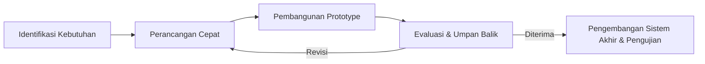
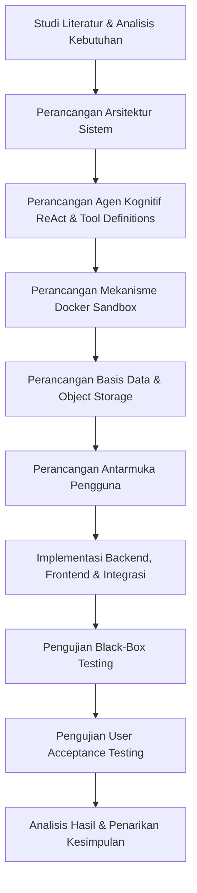

# BAB III

# METODE PENELITIAN

Bab ini menguraikan metode penelitian yang digunakan dalam pengembangan platform AnalisAI, mencakup prosedur implementasi, peralatan dan bahan yang dibutuhkan, tahapan penelitian secara rinci, perancangan arsitektur sistem, serta rencana pengujian dan evaluasi.

---

## 3.1. Tahapan Penelitian

Penelitian ini menggunakan model pengembangan **Prototype** sebagai kerangka kerja dan prosedur implementasi dalam proses pembangunan platform AI Data Analyst bernama AnalisAI. Model *Prototype* dipilih karena sifat sistem yang interaktif dan eksploratif, di mana kebutuhan pengguna terhadap fitur analisis data berbasis percakapan belum sepenuhnya dapat didefinisikan secara matang di awal. Pendekatan ini memungkinkan pembangunan purwarupa fungsional secara iteratif: purwarupa awal dibangun dengan cepat, dievaluasi oleh pengguna untuk mendapatkan umpan balik, dan disempurnakan secara berkelanjutan hingga menghasilkan produk akhir yang stabil.

**[Gambar 3.1: Diagram Alur Metode Pengembangan Prototype]**

Berdasarkan Gambar 3.1, tahapan penelitian terdiri dari lima tahapan utama, yaitu Identifikasi Kebutuhan, Perancangan Cepat, Pembangunan Prototype, Evaluasi & Umpan Balik, serta Pengembangan Sistem Akhir & Pengujian. Penjelasan singkat dari setiap fase adalah sebagai berikut:
1. **Identifikasi Kebutuhan**: Menganalisis kebutuhan fungsional dan non-fungsional sistem berdasarkan rumusan masalah yang telah ditetapkan pada Bab I, yaitu bagaimana membangun platform analisis data otomatis berbasis *single-agent* dengan *tool calling* dan *Docker sandbox*.
2. **Perancangan Cepat**: Merancang arsitektur sistem secara garis besar, meliputi struktur komponen *backend*, *frontend*, mekanisme isolasi eksekusi kode, serta alur interaksi agen dengan pengguna.
3. **Pembangunan Prototype**: Mengimplementasikan purwarupa fungsional yang mencakup fitur-fitur inti seperti unggah dataset, percakapan analisis, eksekusi kode di *sandbox*, dan visualisasi data.
4. **Evaluasi dan Umpan Balik**: Menguji purwarupa untuk mendeteksi kekurangan, ketidaksesuaian, atau potensi perbaikan pada alur kerja agen, antarmuka pengguna, dan keamanan *sandbox*.
5. **Pengembangan Sistem Akhir dan Pengujian**: Menyempurnakan sistem berdasarkan hasil evaluasi, kemudian melaksanakan pengujian formal menggunakan metode *Black-Box Testing* dan *User Acceptance Testing* (UAT).

## 3.2. Sumber Data

Sumber data yang digunakan dalam penelitian ini berupa berkas dataset tabular dalam format CSV, Excel (.xlsx, .xls), JSON, dan Parquet. Karakteristik dari masing-masing dataset pengujian dirinci pada Tabel 3.1. Untuk memvalidasi fungsionalitas dan kinerja sistem AnalisAI, proses pengujian dilakukan secara khusus menggunakan dua dataset publik dari repositori Kaggle yang merepresentasikan skenario analisis dunia nyata:

**Tabel 3.1. Karakteristik Dataset Pengujian**

| Nama Dataset | Jumlah Baris | Jumlah Kolom | Ukuran Berkas | Sumber |
|---|---|---|---|---|
| **Retail Sales Dataset** | 1.000 | 9 | ~60 KB | Kaggle (mohammadtalib786) |
| **Used Car Dataset (Ford)** | 17.965 | 9 | ~1,2 MB | Kaggle (adityadesai13) |

1. **Retail Sales Dataset** (https://www.kaggle.com/datasets/mohammadtalib786/retail-sales-dataset)  
   Dataset ini berisi data transaksi ritel sebanyak 1.000 baris dengan atribut meliputi `Transaction ID`, `Date`, `Customer ID`, `Gender`, `Age`, `Product Category`, `Quantity`, `Price per Unit`, dan `Total Amount`. Dataset ini digunakan untuk menguji fungsionalitas AnalisAI dalam mengeksekusi analisis statistik deskriptif transaksi ritel, visualisasi distribusi demografi pelanggan (seperti histogram usia dan perbandingan gender), serta analisis deret waktu (*time-series*) transaksi ritel bulanan.
    
2. **Used Car Dataset (Ford and Mercedes)** (https://www.kaggle.com/datasets/adityadesai13/used-car-dataset-ford-and-mercedes)  
   Dataset ini berisi 17.965 data transaksi penjualan mobil bekas (khususnya pabrikan Ford) dengan kolom-kolom seperti `model` (model mobil), `year` (tahun pembuatan), `price` (harga jual), `transmission` (tipe transmisi), `mileage` (jarak tempuh), `fuelType` (jenis bahan bakar), `tax` (pajak kendaraan), `mpg` (konsumsi bahan bakar), dan `engineSize` (kapasitas mesin). Dataset ini digunakan untuk menguji performa AnalisAI dalam menangani data dengan pengelompokan kategorikal yang kompleks, pembersihan data pencilan (*outliers*), dan analisis korelasi multivariat (seperti pengaruh jarak tempuh dan kapasitas mesin terhadap harga jual mobil bekas).

Selain berkas lokal, sistem juga mendukung pengunduhan dataset langsung dari internet melalui URL publik dan integrasi ekspor otomatis Google Sheets ke CSV menggunakan modul `download_dataset_tool`.

---

### 3.3. Peralatan dan Bahan Penelitian

Peralatan dan bahan penelitian digunakan untuk mendukung seluruh proses pembangunan platform AI Data Analyst bernama AnalisAI. Dalam penelitian ini, perangkat keras (*hardware*) dan perangkat lunak (*software*) digunakan secara terintegrasi mulai dari proses pengolahan dataset, pelatihan model, evaluasi, hingga implementasi sistem berbasis web.

### 3.3.1. Perangkat Keras (Hardware)

Peralatan perangkat keras yang digunakan untuk mendukung seluruh proses pengembangan, pengolahan data, dan pengujian sistem AnalisAI dirinci pada Tabel 3.2.

**Tabel 3.2. Spesifikasi Perangkat Keras**

| No | Komponen | Spesifikasi |
|---|---|---|
| 1 | Prosesor | Intel / AMD (minimal 4 core) |
| 2 | Memori (RAM) | Minimal 8 GB |
| 3 | Penyimpanan | SSD minimal 50 GB (untuk Docker images dan dataset) |
| 4 | Koneksi Internet | Diperlukan untuk akses API LLM dan unduh dependensi |

### 3.3.2. Perangkat Lunak (Software)
Perangkat lunak yang digunakan dalam penelitian ini terbagi menjadi tiga kategori, yaitu infrastruktur (Tabel 3.3), *backend* (Tabel 3.4), dan *frontend* (Tabel 3.5).

**Tabel 3.3. Perangkat Lunak Infrastruktur**

| Perangkat Lunak | Versi | Fungsi |
|---|---|---|
| Docker & Docker Compose | 24.x / 2.x | Orkestrasi kontainer untuk seluruh layanan (MySQL, Redis, MinIO, Sandbox, Nginx) |
| MySQL | 8.0 | Basis data relasional untuk penyimpanan metadata pengguna dan proyek |
| Redis | 7 (Alpine) | Penyimpanan sesi, antrean pekerjaan (*job queue*), dan *buffer* event SSE |
| MinIO | Latest | Penyimpanan objek (*object storage*) untuk berkas dataset dan hasil ekspor per proyek |
| Nginx | Stable | *Reverse proxy* untuk mengarahkan lalu lintas HTTP ke API dan frontend |

**Tabel 3.4. Perangkat Lunak Backend**

| Pustaka / Framework | Versi | Fungsi |
|---|---|---|
| Python | 3.10+ | Bahasa pemrograman utama sisi server |
| FastAPI | 0.115.6 | *Framework* REST API dan *Server-Sent Events* (SSE) |
| LangChain Core | 0.3.28 | Abstraksi interaksi LLM dan definisi *tool* |
| LangChain OpenAI | 0.2.14 | Klien LLM untuk penyedia API kompatibel OpenAI (SumoPod) |
| LangGraph | 0.2.60 | Orkestrasi agen ReAct berbasis graf siklik (*Directed Cyclic Graph*) |
| SQLAlchemy | 2.0.36 | *Object-Relational Mapping* (ORM) untuk MySQL |
| Docker SDK (Python) | 7.1.0 | Pengelolaan siklus hidup kontainer *sandbox* secara programatik |
| DuckDB | 1.1.3 | Mesin kueri SQL analitik untuk pemrosesan data tabular *server-side* |
| Pandas | 2.2.3 | Pustaka manipulasi dan analisis data tabular |
| Matplotlib / Seaborn | 3.9.2 / 0.13.2 | Pustaka visualisasi data untuk pembuatan grafik |
| bcrypt | 4.2.1 | Algoritma *hashing* kata sandi pengguna |
| python-jose | 3.3.0 | Pembuatan dan verifikasi *JSON Web Token* (JWT) |

**Tabel 3.5. Perangkat Lunak Frontend**

| Pustaka / Framework | Versi | Fungsi |
|---|---|---|
| React | 19.x | Pustaka antarmuka pengguna berbasis komponen |
| Vite | 7.x | *Build tool* dan *development server* |
| Tailwind CSS | 4.x | *Framework* utilitas CSS untuk *styling* responsif |
| Chart.js | 4.5.x | Pustaka *rendering* grafik interaktif pada *dashboard* |
| AG Grid | 35.x | Komponen tabel data interaktif dengan fitur *sorting* dan *filtering* |
| React Router | 7.x | Navigasi halaman berbasis rute (*client-side routing*) |
| Framer Motion | 12.x | Pustaka animasi dan transisi antarmuka |
| Axios | 1.13.x | Klien HTTP dengan *interceptor* JWT otomatis |

## 3.4. Tahapan Penelitian

Keseluruhan tahapan penelitian dirangkum dalam diagram alur yang menggambarkan urutan proses dari analisis kebutuhan hingga penarikan kesimpulan:

**[Gambar 3.2: Bagan Alur Tahapan Penelitian]**

Penjelasan masing-masing tahapan diuraikan pada sub-bab berikut.

### 3.4.1. Studi Literatur dan Analisis Kebutuhan
Tahap awal penelitian dilakukan dengan mempelajari literatur terkait arsitektur agen berbasis LLM, mekanisme *tool calling*, kerangka kerja LangGraph, serta prinsip isolasi eksekusi kode menggunakan Docker. Hasil studi literatur ini telah diuraikan pada Bab II. Berdasarkan kajian tersebut, kebutuhan sistem diidentifikasi dan dirumuskan sebagai berikut:

Proses elisitasi kebutuhan sistem dilakukan dengan melibatkan pemangku kepentingan (*stakeholders*) yang mencakup analis data profesional dan pengguna bisnis non-teknis. Hal ini penting untuk menyelaraskan ekspektasi pengguna terhadap kapabilitas teknis model bahasa besar dan memastikan alur kerja analisis data yang dirancang dapat menyelesaikan masalah nyata secara akurat.

Kebutuhan fungsional dan non-fungsional yang telah diidentifikasi bertindak sebagai acuan dasar (*baseline metrics*) dalam proses perancangan cepat dan pembangunan purwarupa. Selain itu, daftar kebutuhan ini digunakan secara langsung pada tahap akhir penelitian untuk merumuskan skenario uji guna memverifikasi fungsionalitas dan keamanan platform secara ketat.

**a. Kebutuhan Fungsional**
1. Sistem menyediakan fitur registrasi dan autentikasi pengguna menggunakan JWT (*access token* dan *refresh token*).
2. Pengguna dapat membuat, mengelola, dan menghapus ruang proyek yang masing-masing memiliki dataset dan riwayat sesi percakapan terpisah.
3. Pengguna dapat mengunggah berkas dataset tabular (CSV, XLSX, XLS, JSON, Parquet) atau memberikan tautan URL untuk diunduh otomatis oleh sistem.
4. Pengguna dapat mengajukan pertanyaan analisis data menggunakan bahasa alami, dan sistem mengeksekusi analisis secara otomatis melalui agen tunggal berbasis ReAct.
5. Sistem mampu menghasilkan visualisasi data (grafik *bar*, *line*, *scatter*, *pie*, *heatmap*, *histogram*, dan lainnya) secara otomatis berdasarkan permintaan pengguna.
6. Sistem mampu menghasilkan laporan profiling deskriptif berformat HTML secara otomatis.
7. Sistem mampu menghasilkan *dashboard* interaktif dengan grafik, tabel, dan filter berbasis kueri SQL DuckDB.
8. Pengguna dapat mengekspor hasil analisis to berbagai format berkas (Jupyter Notebook, CSV, XLSX, JSON, Markdown, HTML).
9. Sistem menyediakan *widget* daftar tugas (*task list*) yang menampilkan rencana kerja dan progres agen secara *real-time*.
10. Sistem mendukung klarifikasi otomatis ketika terdapat beberapa dataset dalam satu proyek dan pengguna tidak menyebutkan dataset tertentu.

**b. Kebutuhan Non-Fungsional**
1. **Keamanan**: Seluruh kode Python yang dihasilkan LLM dieksekusi di dalam kontainer Docker terisolasi tanpa akses jaringan (*network disabled*), dengan pembatasan memori maksimal 512 MB dan *timeout* eksekusi 120 detik.
2. **Responsivitas**: Respons agen dikirimkan secara *streaming* menggunakan protokol *Server-Sent Events* (SSE) agar pengguna dapat melihat token teks, log progres, dan grafik secara *real-time*.
3. **Skalabilitas**: Pemrosesan pekerjaan analisis dilakukan secara asinkron melalui antrean Redis, memungkinkan penambahan jumlah *worker* secara horizontal.
4. **Ketahanan**: Kegagalan jaringan atau penyegaran halaman (*refresh*) tidak membatalkan analisis yang sedang berjalan; pengguna dapat terhubung kembali dan membaca ulang *buffer* event dari Redis.

### 3.4.2. Tahap Perancangan Cepat (Quick Design)
Pada tahap perancangan cepat (*quick design*), dilakukan perancangan menyeluruh terhadap arsitektur sistem, rancangan interaksi aktor dengan sistem (Use Case), alur logika keputusan agen kognitif cerdas (*ReAct flow*), mekanisme keamanan sandbox, skema penyimpanan basis data relasional (MySQL) dan non-relasional (Redis), alur kerja antrean asinkron (*worker queue*), hingga struktur navigasi antarmuka pengguna. Seluruh hasil rancangan detail berupa diagram arsitektur, diagram sekuensial, ERD, dan spesifikasi tabel dipresentasikan secara khusus pada Subbab 4.1 (Analisis dan Perancangan Sistem) di BAB IV.

Pemodelan sistem menggunakan representasi grafis seperti diagram UML (*Unified Modeling Language*) mempermudah pengembang dalam memetakan kompleksitas komunikasi asinkron antara frontend, backend, antrean Redis, dan kontainer *sandbox*. Desain arsitektur ini juga memastikan struktur basis data MySQL terdistribusi dengan baik menggunakan relasi *one-to-many* antara tabel proyek dan tabel riwayat obrolan serta tabel berkas data.

Hasil rancangan cepat ini bertindak sebagai cetak biru (*blueprint*) teknis selama proses pengodean purwarupa. Dengan membatasi ruang lingkup rancangan awal pada komponen kritis, pengembang dapat fokus membangun fitur analitik inti tanpa terjebak dalam detail optimasi tingkat lanjut yang belum diperlukan di awal fase purwarupa.

### 3.4.3. Tahap Pembangunan Prototype
Berdasarkan rancangan cepat yang telah dibuat, dilakukan pembangunan purwarupa fungsional (*functional prototype*). Proses implementasi mencakup pembuatan antarmuka pengguna (*frontend*) menggunakan React 19, pembuatan REST API server (*backend*) dengan FastAPI, pengaturan *message queue* dengan Redis, pembuatan layanan pemrosesan *background* (*worker*), serta penyusunan kontainer terisolasi (*Docker sandbox*). Detail implementasi dan fungsionalitas antarmuka serta sisi server dibahas pada Subbab 4.2 (Implementasi Sistem) di BAB IV.

Penggunaan metodologi pembangunan cepat (*agile prototyping*) membantu tim dalam menyatukan fungsionalitas backend dan frontend secara paralel. Selama proses ini, integrasi modul *tool calling* LLM disempurnakan secara bertahap dengan menggunakan parser JSON dinamis di sisi server backend FastAPI untuk memvalidasi instruksi masukan sebelum dikirim ke Docker.

Setiap komponen yang telah selesai dibangun langsung diuji konektivitasnya melalui *REST endpoint* dan kanal SSE. Integrasi awal ini memastikan bahwa aliran data dari berkas mentah hingga menjadi visualisasi grafik interaktif pada antarmuka frontend dapat berjalan tanpa hambatan teknis yang berarti.

### 3.4.4. Tahap Evaluasi dan Umpan Balik
Purwarupa awal yang telah dibangun kemudian diuji dan dievaluasi secara internal. Tahap evaluasi ini dilakukan secara iteratif untuk mendeteksi adanya malafungsi pada *tool calling* agen, keterbatasan visualisasi, atau celah keamanan pada lingkungan eksekusi kode (*sandbox*). Jika ditemukan kendala atau ketidaksesuaian fungsional, sistem akan didekatkan kembali pada tahap perancangan cepat untuk dilakukan perbaikan sebelum masuk ke tahap pengembangan sistem akhir.

Evaluasi berkala ini melibatkan analisis log kueri LLM untuk melihat tingkat keberhasilan interpretasi bahasa alami pengguna menjadi kode program Python yang valid. Apabila ditemukan kasus di mana LLM menghasilkan instruksi kode yang berulang kali gagal dieksekusi oleh interpreter kontainer, struktur perintah dasar (*system prompt*) akan disempurnakan.

Selain perbaikan di sisi kecerdasan buatan, evaluasi ini juga menyoroti keandalan isolasi sumber daya Docker. Pemantauan berkala dilakukan untuk mendeteksi potensi memori bocor (*memory leak*) pada kontainer sandbox dan mengoptimalkan siklus pembersihan kontainer *idle* agar sumber daya server tetap terjaga secara efisien.

### 3.4.5. Tahap Pengembangan Sistem Akhir dan Pengujian
Setelah purwarupa dinilai stabil dan memenuhi kriteria evaluasi awal, sistem dikembangkan menjadi produk akhir. Pengujian formal kemudian dilakukan secara komprehensif menggunakan empat metode pengujian, yaitu *Black-Box Testing* untuk menguji fungsionalitas, pengujian keamanan *Docker sandbox*, evaluasi kualitas jawaban oleh evaluator ahli, serta *User Acceptance Testing* (UAT) oleh pengguna. Rencana skenario pengujian diuraikan pada Subbab 3.5, sedangkan hasil pengujian dibahas secara lengkap pada Subbab 4.3 hingga 4.6 di BAB IV.

Fase transisi dari purwarupa ke sistem akhir ditandai dengan pengerasan sistem (*system hardening*), seperti pengamanan variabel lingkungan, enkripsi data sensitif, dan optimalisasi *reverse proxy* Nginx. Konfigurasi orkestrasi Docker Compose disesuaikan untuk mode produksi agar menjamin seluruh layanan pendukung (Redis, MySQL, MinIO) dapat beroperasi secara stabil dengan konsumsi memori terdistribusi.

Pengujian akhir dilaksanakan dengan menjalankan seluruh rangkaian skenario uji (*test suites*) secara metodologis. Hasil pengujian didokumentasikan secara rinci untuk memberikan bukti ilmiah bahwa platform AnalisAI tidak hanya ramah pengguna, tetapi juga memiliki ketahanan tinggi terhadap kegagalan operasional dan serangan keamanan injeksi kode.

## 3.5. Rencana Pengujian dan Evaluasi

Pengujian sistem dilaksanakan menggunakan dua pendekatan utama yang saling melengkapi: *Black-Box Testing* untuk memverifikasi fungsionalitas sistem, dan *User Acceptance Testing* (UAT) untuk mengevaluasi kegunaan sistem dari sudut pandang pengguna akhir.

### 3.5.1. Black-Box Testing
Pengujian *Black-Box* dilakukan untuk memvalidasi bahwa setiap fitur sistem berfungsi sesuai dengan kebutuhan fungsional yang telah dirancang, tanpa memeriksa logika internal kode. Skenario pengujian dirancang berdasarkan kebutuhan fungsional pada sub-bab 3.4.1, dengan rincian kasus uji yang dapat dilihat pada Tabel 3.6.

**Tabel 3.6. Rancangan Skenario Pengujian Black-Box**

| No | Skenario Pengujian | Masukan | Keluaran yang Diharapkan |
|:---:|---|---|---|
| 1 | Registrasi akun baru | Username dan password valid | Akun berhasil dibuat, pengguna dapat login |
| 2 | Login dengan kredensial valid | Username dan password terdaftar | Token JWT dikembalikan, pengguna diarahkan ke Dashboard |
| 3 | Membuat proyek baru | Nama dan deskripsi proyek | Proyek berhasil dibuat dan muncul di daftar |
| 4 | Mengunggah dataset CSV | Berkas CSV valid | Berkas tersimpan di MinIO dan muncul di sidebar proyek |
| 5 | Mengunggah dataset Excel | Berkas XLSX valid | Berkas tersimpan di MinIO dan muncul di sidebar proyek |
| 6 | Meminta analisis EDA via chat | Pertanyaan bahasa alami (contoh: "Lakukan EDA pada dataset ini") | Agen menjalankan analisis, menampilkan kode, output, dan ringkasan |
| 7 | Meminta visualisasi data | Pertanyaan (contoh: "Buat histogram kolom usia") | Grafik PNG ditampilkan di panel obrolan |
| 8 | Meminta profiling dataset | Pertanyaan (contoh: "Buat profiling data") | Berkas HTML profiling dihasilkan dan dapat diunduh |
| 9 | Mengekspor hasil ke Jupyter Notebook | Pertanyaan (contoh: "Ekspor ke notebook") | Berkas .ipynb dihasilkan dan dapat diunduh |
| 10 | Klarifikasi multi-dataset | Pertanyaan umum tanpa menyebut nama berkas pada proyek dengan 2+ dataset | Sistem menampilkan pertanyaan klarifikasi pilihan ganda |
| 11 | Eksekusi kode berbahaya di sandbox | Kode mengandung `os.system` atau `subprocess` | Kode ditolak oleh validator, sandbox tidak mengeksekusi |
| 12 | Timeout eksekusi sandbox | Kode dengan *infinite loop* | Eksekusi dihentikan setelah 120 detik, pesan error ditampilkan |
| 13 | Meminta dashboard interaktif | Pertanyaan (contoh: "Buat dashboard interaktif") | Berkas dashboard.json dihasilkan dan dashboard ditampilkan di UI |
| 14 | Unduh dataset dari URL | URL publik berkas CSV | Berkas berhasil diunduh dan muncul di daftar dataset proyek |
| 15 | Reconnect setelah refresh halaman | Refresh halaman saat analisis berjalan | Analisis tetap berjalan, event stream dapat dilanjutkan |

### 3.5.2. User Acceptance Testing (UAT)

Pengujian UAT dilakukan dengan melibatkan 10 responden pengguna yang mewakili target pengguna non-teknis, terdiri dari 5 analis data (*data analysts*) dan 5 pengguna bisnis umum. Setiap responden diminta untuk menyelesaikan sejumlah tugas analisis data menggunakan platform AnalisAI, kemudian mengisi kuesioner evaluasi yang dirancang menggunakan **Skala Likert 1–5** dengan rincian bobot penilaian sebagai berikut:
- Skor 1: Sangat Tidak Setuju (STS)
- Skor 2: Tidak Setuju (TS)
- Skor 3: Netral (N)
- Skor 4: Setuju (S)
- Skor 5: Sangat Setuju (SS)

Aspek-aspek yang dievaluasi dalam kuesioner UAT meliputi:
1. **Kemudahan penggunaan**: Seberapa mudah pengguna memahami dan mengoperasikan antarmuka percakapan.
2. **Keakuratan hasil analisis**: Seberapa tepat dan relevan hasil analisis yang dihasilkan agen terhadap pertanyaan pengguna.
3. **Kualitas visualisasi**: Seberapa informatif dan jelas grafik yang dihasilkan oleh sistem.
4. **Responsivitas sistem**: Seberapa cepat sistem merespons permintaan pengguna.
5. **Kepuasan keseluruhan**: Penilaian umum terhadap pengalaman menggunakan platform.

Skor hasil pengisian kuesioner dihitung persentase kelayakannya menggunakan rumus matematika berikut:

$$Persentase = \frac{\text{Skor Diperoleh}}{\text{Skor Maksimum}} \times 100\%$$

Di mana:
- **Skor Diperoleh**: Jumlah total nilai yang diberikan oleh seluruh responden untuk suatu aspek pernyataan.
- **Skor Maksimum**: Skor tertinggi skala Likert (5) dikalikan dengan jumlah pernyataan dan jumlah responden ($5 \times \text{jumlah pernyataan} \times \text{jumlah responden}$).

Hasil persentase UAT dikelompokkan ke dalam kategori tingkat kelayakan untuk diinterpretasikan berdasarkan klasifikasi pada Tabel 3.7.

**Tabel 3.7. Kriteria Klasifikasi Kelayakan Skor UAT**

| Rentang Skor Persentase | Klasifikasi Kelayakan |
|---|---|
| 81% – 100% | Sangat Layak / Sangat Baik |
| 61% – 80% | Layak / Baik |
| 41% – 60% | Cukup Layak / Cukup Baik |
| 21% – 40% | Tidak Layak / Buruk |
| 0% – 20% | Sangat Tidak Layak / Sangat Buruk |

### 3.5.3. Pengujian Keamanan Sandbox

Pengujian keamanan difokuskan pada verifikasi bahwa mekanisme isolasi Docker Sandbox berfungsi dengan benar. Skenario pengujian meliputi:
1. Percobaan eksekusi kode yang mengandung pemanggilan modul terlarang (`os.system`, `subprocess`, `__import__`).
2. Percobaan akses jaringan dari dalam kontainer (*ping*, *curl*, *wget*).
3. Percobaan penggunaan memori melebihi batas 512 MB.
4. Percobaan eksekusi kode melebihi batas waktu 120 detik.
5. Verifikasi bahwa kontainer dihapus secara otomatis setelah sesi berakhir atau *idle* selama 10 menit.

Melalui rangkaian skenario pengujian keamanan ini, integritas sistem host dapat dipastikan tetap terlindungi secara optimal dari potensi eksekusi kode berbahaya. Hasil uji penetrasi sandbox ini dikumpulkan sebagai bagian dari laporan jaminan keamanan sistem.

Pengujian dilakukan dengan menggunakan otomatisasi skrip uji yang secara berkala mengirimkan instruksi berbahaya ke API backend. Respon yang diberikan sistem kemudian dianalisis untuk memastikan bahwa tidak ada satupun instruksi berbahaya yang berhasil menembus batasan kontainer terisolasi, sehingga menghasilkan tingkat keamanan lingkungan produksi yang andal.
