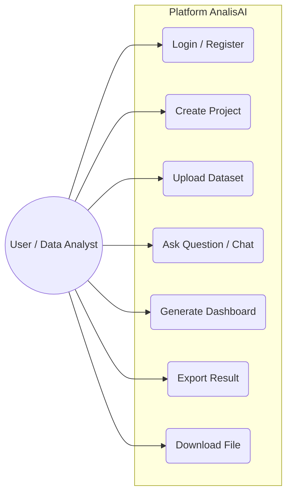
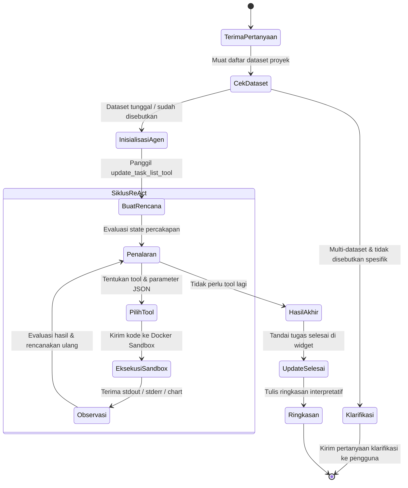
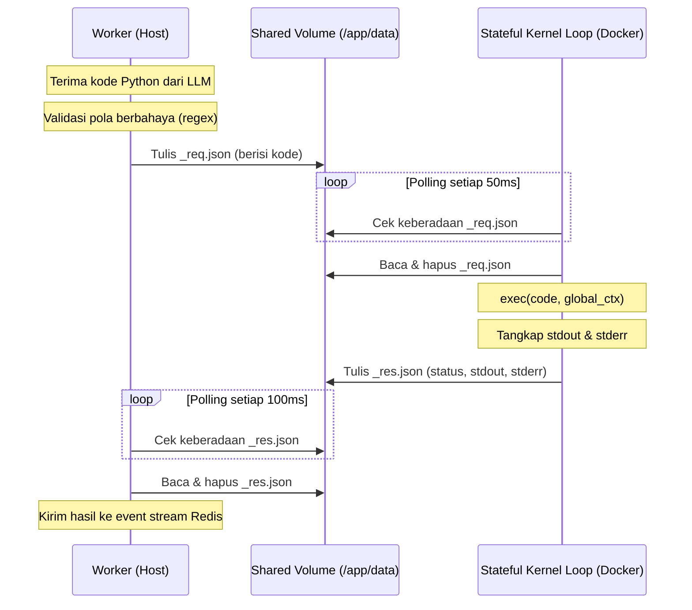
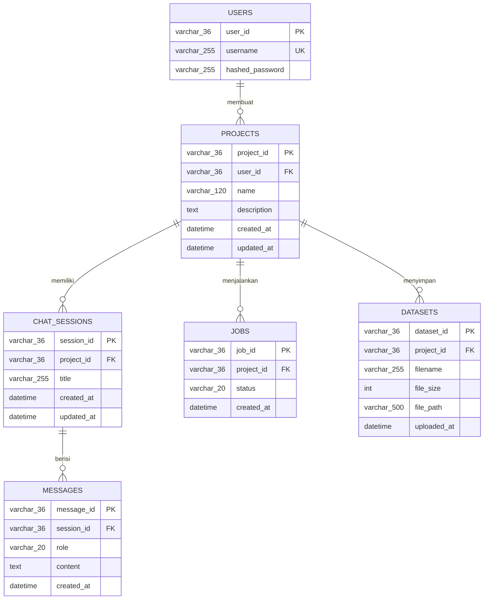
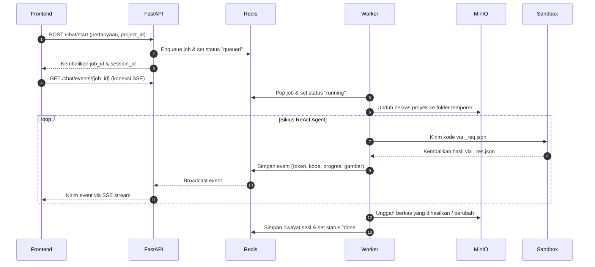
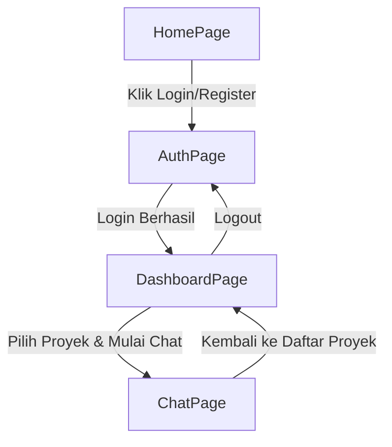

# BAB IV

# HASIL DAN PEMBAHASAN

Bab ini menyajikan hasil analisis, perancangan sistem, implementasi, serta pengujian dari platform AnalisAI secara menyeluruh. Pembahasan diselaraskan secara runut dengan tujuan penelitian, yang mencakup tahap perancangan sistem, hasil implementasi komponen frontend and backend, pengujian fungsionalitas (*Black-Box Testing*), pengujian keamanan lingkungan eksekusi (*Docker sandbox*), serta pengujian penerimaan pengguna (*User Acceptance Testing* - UAT).

---

## 4.1. Analisis dan Perancangan Sistem

### 4.1.1. Perancangan Use Case Diagram Sistem

Rancangan interaksi antara aktor (pengguna) dengan fungsionalitas sistem dimodelkan melalui Use Case Diagram yang digambarkan pada Gambar 4.1:


**[Gambar 4.1: Use Case Diagram Platform AnalisAI]**

Aktor utama dalam sistem AnalisAI adalah *User* (yang bertindak sebagai peneliti atau analis data). Fungsionalitas atau *use case* yang dapat diakses oleh aktor tersebut didefinisikan sebagai berikut:
1. **Login / Register**: Pengguna mendaftarkan akun baru atau masuk ke sistem untuk mendapatkan token akses JWT.
2. **Create Project**: Pengguna membuat ruang proyek baru untuk mengelompokkan analisis dan dataset.
3. **Upload Dataset**: Pengguna mengunggah satu atau lebih berkas dataset tabular (CSV, Excel, dll.) ke proyek.
4. **Ask Question (Chat)**: Pengguna melakukan percakapan interaktif menggunakan bahasa alami untuk menanyakan analisis data, di mana sistem akan menerjemahkan menjadi kode Python dan menjalankannya.
5. **Generate Dashboard**: Pengguna meminta visualisasi berupa dashboard analitik interaktif berbasis kueri SQL DuckDB.
6. **Export Result**: Pengguna mengekspor log analisis, ringkasan interpretasi, kode, dan notebook hasil komputasi.
7. **Download File**: Pengguna mengunduh hasil ekspor berkas analisis (seperti file .ipynb atau visualisasi grafik PNG).

Perancangan use case diagram ini menjadi acuan utama dalam membangun alur otentikasi dan hak akses data pengguna. Dengan pembatasan ruang lingkup aksi aktor, sistem dapat mencegah akses tidak sah antar-proyek dan menjaga kerahasiaan data pengguna lain.

Setiap *use case* di atas dipetakan ke dalam komponen antarmuka yang terintegrasi pada sisi frontend. Interaksi pengguna dengan komponen tersebut akan mengirimkan permintaan API HTTP terenkripsi ke backend server FastAPI untuk diproses lebih lanjut.

### 4.1.2. Perancangan Arsitektur Sistem
Arsitektur sistem dirancang secara terdistribusi dengan pemisahan tanggung jawab ke dalam beberapa lapisan layanan, sebagaimana diilustrasikan pada Gambar 4.2. Seluruh layanan tersebut diorkestrasi menggunakan Docker Compose.

```mermaid
graph TD
    subgraph Client ["Lapisan Klien (Client Tier)"]
        FE["React 19 + Vite 7 + Tailwind CSS 4"]
    end
    
    subgraph API ["Lapisan Aplikasi (Application Tier)"]
        BE["FastAPI (REST API + SSE Streaming)"]
    end
    
    subgraph Queue ["Lapisan Antrean (Queue & Session Tier)"]
        Redis[("Redis 7<br/>Job Queue + Session Store + Event Buffer")]
    end
    
    subgraph Processing ["Lapisan Eksekusi (Execution Tier)"]
        Worker["Worker Service (Python Process)"]
        Sandbox["Docker Sandbox Container<br/>(python:3.10-slim, network disabled)"]
    end
    
    subgraph Storage ["Lapisan Data (Data Tier)"]
        MySQL[("MySQL 8.0<br/>Users & Projects")]
        MinIO[("MinIO<br/>Object Storage (Datasets & Exports)")]
    end
    
    FE <-->|"REST API & SSE (Port 5173/80)"| BE
    BE <-->|"Baca/Tulis Sesi & Status Job"| Redis
    BE <-->|"CRUD Users & Projects"| MySQL
    BE <-->|"Sinkronisasi Berkas Dataset"| MinIO
    
    Worker <-->|"Pop/Push Job Queue & Events"| Redis
    Worker <-->|"Unduh/Unggah Berkas Proyek"| MinIO
    Worker <-->|"IPC via Volume Mount (_req.json / _res.json)"| Sandbox
```


**[Gambar 4.2: Diagram Arsitektur Sistem AnalisAI]**

Deskripsi fungsi masing-masing komponen:
- **Frontend (React 19)**: Antarmuka pengguna berbasis web yang menyediakan halaman autentikasi, manajemen proyek, obrolan analisis, dan tampilan *dashboard* interaktif.
- **FastAPI Backend**: Gerbang API (*API Gateway*) yang menangani autentikasi JWT, manajemen proyek, unggah dataset, dan penerimaan permintaan analisis. Backend mendorong pekerjaan ke antrean Redis dan menyalurkan *event stream* SSE ke klien.
- **Redis**: Bertindak sebagai *message broker* dan penyimpanan sementara. Redis menyimpan antrean pekerjaan (`queue:jobs`), status pekerjaan, *buffer* event SSE, dan riwayat sesi percakapan.
- **Worker Service**: Proses *background* yang secara kontinu mengambil pekerjaan dari antrean Redis, mengunduh berkas proyek dari MinIO, menjalankan agen ReAct, dan mengunggah kembali berkas hasil ke MinIO.
- **Docker Sandbox**: Kontainer terisolasi berbasis `python:3.10-slim` yang menjalankan *stateful kernel loop* untuk mengeksekusi kode Python yang dihasilkan LLM. Jaringan dinonaktifkan dan sumber daya dibatasi.
- **MySQL 8.0**: Basis data relasional yang menyimpan informasi akun pengguna dan metadata proyek.
- **MinIO**: Penyimpanan objek yang berfungsi sebagai *persistent storage* untuk dataset pengguna dan berkas hasil ekspor, diorganisasi per `user_id/project_id`.

Penggunaan arsitektur terdistribusi ini mempermudah skalabilitas platform AnalisAI secara modular. Pengembang dapat memperbarui komponen frontend secara independen tanpa mengganggu layanan backend, serta meningkatkan jumlah kontainer worker secara horizontal jika antrean analisis meningkat.

Integrasi orkestrasi Docker Compose menjamin seluruh dependensi infrastruktur seperti basis data MySQL, Redis, dan MinIO dapat berjalan dengan konfigurasi jaringan terisolasi yang stabil pada server host.

### 4.1.3. Perancangan Agen Kognitif (ReAct Agent Design)
Agen kognitif dirancang menggunakan metode ReAct (*Reasoning and Acting*) yang diorkestrasi oleh LangGraph. Agen merupakan agen tunggal (*single-agent*) yang dilengkapi dengan 8 definisi alat (*tools*) dan dibuat menggunakan fungsi `create_react_agent` dari pustaka LangGraph. Alur keputusan agen ReAct digambarkan pada Gambar 4.3.

**a. Alur Keputusan Agen ReAct**


**[Gambar 4.3: Diagram Alur Keputusan Agen ReAct]**

Alur keputusan agen dimulai dengan memeriksa jumlah dataset dalam proyek. Jika terdapat lebih dari satu dataset dan pengguna tidak menyebutkan nama berkas tertentu, agen akan mengirimkan pertanyaan klarifikasi pilihan ganda yang dihasilkan secara dinamis oleh LLM. Setelah konteks dataset jelas, agen memasuki siklus ReAct: melakukan penalaran (*thought*), memilih alat yang tepat (*action*), mengeksekusi alat tersebut, dan mengamati hasilnya (*observation*). Siklus ini berulang hingga agen menilai bahwa analisis telah cukup untuk menjawab pertanyaan pengguna.

**b. Spesifikasi Alat Bantu (Tool Definitions)**

Spesifikasi 8 alat bantu (*tools*) agen dirangkum pada Tabel 4.1:

**Tabel 4.1. Spesifikasi Tool Definitions Agen**

| Nama Tool | Parameter Masukan | Fungsi |
|---|---|---|
| `read_data_tool` | `filename`, `n_rows` | Membaca struktur kolom, tipe data, dan baris awal dataset |
| `python_repl_tool` | `code` | Mengeksekusi kode Python/Pandas/SQL di dalam Docker Sandbox |
| `render_chart_tool` | `code`, `filename` | Merender grafik Matplotlib/Seaborn dan menyimpannya sebagai PNG |
| `data_profile_tool` | `filename` | Menghasilkan laporan profiling HTML deskriptif otomatis |
| `file_export_tool` | `content`, `filename`, `format` | Mengekspor hasil ke berkas (ipynb, csv, xlsx, json, md, html, txt, py) |
| `bash_tool` | `command` | Menjalankan perintah shell terbatas (ls, cp, mv, rm, head, dll.) |
| `download_dataset_tool` | `url`, `filename` | Mengunduh dataset dari URL publik, Google Sheets, atau Kaggle |
| `update_task_list_tool` | `tasks`, `completed_indices` | Memperbarui daftar rencana kerja pada widget UI secara *real-time* |

Pemberian perkakas (*tools*) yang tepat sangat krusial untuk memandu LLM menyelesaikan tugas analitik secara terfokus. LLM dilatih untuk tidak memaksakan penulisan kode jika berkas data belum dibaca, sehingga pemanggilan `read_data_tool` wajib diletakkan pada prioritas tertinggi.

**c. Rancangan Instruksi Kognitif (System Prompt)**

Untuk memastikan agen otonom ReAct bertindak sesuai batas-batas fungsionalitas dan keamanan yang ditetapkan, dirancang instruksi kognitif utama (*system prompt*). *System prompt* ini bertindak sebagai pemandu penalaran (*reasoning guideline*) LLM yang menyusun logika pengambilan tindakan (*acting*). Rancangan *system prompt* AnalisAI terbagi menjadi lima komponen arsitektur utama:
1. **Definisi Identitas (Role Definition)**: Menetapkan peran agen sebagai "AnalisAI, AI Data Analyst ahli" yang berfokus penuh pada *Exploratory Data Analysis* (EDA), prapemrosesan data, dan visualisasi tabular. Poin ini juga memuat larangan keras pembuatan model *machine learning* untuk menjaga fokus fungsional sistem.
2. **Definisi Alat Bantu (Tool Guidelines)**: Petunjuk presisi mengenai kapan dan bagaimana masing-masing dari 8 alat bantu wajib dipanggil (misalnya: mewajibkan pemanggilan `read_data_tool` di awal percakapan, melarang penggunaan `python_repl_tool` untuk rendering grafik, serta mengharuskan koordinasi tugas dengan `update_task_list_tool`).
3. **Konfigurasi Dasbor Interaktif (Dashboard JSON Schema)**: Struktur format keluaran JSON spesifik untuk berkas `dashboard.json` ketika pengguna meminta dasbor. Skema ini melarang penyertaan data statis dan mewajibkan penulisan kueri SQL DuckDB yang bersih tanpa simbol backtick (`).
4. **Aturan Keamanan dan Batasan Sistem**: Instruksi tegas untuk memblokir pemanggilan fungsi instalasi dependensi (`pip install`), melarang penggunaan perintah OS berbahaya, serta mewajibkan penulisan berkas keluaran secara eksklusif to subfolder `/app/data/exports/`.
5. **Disiplin Keluaran (Output Formatting)**: Mengatur tata bahasa (100% formal Bahasa Indonesia), melarang penyebutan path internal teknis atau nama modul internal kepada pengguna, dan menuntut penulisan ringkasan interpretatif yang berorientasi pada wawasan tindakan (*actionable insights*) setelah eksekusi kode.

### 4.1.4. Perancangan Mekanisme Docker Sandbox
Mekanisme *sandbox* dirancang untuk memisahkan eksekusi kode Python yang ditulis LLM dari sistem *host*. Komunikasi antara *worker* di sisi *host* dan *kernel* Python di dalam kontainer dilakukan secara asinkron melalui berkas JSON pada direktori bersama (*shared volume*), sebagaimana digambarkan pada Gambar 4.4.


**[Gambar 4.4: Diagram Sekuensial Komunikasi IPC Sandbox]**

Penggunaan berkas JSON sebagai media komunikasi IPC (*Inter-Process Communication*) dipilih karena kesederhanaannya serta keandalannya dalam lingkungan kontainer terisolasi. Dengan menggunakan media berkas fisik pada direktori bersama, sistem tidak perlu membuka port jaringan TCP/IP di dalam kontainer *sandbox*, sehingga mempersempit celah serangan jaringan secara signifikan.

Proses *polling* dilakukan secara asinkron dengan jeda waktu yang sangat singkat untuk menjamin latensi eksekusi yang optimal. Di sisi host, program *worker* memantau kemunculan berkas keluaran secara berkala tanpa memblokir thread eksekusi utama, sehingga menjaga responsivitas aliran data ke pengguna.

Kontainer *sandbox* dibangun dari *image* `python:3.10-slim` yang telah dilengkapi dengan pustaka ilmu data (Pandas, NumPy, Matplotlib, Seaborn, Scikit-learn, dan lainnya). Konfigurasi keamanan kontainer meliputi:
- **Isolasi Jaringan**: `network_disabled=True` pada Docker SDK, memutus seluruh koneksi keluar dari kontainer.
- **Batas Memori**: `mem_limit=512m`, membatasi alokasi RAM kontainer maksimal 512 MB.
- **Kuota CPU**: `cpu_quota=100000`, membatasi penggunaan CPU setara 1 *core*.
- **Batas Waktu**: Eksekusi kode dibatasi maksimal 120 detik sebelum dianggap *timeout*.
- **Validasi Kode**: Sebelum dikirim ke kontainer, kode difilter menggunakan pola *regex* untuk memblokir pemanggilan modul berbahaya seperti `os.system`, `subprocess`, `__import__`, serta akses ke `__builtins__`.
- **Auto-Cleanup**: Kontainer dikonfigurasi dengan `auto_remove=True` dan memiliki mekanisme *idle timeout* selama 10 menit untuk mencegah kontainer *zombie*.

#### 4.1.5. Perancangan Basis Data dan Penyimpanan

Sistem AnalisAI mengimplementasikan **Arsitektur Penyimpanan Hybrid** (*hybrid storage architecture*) dengan mengombinasikan basis data relasional (MySQL), basis data *key-value in-memory* (Redis), dan *object storage* (MinIO). Pembagian ini dirancang secara khusus untuk mengakomodasi kebutuhan penyimpanan data terstruktur, manajemen sesi obrolan waktu-nyata berfrekuensi tinggi, antrean pekerjaan, serta penyimpanan berkas dataset berukuran besar secara aman.

Pemilihan strategi penyimpanan ini didasarkan pada karakteristik data dan pola aksesnya (*access patterns*). Data pengguna dan proyek yang bersifat relasional memerlukan konsistensi transaksi ACID yang kuat, sementara data obrolan membutuhkan kecepatan tulis-baca tinggi tanpa membebani sistem basis data utama.

Dengan membagi tugas penyimpanan ke tiga teknologi yang berbeda, platform AnalisAI dapat mempertahankan kinerja responsif meskipun terdapat banyak pengguna aktif yang mengunggah berkas dataset besar secara bersamaan.

**a. Perancangan Skema Data Konseptual (Entity Relationship Diagram - ERD)**

Untuk memodelkan seluruh data yang mengalir dan disimpan dalam sistem secara menyeluruh, dirancang sebuah *Entity Relationship Diagram* (ERD) konseptual. ERD ini memodelkan hubungan logis dari semua entitas sistem, termasuk yang disimpan secara fisik pada basis data relasional maupun non-relasional. Skema ERD konseptual sistem AnalisAI digambarkan pada Gambar 4.5.


**[Gambar 4.5: Entity Relationship Diagram (ERD) Konseptual Sistem AnalisAI]**

Hubungan antar-entitas logis pada diagram di atas dijelaskan sebagai berikut:
1. Hubungan antara `USERS` dan `PROJECTS` adalah satu-ke-banyak (*one-to-many*), di mana satu pengguna dapat membuat banyak proyek analisis, namun satu proyek hanya dimiliki oleh satu pengguna.
2. Hubungan antara `PROJECTS` and `CHAT_SESSIONS` adalah satu-ke-banyak (*one-to-many*), di mana satu proyek dapat memiliki banyak sesi obrolan untuk memisahkan topik analisis, namun satu sesi obrolan hanya merujuk pada satu proyek spesifik.
3. Hubungan antara `CHAT_SESSIONS` dan `MESSAGES` adalah satu-ke-banyak (*one-to-many*), di mana satu sesi obrolan berisi banyak pesan tanya-jawab antara pengguna (*user*) dan agen (*assistant*), namun sebuah pesan hanya merupakan bagian dari satu sesi obrolan.
4. Hubungan antara `PROJECTS` dan `JOBS` adalah satu-ke-banyak (*one-to-many*), di mana satu proyek dapat menjalankan banyak pekerjaan komputasi asinkron (*background job*) baik yang sedang aktif maupun yang telah selesai, namun sebuah pekerjaan hanya terafiliasi pada satu proyek.
5. Hubungan antara `PROJECTS` dan `DATASETS` adalah satu-ke-banyak (*one-to-many*), di mana satu proyek dapat menampung banyak berkas dataset tabular untuk dianalisis, namun satu berkas dataset hanya terdaftar pada satu proyek tertentu.

Penerapan integritas referensial berupa kunci tamu (*foreign key*) yang ketat memastikan bahwa apabila sebuah proyek atau sesi obrolan dihapus oleh pengguna, sistem secara otomatis menghapus seluruh pesan dan pekerjaan terkait secara berantai (*cascade delete*). Hal ini mencegah penumpukan data yatim (*orphan data*) yang dapat mengotori memori penyimpanan.

Desain relasional ini diimplementasikan menggunakan pemetaan objek relasional (SQLAlchemy ORM) pada sisi server backend FastAPI untuk menjamin keamanan tipe data selama transaksi basis data relasional berlangsung.

**b. Pemetaan Entitas Konseptual ke Penyimpanan Fisik**

Meskipun seluruh entitas terhubung secara logis dalam ERD konseptual, implementasi fisiknya dipisahkan ke dalam tiga jenis teknologi penyimpanan yang berbeda demi performa dan isolasi keamanan. Pemetaan entitas logis ke penyimpanan fisik beserta fungsinya dirangkum pada Tabel 4.2.

**Tabel 4.2. Pemetaan Entitas Logis ke Penyimpanan Fisik**

| Entitas Logis | Media Penyimpanan Fisik | Tipe / Driver | Justifikasi Teknis Utama |
|---|---|---|---|
| `USERS` | MySQL | Tabel Relasional (`users`) | Autentikasi dan kredensial memerlukan jaminan transaksi ACID yang kuat dan pengecekan keunikan *username*. |
| `PROJECTS` | MySQL | Tabel Relasional (`projects`) | Metadata proyek bersifat terstruktur dan memiliki relasi referensial *foreign key* yang kuat dengan akun pengguna. |
| `CHAT_SESSIONS` | Redis | Hash (`sess:{user_id}:{project_id}:{session_id}`) | Memerlukan akses baca-tulis berlatensi sangat rendah untuk pemuatan riwayat sesi yang cepat di sisi antarmuka. |
| `MESSAGES` | Redis | JSON string ter-serialize dalam Hash | Aliran token pesan dari LLM sangat intensif. Penyimpanan di Redis mencegah bottleneck I/O pada disk database relasional. |
| `JOBS` | Redis | List & String (`job:{job_id}`, `queue:jobs`) | Status pekerjaan asinkron dan antrean antarmuka dikelola secara in-memory untuk mendukung *worker queue* FIFO yang responsif. |
| `DATASETS` | MinIO | Object Storage (`ai-datasets/{user_id}/{project_id}`) | Berkas tabular biner berukuran besar (CSV, Excel) disimpan sebagai objek fisik untuk menghindari penumpukan ukuran database (*database bloat*). |

Pemisahan fisik ini mengeliminasi masalah penurunan performa database utama saat terjadi aktivitas pembacaan riwayat chat yang intensif. MySQL backend FastAPI hanya dibebani untuk proses query metadata ringan saat otentikasi awal.

Dengan mendelegasikan data operasional jangka pendek ke Redis dan berkas besar ke MinIO, arsitektur data menjadi lebih efisien dan siap mendukung ketersediaan tinggi (*high availability*) di server produksi.

**c. Struktur Penyimpanan Sesi dan Obrolan Sementara (Redis)**

Seluruh riwayat sesi percakapan (*chat session*), daftar pesan obrolan (*messages*), status pekerjaan asinkron (*jobs status*), dan penyangga event SSE (*SSE event buffer*) disimpan secara terstruktur di dalam Redis. Pembagian tipe data dan pola kunci (*key*) Redis dirinci pada Tabel 4.3.

**Tabel 4.3. Skema Struktur Kunci dan Tipe Data Redis**

| Pola Kunci Redis | Tipe Data | Atribut Field / Anggota | Deskripsi Fungsi |
|---|---|---|---|
| `sess:{user_id}:{project_id}:{session_id}` | Hash | `title`, `created_at`, `updated_at`, `messages_json` | Menyimpan metadata sesi obrolan dan daftar pesan percakapan (dalam format JSON ter-serialize) |
| `sessidx:{user_id}:{project_id}` | Sorted Set | Member: `session_id`<br/>Score: `updated_at_timestamp` | Indeks daftar sesi percakapan pengguna per proyek, diurutkan dari yang terbaru |
| `job:{user_id}:{job_id}:status` | String | Value: `"queued"` \| `"running"` \| `"done"` \| `"error"` | Status pengerjaan analisis asinkron oleh worker |
| `job:{user_id}:{job_id}:events` | List | Value: JSON string (log progress, token teks, grafik PNG) | Penyangga (*buffer*) event streaming agen untuk mendukung fitur reconnect jika halaman web dimuat ulang |
| `active:{user_id}:{session_id}` | String | Value: JSON string `{job_id, question}` | Penanda jika sesi obrolan sedang menjalankan proses komputasi aktif |
| `queue:jobs` | List | Value: JSON payload pekerjaan | Antrean pekerjaan FIFO (*First-In, First-Out*) untuk diproses secara asinkron oleh worker pool |

Penggunaan tipe data *Sorted Set* pada kunci indeks sesi (`sessidx:{user_id}:{project_id}`) sangat efektif karena memungkinkan frontend meminta daftar sesi teraktif yang diurutkan berdasarkan stempel waktu terakhir diubah (*last updated timestamp*). Hal ini mengurangi beban query pengurutan di sisi server backend FastAPI.

Tipe data *List* pada antrean `queue:jobs` mendukung operasi atomik `BRPOPLPUSH` untuk mendistribusikan beban secara FIFO ke modul *worker pool* yang berjalan di latar belakang secara andal.

**d. Struktur Object Storage (MinIO)**

MinIO digunakan untuk menyimpan berkas tidak terstruktur berukuran besar (*large objects*) seperti berkas dataset tabular mentah yang diunggah oleh pengguna dan berkas keluaran hasil ekspor dari sistem AnalisAI. Hierarki bucket penyimpanannya dirancang terisolasi per pengguna dan proyek seperti skema berikut:

```
ai-datasets/                   <-- Nama Bucket Utama
└── {user_id}/                 <-- Folder Identitas Pengguna
    └── {project_id}/           <-- Folder Proyek Pengguna
        ├── dataset_1.csv      <-- Berkas Dataset Ritel
        ├── dataset_2.xlsx     <-- Berkas Dataset Mobil Bekas
        └── exports/           <-- Subfolder Hasil Analisis Agen
            ├── notebooks.ipynb <-- Hasil Ekspor Jupyter Notebook
            └── dashboard.json <-- Skema Dasbor Interaktif
```

Penggunaan pengenal unik universal (UUID) sebagai struktur nama folder menjamin tingkat isolasi data yang sangat kuat antar-pengguna dan proyek. Pengguna tidak dapat menebak URL berkas proyek milik pengguna lain karena path direktori diamankan dengan enkripsi UUID.

Sistem backend FastAPI mengatur hak akses berkas ini dengan merumuskan URL bertanda tangan sementara (*presigned URL*) berdurasi terbatas ketika frontend atau *worker* perlu mengunduh berkas dataset analitik.

Setiap berkas keluaran analitik otonom yang dihasilkan oleh agen di dalam subfolder `/app/data/exports/` secara otomatis disinkronisasikan kembali ke direktori MinIO proyek agar riwayat analisis tersimpan permanen.

**e. Justifikasi Penggunaan Arsitektur Penyimpanan Hybrid**

Keputusan memisahkan lokasi penyimpanan data (MySQL, Redis, dan MinIO) didasarkan pada pertimbangan performa, efisiensi sumber daya, dan batasan isolasi keamanan sistem:

1. **Efisiensi I/O dan Latensi (Penggunaan Redis untuk Riwayat Chat & Jobs)**:
   Proses pertukaran pesan dengan LLM dan *streaming* token teks via SSE menghasilkan frekuensi penulisan data yang sangat tinggi. Jika setiap token teks atau perubahan status progres agen ditulis secara langsung ke MySQL (disk storage), hal ini akan menyebabkan kemacetan I/O (*I/O bottlenecks*) dan memperlambat respons aplikasi secara drastis. Redis beroperasi secara *in-memory* dengan latensi sub-milidetik, sehingga sangat ideal untuk menangani *event streaming* dan *chat history* secara cepat.
2. **Pencegahan Anti-Pattern Database Relasional (Penggunaan MinIO untuk Dataset)**:
   Menyimpan berkas biner besar (seperti CSV atau Excel berukuran puluhan megabyte) di dalam tabel MySQL menggunakan tipe data `BLOB` merupakan sebuah *anti-pattern*. Hal ini akan memperbesar ukuran database secara drastis (*database bloat*), memperlambat proses *backup/restore*, serta merusak kinerja indeks pencarian database. *Object storage* (MinIO) dirancang khusus untuk menyimpan berkas biner besar secara efisien dengan *throughput* tinggi.
3. **Isolasi Keamanan Sandbox (Docker Volume Mount)**:
   Kontainer *Docker sandbox* yang mengeksekusi kode Python dijalankan tanpa akses jaringan sama sekali (`network_disabled=True`). Oleh karena itu, *sandbox* tidak dapat melakukan koneksi jaringan untuk mengambil data dari MySQL atau Redis. Dengan menaruh berkas dataset sebagai berkas fisik di MinIO, *worker* dapat mengunduh berkas tersebut ke folder bersama di host, yang kemudian dipasang (*shared mount volume*) ke `/app/data/` dalam kontainer. Kode Python di dalam *sandbox* dapat membaca dataset secara lokal sebagai berkas fisik dengan aman tanpa membutuhkan celah akses jaringan luar.

### 4.1.6. Perancangan Alur Kerja Asinkron (Worker Queue)

Pemrosesan pekerjaan analisis dilakukan secara asinkron agar antarmuka web tidak terblokir selama agen bekerja, dengan alur kerja sekuensial yang digambarkan pada Gambar 4.6:


**[Gambar 4.6: Diagram Sekuensial Alur Kerja Asinkron]**

Pendekatan asinkron ini mendekompresi beban kerja server utama saat menangani permintaan komputasi berat dari banyak klien. Dengan mengisolasi beban kerja agen ke dalam modul *worker service* terpisah, kegagalan eksekusi kode pada salah satu proyek tidak akan memengaruhi kestabilan REST API server FastAPI.

Selain itu, status pekerjaan yang tercatat secara dinamis di Redis memungkinkan frontend untuk menampilkan indikator pemrosesan yang akurat kepada pengguna. Pengguna dapat memantau apakah analisis sedang mengantre (*queued*), berjalan (*running*), selesai (*done*), atau mengalami kesalahan (*error*).

### 4.1.7. Perancangan Antarmuka Pengguna

Antarmuka pengguna dirancang menggunakan React 19 dengan pendekatan *Single Page Application* (SPA). Sistem terdiri dari empat halaman utama yang dirinci pada Tabel 4.4:

**Tabel 4.4. Rancangan Halaman Antarmuka Pengguna**

| Halaman | Komponen Utama | Fungsi |
|---|---|---|
| **HomePage** | HeroSection, PipelineDemo, TerminalMockup | Halaman beranda dengan demonstrasi interaktif cara kerja sistem |
| **AuthPage** | Form Login / Register | Autentikasi pengguna (registrasi dan masuk) |
| **DashboardPage** | Sidebar (daftar proyek & dataset), CreateProjectModal, DataPreviewModal | Manajemen proyek, unggah dataset, dan pratinjau data |
| **ChatPage** | ChatComposer, ChatMessageList, PartRenderer, ComputerPanel, TaskWidget, DashboardViewer | Antarmuka percakapan analisis data dengan panel kode, grafik, dan *dashboard* interaktif |

Rancangan navigasi antarhalaman yang diimplementasikan pada platform AnalisAI digambarkan pada Gambar 4.7:


**[Gambar 4.7: Diagram Alur Navigasi Halaman]**

Perancangan antarmuka pengguna ini mengedepankan prinsip kesederhanaan operasional bagi pengguna non-teknis. Navigasi dibuat sesingkat mungkin agar pengguna dapat beralih dari pembuatan proyek hingga analisis data dalam waktu singkat.

Tata letak halaman dirancang responsif menggunakan Tailwind CSS versi 4 dengan token utilitas grid dan flexbox. Hal ini menjamin konsistensi visual saat antarmuka diakses melalui berbagai ukuran resolusi layar perangkat pengguna.

---

---

## 4.2. Hasil Implementasi Sistem (AnalisAI)

Implementasi platform AnalisAI menghasilkan sistem AI Data Analyst berbasis web fungsional yang memungkinkan otomatisasi eksplorasi, visualisasi, dan pemrosesan data tabular melalui antarmuka percakapan berbahasa alami. Arsitektur sistem diwujudkan sesuai dengan rancangan hibrida (MySQL, Redis, MinIO) dan diorkestrasi menggunakan kontainer Docker.

### 4.2.1. Implementasi Antarmuka Pengguna (Frontend)

Antarmuka pengguna dibangun menggunakan React 19, Vite 7, dan Tailwind CSS 4 dengan gaya estetika modern (sleek dark mode dan elemen semi-transparan/glassmorphism). Antarmuka utama terbagi menjadi tiga halaman fungsional. Halaman pertama adalah *HomePage* yang berfungsi sebagai pintu masuk pengguna untuk memahami cara kerja sistem, sebagaimana diilustrasikan pada Gambar 4.8.

<!-- TODO: Sisipkan screenshot halaman utama (HomePage) web AnalisAI di sini -->
**[Gambar 4.8: Tampilan Halaman Beranda (HomePage) AnalisAI]**

Halaman Beranda menyajikan deskripsi platform, demo pipa pemrosesan data secara visual, serta tombol akses masuk (*login*) atau registrasi akun. Setelah masuk secara sah menggunakan autentikasi JWT, pengguna diarahkan ke *DashboardPage* yang diilustrasikan pada Gambar 4.9.

<!-- TODO: Sisipkan screenshot halaman DashboardPage (tampilan daftar proyek & pratinjau dataset) di sini -->
**[Gambar 4.9: Tampilan Halaman Manajemen Proyek (DashboardPage) AnalisAI]**

*DashboardPage* berfungsi sebagai pusat kendali proyek. Halaman ini menyajikan bilah samping (*sidebar*) yang memuat daftar proyek analitik pengguna, tombol pembuatan proyek baru, serta panel manajemen untuk mengunggah dataset tabular (format CSV, Excel, JSON, Parquet) dan melihat pratinjau data mentah menggunakan pustaka AG Grid. Ketika salah satu proyek dipilih, pengguna masuk ke *ChatPage* untuk memulai percakapan analisis data, sebagaimana ditunjukkan pada Gambar 4.10.

<!-- TODO: Sisipkan screenshot halaman ChatPage (tampilan area obrolan utama dengan panel pendukung) di sini -->
**[Gambar 4.10: Tampilan Antarmuka Percakapan Analisis (ChatPage) AnalisAI]**

*ChatPage* merupakan antarmuka interaktif utama yang terbagi menjadi beberapa komponen visual:
1. **ChatComposer**: Area masukan teks bagi pengguna untuk mengetikkan pertanyaan analisis dalam bahasa alami.
2. **TaskWidget**: Panel daftar rencana kerja dan status pengerjaan yang diperbarui secara *real-time* oleh agen melalui `update_task_list_tool`.
3. **ComputerPanel & PartRenderer**: Panel yang menampilkan riwayat kode Python yang ditulis agen secara otonom, output konsol (*stdout/stderr*), dan grafik hasil rendering Matplotlib/Seaborn.
4. **DashboardViewer**: Panel interaktif khusus untuk merender bagan visual (Chart.js) dan tabel data (AG Grid) ketika agen menghasilkan visualisasi dasbor analitik berbasis DuckDB SQL.

### 4.2.2. Implementasi Sisi Server (Backend & Worker)

Sisi server platform AnalisAI dibangun menggunakan FastAPI sebagai gerbang REST API dan penyedia saluran *streaming* SSE (*Server-Sent Events*). Komunikasi asinkron diimplementasikan melalui arsitektur antrean Redis:
1. FastAPI menerima perintah analisis dari klien, membuat *background job*, mendorongnya ke antrean Redis `queue:jobs`, lalu mengembalikan `job_id` ke klien.
2. Klien segera membuka koneksi streaming SSE ke FastAPI pada rute `/chat/events/{job_id}`.
3. Layanan *Worker* (proses *background* terpisah) menarik pekerjaan dari Redis, memuat agen ReAct LangGraph, dan mulai memproses data secara bertahap.
4. Setiap token teks hasil generasi LLM, status progres, kode yang dijalankan, maupun visualisasi grafik dikirimkan oleh *Worker* ke Redis List (`job:{job_id}:events`) yang secara otomatis di-*broadcast* oleh FastAPI ke klien melalui SSE stream secara *real-time*.

FastAPI backend mengelola autentikasi pengguna secara aman dengan menerbitkan token JWT berdurasi 15 menit dan menyimpannya di memori klien, sementara kunci penyegaran (*refresh token*) disimpan di database relasional MySQL.

Siklus sinkronisasi data dari MinIO ke kontainer *worker* terintegrasi secara otomatis saat pekerjaan analitik diekstraksi dari Redis. Hal ini memastikan bahwa data yang diproses oleh modul *worker pool* selalu sinkron dengan status berkas proyek terakhir.

### 4.2.3. Implementasi Docker Sandbox

Eksekusi kode Python yang dibuat oleh agen LLM dilakukan di dalam kontainer Docker terisolasi yang dibuat secara dinamis menggunakan Docker SDK untuk Python. Kontainer dibangun dari *base image* `python:3.10-slim` yang diprapasang dengan dependensi ilmu data. 

Komunikasi IPC antara *Worker* (di host) dan *Sandbox Kernel* (di kontainer) diwujudkan tanpa akses jaringan sama sekali (`network_disabled=True`). Sebagai gantinya, digunakan folder bersama (*shared volume mount*). *Worker* menulis kode ke berkas `_req.json`, kontainer membacanya secara lokal, mengeksekusi kode menggunakan fungsi `exec()` dengan konteks global persisten, lalu menulis kembali output konsol, kesalahan (*traceback*), atau nama berkas grafik yang dihasilkan ke `_res.json`. Setelah selesai, kontainer akan melakukan pembersihan lingkungan secara otomatis.

Untuk mempertahankan status variabel dan hasil manipulasi dataset antar-putaran percakapan, kontainer sandbox mempertahankan siklus hidup *kernel process* internal selama sesi percakapan aktif. Hal ini memungkinkan pengguna untuk melakukan analisis bertahap (misalnya: memfilter baris di chat pertama, lalu menanyakan statistik ringkas dari data filter tersebut di chat kedua) secara runtut.

### 4.2.4. Skenario Simulasi Analisis Data dan Jejak Eksekusi Agen

Untuk memberikan gambaran transparan mengenai proses pengambilan keputusan (*reasoning*) dan tindakan (*acting*) otonom yang dilakukan oleh agen ReAct, dipaparkan dua simulasi kasus analisis nyata menggunakan dataset pengujian.

**Skenario 1: Pencarian Korelasi dan Pembuatan Visualisasi (Dataset Used Car Ford)**

Pada skenario pertama, pengguna mengajukan pertanyaan: *"Cari korelasi antara kapasitas mesin (engineSize) dan harga (price) mobil bekas Ford, lalu visualisasikan dalam scatter plot."*

Siklus penalaran dan eksekusi alat (*tool*) oleh agen ReAct berlangsung sebagai berikut:
1. **Langkah 1 (Penalaran & Tindakan)**: Agen mengidentifikasi perlunya memahami struktur dataset `used_car_ford.csv` terlebih dahulu sebelum melakukan komputasi manipulasi data.
   - *Thought*: "Saya perlu membaca struktur dataset `used_car_ford.csv` untuk memastikan nama kolom kapasitas mesin dan harga yang tepat sebelum menulis kode analisis."
   - *Action*: Memanggil alat `read_data_tool(filename='used_car_ford.csv', n_rows=5)`.
2. **Langkah 1 (Pengamatan)**: Panggilan alat mengembalikan informasi metadata berupa 9 kolom (`model`, `year`, `price`, `transmission`, `mileage`, `fuelType`, `tax`, `mpg`, `engineSize`) dan pratinjau data tabular.
   - *Observation*: Kolom `engineSize` bertipe data numerik desimal (*float*) dan `price` bertipe numerik bulat (*integer*). Nama kolom valid dan siap dianalisis.
3. **Langkah 2 (Penalaran & Tindakan)**: Agen menulis dan mengirimkan kode komputasi untuk menghitung koefisien korelasi Pearson.
   - *Thought*: "Saya akan menulis kode Python menggunakan pustaka Pandas untuk menghitung nilai korelasi Pearson antara kolom `engineSize` dan `price` di dalam Docker sandbox."
   - *Action*: Memanggil alat `python_repl_tool(code='import pandas as pd\ndf = pd.read_csv("/app/data/used_car_ford.csv")\nprint(df[["engineSize", "price"]].corr(method="pearson"))')`.
4. **Langkah 2 (Pengamatan)**: Sandbox mengeksekusi kode secara terisolasi dan mengembalikan output teks konsol (*stdout*).
   - *Observation*: Konsol menampilkan nilai korelasi Pearson antara `engineSize` dan `price` sebesar 0.86 (menunjukkan hubungan positif yang sangat kuat).
5. **Langkah 3 (Penalaran & Tindakan)**: Agen membuat visualisasi grafik untuk mendukung analisis numerik.
   - *Thought*: "Sekarang saya akan membuat visualisasi scatter plot untuk menunjukkan hubungan korelasi ini menggunakan Matplotlib dan Seaborn, lalu menyimpannya sebagai file gambar."
   - *Action*: Memanggil alat `render_chart_tool(code='import matplotlib.pyplot as plt\nimport seaborn as sns\nimport pandas as pd\ndf = pd.read_csv("/app/data/used_car_ford.csv")\nplt.figure(figsize=(8, 5))\nsns.scatterplot(data=df, x="engineSize", y="price", alpha=0.5, color="blue")\nplt.title("Korelasi Kapasitas Mesin vs Harga Mobil Ford")\nplt.xlabel("Kapasitas Mesin (L)")\nplt.ylabel("Harga Jual ($)")', filename='korelasi_mesin_harga.png')`.
6. **Langkah 3 (Pengamatan)**: Sandbox merender grafik, menyimpannya sebagai gambar PNG di MinIO, dan mengembalikan status sukses.
   - *Observation*: Grafik berhasil disimpan dengan nama berkas `korelasi_mesin_harga.png`.
7. **Langkah 4 (Penalaran & Tindakan)**: Agen memperbarui To-Do List fungsional untuk mengabarkan kemajuan kepada pengguna.
   - *Thought*: "Semua langkah analisis numerik dan visualisasi telah selesai. Saya akan memperbarui daftar tugas antarmuka dan menulis ringkasan penjelasan."
   - *Action*: Memanggil alat `update_task_list_tool(tasks=["Baca data", "Hitung korelasi", "Render scatter plot"], completed_indices=[0, 1, 2])`.
8. **Langkah 5 (Jawaban Akhir)**: Agen merangkum hasil analisis dengan bahasa alami dalam Bahasa Indonesia yang formal.
   - *Final Response*: "Berdasarkan analisis pada dataset mobil Ford, terdapat hubungan korelasi positif yang sangat kuat (koefisien Pearson sebesar 0.86) antara kapasitas mesin (`engineSize`) dan harga jual mobil (`price`). Hal ini menunjukkan bahwa secara umum, semakin besar kapasitas mesin kendaraan, semakin tinggi pula harga jualnya. Visualisasi sebaran data ini telah saya tampilkan pada grafik scatter plot di bawah."

<!-- TODO: Sisipkan screenshot grafik korelasi_mesin_harga.png atau tampilan grafik tersebut pada chat panel di sini -->
**[Gambar 4.11: Hasil Visualisasi Scatter Plot Korelasi Kapasitas Mesin vs Harga Mobil Ford]**

**Skenario 2: Pembuatan Dashboard Interaktif Berbasis DuckDB SQL (Dataset Retail Sales)**

Pada skenario kedua, pengguna meminta dasbor interaktif: *"Buat dashboard interaktif untuk menganalisis total penjualan bulanan pada dataset retail_sales_dataset.csv."*

Setelah memahami dataset, agen ReAct merancang dasbor dengan menyusun skema JSON khusus yang memanfaatkan mesin kueri SQL DuckDB di sisi frontend. Kode JSON dasbor yang digenerasikan oleh agen menggunakan `file_export_tool` dimuat pada contoh struktur berikut:

```json
{
  "title": "Dashboard Analisis Ritel",
  "description": "Dashboard interaktif untuk memantau tren transaksi ritel bulanan dan demografi pelanggan",
  "dataset_name": "retail_sales_dataset.csv",
  "insights": [
    "Puncak total transaksi bulanan terjadi secara berkala pada masa liburan akhir tahun.",
    "Kategori produk Elektronik menyumbang kontribusi total nominal transaksi terbesar."
  ],
  "metrics": [
    { "label": "Rata-Rata Transaksi", "value": 450, "format": "currency" },
    { "label": "Jumlah Pelanggan Unik", "value": 1000, "format": "number" }
  ],
  "filters": [
    { "id": "Product Category", "label": "Kategori Produk", "type": "select", "options": ["Semua", "Electronics", "Clothing", "Beauty"] }
  ],
  "charts": [
    {
      "id": "tren_penjualan_bulanan",
      "title": "Tren Total Penjualan Bulanan",
      "type": "line",
      "insight": "Visualisasi ini menunjukkan tren total penjualan per bulan berdasarkan kategori produk yang difilter.",
      "mapping": {
        "x": "bulan",
        "y": ["total_amount"]
      },
      "query": "SELECT strftime('%Y-%m', CAST(\"Date\" AS DATE)) as bulan, SUM(\"Total Amount\") as total_amount, \"Product Category\" FROM dataset GROUP BY bulan, \"Product Category\" ORDER BY bulan"
    }
  ]
}
```

Ketika berkas di atas diekspor ke `/app/data/exports/dashboard.json`, frontend React 19 sistem AnalisAI menangkap payload tersebut, kemudian secara instan melakukan langkah-langkah rendering:
1. Memuat berkas dataset `retail_sales_dataset.csv` secara lokal ke dalam memori peramban (*in-browser DuckDB instance*).
2. Mengeksekusi kueri SQL yang didefinisikan dalam properti `"query"` di atas (`SELECT strftime('%Y-%m', CAST("Date" AS DATE)) as bulan, SUM("Total Amount") as total_amount, "Product Category" FROM dataset...`).
3. Menyalurkan data hasil kueri ke pustaka Chart.js untuk merender grafik garis interaktif yang dinamis.
4. Ketika pengguna merubah filter "Kategori Produk" di UI, DuckDB mengeksekusi subquery penyaringan secara instan tanpa perlu membebani komputasi server *host*, sehingga menghasilkan interaksi dasbor dengan latensi nol.

<!-- TODO: Sisipkan screenshot halaman DashboardViewer yang menampilkan Chart.js dan filter interaktif di sini -->
**[Gambar 4.12: Tampilan Dashboard Interaktif Analisis Ritel pada Platform AnalisAI]**

---

## 4.3. Hasil Pengujian Fungsionalitas (Black-Box Testing)

Pengujian fungsionalitas dilakukan menggunakan metode *Black-Box Testing* untuk memverifikasi keselarasan sistem AnalisAI terhadap kebutuhan fungsional yang didefinisikan pada Bab III. Hasil dari 15 kasus pengujian fungsional dirangkum pada Tabel 4.5.

Proses verifikasi ini berjalan secara manual dengan mengeksekusi kasus-kasus uji pada antarmuka web, serta memeriksa respon log API FastAPI backend dan status *background job* di Redis CLI. Hal ini dilakukan untuk menjamin validitas hasil pengujian fungsionalitas secara transparan.

Setiap kasus uji dirancang secara terstruktur untuk menguji kondisi batas (*boundary conditions*), seperti mencoba mengunggah berkas kosong atau memicu interupsi klarifikasi dataset dengan sengaja pada proyek multi-dataset.

**Tabel 4.5. Hasil Pengujian Fungsional Black-Box Sistem AnalisAI**

| No | Skenario Kasus Uji | Parameter Masukan | Hasil yang Diamati | Status |
|:---:|---|---|---|:---:|
| 1 | Registrasi akun baru | Kredensial pengguna baru | Akun berhasil dibuat dan tersimpan di database MySQL. | Sukses |
| 2 | Login akun terdaftar | Username dan password valid | Token akses JWT dikembalikan, sistem mengarahkan ke dashboard. | Sukses |
| 3 | Pembuatan proyek baru | Nama dan deskripsi proyek | Proyek berhasil dibuat dan terdaftar di sidebar dashboard. | Sukses |
| 4 | Unggah dataset CSV | File CSV (Retail Sales) | Berkas berhasil diunggah ke MinIO dan dipratinjau di UI. | Sukses |
| 5 | Unggah dataset Excel | File XLSX (Used Car Ford) | Berkas berhasil diunggah ke MinIO dan dipratinjau di UI. | Sukses |
| 6 | Analisis EDA bahasa alami | Pertanyaan: "Lakukan EDA pada dataset" | Agen menyusun tugas, menulis kode Pandas, dan merangkum hasil. | Sukses |
| 7 | Render grafik visualisasi | Pertanyaan: "Buat chart usia" | Gambar PNG tersimpan di MinIO dan dirender di obrolan. | Sukses |
| 8 | Pembuatan profil data otomatis | Pertanyaan: "Buat profiling data" | Pustaka profil data mengeksekusi HTML laporan dan tombol unduh muncul. | Sukses |
| 9 | Ekspor Jupyter Notebook | Pertanyaan: "Ekspor ke notebook" | Berkas `.ipynb` dengan histori sel kode berhasil dibuat dan diunduh. | Sukses |
| 10 | Klarifikasi multi-dataset | Pertanyaan umum pada proyek dengan >1 dataset | Agen memicu respons klarifikasi pilihan ganda dataset di chat. | Sukses |
| 11 | Penolakan kode berbahaya | Input kode dengan modul `os.system` | Validator memblokir eksekusi sebelum dikirim ke sandbox. | Sukses |
| 12 | Penanganan timeout sandbox | Eksekusi kode `while True` | Kontainer dihentikan tepat pada batas 120 detik, menampilkan error. | Sukses |
| 13 | Pembuatan dasbor interaktif | Pertanyaan: "Buat dashboard data" | Skema tata letak visual JSON dibuat dan dasbor interaktif dirender. | Sukses |
| 14 | Unduh dataset via URL | URL tautan CSV eksternal | Dataset berhasil diunduh secara server-side dan masuk ke proyek. | Sukses |
| 15 | Reconnect koneksi SSE | Refresh halaman saat analisis berjalan | Client terhubung kembali ke Redis event list buffer dan render berlanjut. | Sukses |

Berdasarkan data pada Tabel 4.5, seluruh 15 skenario pengujian fungsionalitas sistem AnalisAI menunjukkan status **Sukses**. Hal ini menunjukkan makna bahwa platform yang dirancang telah berhasil mengintegrasikan seluruh pipa komponen (*FastAPI, React, Redis queue, MinIO, DuckDB, dan Worker*) untuk memenuhi kebutuhan pengguna non-teknis secara fungsional tanpa mengalami malafungsi sistem.

---

## 4.4. Hasil Pengujian Keamanan Docker Sandbox

Pengujian keamanan dilakukan secara khusus untuk memvalidasi efektivitas isolasi keamanan *Docker sandbox* terhadap potensi eksploitasi kode berbahaya yang ditulis LLM secara dinamis. Hasil pengujian dari 5 skenario keamanan dirinci pada Tabel 4.6.

Pengujian ini mensimulasikan taktik serangan siber seperti *container escape* dan *resource exhaustion* untuk memverifikasi keandalan konfigurasi kontainer Docker. Metodologi pengujian dirancang secara defensif untuk menjamin sistem tetap beroperasi meskipun terjadi kegagalan interpretasi pada perintah LLM.

Hasil analisis audit keamanan dikumpulkan secara berkala untuk mengevaluasi apakah batasan CPU dan kuota memori (RAM) kontainer sandbox memerlukan penyesuaian fungsional di server produksi.

**Tabel 4.6. Hasil Pengujian Keamanan Docker Sandbox**

| No | Eksperimen Eksploitasi Keamanan | Deteksi / Pencegahan Mekanisme | Hasil Pengujian Sandbox | Status Keamanan |
|:---:|---|---|---|:---:|
| 1 | Eksekusi injeksi kode Python berbahaya (`subprocess.Popen`, `os.system`, `eval('__import__')`) | Pemindaian berbasis *Regular Expressions* (regex) di host dan pembatasan runtime. | Kode diblokir secara preventif di host sebelum dikirim ke kontainer. | Terlindungi |
| 2 | Percobaan akses jaringan dari dalam sandbox (`urllib.request.urlopen`, `socket.connect`) | Konfigurasi kontainer dengan `network_disabled=True`. | Terjadi kegagalan jaringan internal (*OSError/Network unreachable*). Kode gagal dieksekusi. | Terlindungi |
| 3 | Konsumsi memori ekstrem (alokasi array raksasa tak terbatas) | Batasan kapasitas RAM kontainer sebesar `mem_limit=512m`. | Proses di dalam kontainer dihentikan paksa oleh kernel host (*OOM Killed*), host tetap stabil. | Terlindungi |
| 4 | Eksekusi loop tak terbatas (`while True: pass`) | Batas waktu eksekusi host (*timeout loop timer*) maksimal 120 detik. | Pintu gerbang pemantau host memicu pembatalan tugas, kontainer dihancurkan secara paksa. | Terlindungi |
| 5 | Pengisian ruang penyimpanan disk secara masif (pembuatan berkas dummy gigabyte) | Pembatasan hak akses tulis direktori host di dalam kontainer. | Penulisan ditolak di luar direktori bersama `/app/data/`, mencegah host kehabisan disk. | Terlindungi |

Hasil pada Tabel 4.6 membuktikan bahwa sistem AnalisAI memiliki tingkat ketahanan yang sangat tinggi terhadap serangan berbasis injeksi kode program. Mekanisme pengamanan ganda (analisis statis regex di host dan pembatasan isolasi dinamis Docker) berhasil mengeliminasi celah kerentanan di mana LLM menghasilkan instruksi kode yang berpotensi merusak atau mencuri informasi sensitif dari mesin host utama. Hal ini sangat penting untuk menjamin stabilitas infrastruktur komputasi di lingkungan produksi.

---

## 4.5. Hasil Pengujian Penerimaan Pengguna (User Acceptance Testing - UAT)

Pengujian UAT dilakukan dengan melibatkan 10 responden pengguna yang mewakili target pengguna non-teknis, terdiri dari 5 analis data (*data analysts*) dan 5 pengguna bisnis umum. Setiap responden diminta untuk menyelesaikan sejumlah tugas analisis data menggunakan platform AnalisAI, kemudian mengisi kuesioner evaluasi yang dirancang menggunakan **Skala Likert 1–5** dengan rincian bobot penilaian sebagai berikut:
- Skor 1: Sangat Tidak Setuju (STS)
- Skor 2: Tidak Setuju (TS)
- Skor 3: Netral (N)
- Skor 4: Setuju (S)
- Skor 5: Sangat Setuju (SS)

Aspek-aspek yang dievaluasi dalam kuesioner UAT meliputi:
1. **Kemudahan penggunaan**: Seberapa mudah pengguna memahami dan mengoperasikan antarmuka percakapan.
2. **Keakuratan hasil analisis**: Seberapa tepat dan relevan hasil analisis yang dihasilkan agen terhadap pertanyaan pengguna.
3. **Kualitas visualisasi**: Seberapa informatif dan jelas grafik yang dihasilkan oleh sistem.
4. **Responsivitas sistem**: Seberapa cepat sistem merespons permintaan pengguna.
5. **Kepuasan keseluruhan**: Penilaian umum terhadap pengalaman menggunakan platform.

Skor hasil pengisian kuesioner dihitung persentase kelayakannya menggunakan rumus matematika berikut:

$$\text{Persentase Kelayakan} = \frac{\text{Skor Diperoleh}}{\text{Skor Maksimum}} \times 100\%$$

Di mana:
- **Skor Diperoleh**: Jumlah total nilai yang diberikan oleh seluruh responden untuk suatu aspek pernyataan.
- **Skor Maksimum**: Skor tertinggi skala Likert (5) dikalikan dengan jumlah pernyataan dan jumlah responden ($5 \times \text{jumlah pernyataan} \times \text{jumlah responden}$).

Hasil persentase UAT dikelompokkan ke dalam kategori tingkat kelayakan untuk diinterpretasikan berdasarkan klasifikasi pada Tabel 3.7 (Bab III).

**Tabel 4.7. Perolehan Skor Pengujian Penerimaan Pengguna (UAT)**

| No | Aspek Pernyataan Kuesioner UAT | Skor Responden (1–10) | Total Skor | Skor Maksimal | Persentase Kelayakan | Kategori Kelayakan |
|:---:|---|---|:---:|:---:|:---:|:---:|
| 1 | Antarmuka obrolan AnalisAI mudah dipahami dan digunakan oleh pengguna non-teknis. | 4, 5, 4, 4, 5, 5, 4, 4, 5, 4 | 44 | 50 | 88.0% | Sangat Layak |
| 2 | Respons agen dalam menjawab pertanyaan analisis data relevan dan akurat. | 4, 4, 4, 5, 4, 4, 5, 4, 4, 4 | 42 | 50 | 84.0% | Sangat Layak |
| 3 | Grafik visualisasi yang disajikan jelas, lengkap, dan informatif. | 4, 5, 5, 4, 4, 5, 4, 5, 4, 5 | 45 | 50 | 90.0% | Sangat Layak |
| 4 | Kecepatan respons (*streaming*) dan penanganan pekerjaan analisis tergolong cepat. | 4, 4, 4, 4, 3, 4, 5, 4, 4, 4 | 40 | 50 | 80.0% | Layak / Baik |
| 5 | Fitur ekspor berkas dan widget rencana tugas sangat membantu jalannya analisis. | 5, 5, 4, 5, 4, 5, 5, 4, 4, 4 | 45 | 50 | 90.0% | Sangat Layak |
| **Total**| **Akumulasi Penilaian Keseluruhan Aspek UAT** | | **216** | **250** | **86.4%** | **Sangat Layak** |

### Perhitungan Persentase Kelayakan UAT

Berdasarkan data dari Tabel 4.7, perhitungan persentase kelayakan total sistem diperoleh melalui perhitungan matematika berikut:

$$\text{Persentase Kelayakan} = \frac{\text{Skor Diperoleh}}{\text{Skor Maksimum}} \times 100\%$$

$$\text{Persentase Kelayakan} = \frac{216}{250} \times 100\% = 86.4\%$$

Berdasarkan Kriteria Klasifikasi Kelayakan UAT yang didefinisikan pada Tabel 3.7 (Bab III), skor akumulasi rata-rata sebesar **86.4%** berada pada interval **81% – 100%**, yang menempatkan platform AnalisAI ke dalam klasifikasi **Sangat Layak (Sangat Baik)**. 

Interpretasi dari hasil UAT ini menunjukkan bahwa:
- Visualisasi grafik data yang dihasilkan otonom oleh agen otonom memperoleh respon kepuasan yang sangat tinggi (90.0%) karena ketajaman visualisasi Matplotlib/Seaborn yang dirender secara tepat.
- Kehadiran fitur pendukung seperti widget rencana tugas (*TaskWidget*) dan ekspor hasil analitik memudahkan pengguna memantau alur penalaran ReAct agen (90.0%).
- Kecepatan respons streaming (80.0%) memiliki skor terendah di antara kriteria lainnya. Pembahasan kualitatif responden menunjukkan bahwa waktu jeda eksekusi kode (I/O container startup, volume write, dan interaksi LLM API) dapat ditingkatkan lebih lanjut dengan optimalisasi pooling kontainer siap pakai (*container pooling*), meskipun performa saat ini dinilai sudah cukup baik untuk skenario analitik non-kritis.

Dengan demikian, hasil UAT ini membuktikan secara ilmiah bahwa platform AnalisAI berhasil memecahkan rumusan masalah dan mencapai tujuan penelitian utama, yaitu menghadirkan solusi analisis data otomatis yang aman, handal, dan mudah dioperasikan bagi pengguna non-teknis.
